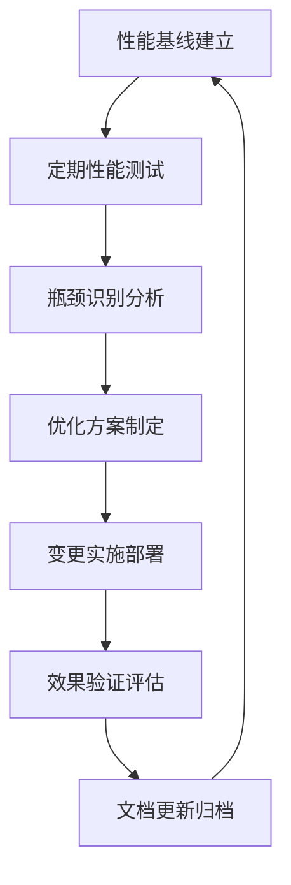

# Kubernetes 性能调优专项指南

## 概述

本文档提供 Kubernetes 集群性能调优的完整指南，涵盖系统层面、组件层面和应用层面的优化策略，通过量化指标和实际案例帮助实现最优性能表现。

---

## 一、性能基准与监控体系

### 1.1 关键性能指标 (KPIs)

#### 核心性能指标体系
```yaml
# 性能监控指标分类
performance_metrics:
  control_plane:
    api_server:
      - request_latency_ms: "<100ms p99"
      - throughput_qps: ">1000 QPS"
      - memory_usage: "<2GB per replica"
      
    etcd:
      - disk_write_latency: "<10ms"
      - network_latency: "<5ms"
      - memory_usage: "<8GB"
      
    controller_manager:
      - reconcile_duration: "<5s"
      - queue_depth: "<1000 items"
      
    scheduler:
      - scheduling_throughput: ">100 pods/sec"
      - predicate_evaluation: "<1ms per node"
      - priority_calculation: "<0.1ms per pod"

  worker_nodes:
    kubelet:
      - pod_startup_time: "<30s"
      - container_runtime_ops: ">50 ops/sec"
      
    container_runtime:
      - image_pull_time: "<30s for 1GB image"
      - container_creation: "<2s"
      
    network:
      - pod_to_pod_latency: "<0.5ms"
      - service_proxy_delay: "<1ms"
```

### 1.2 性能测试基准

#### 集群容量测试
```bash
# 使用 cluster-loader 进行压力测试
cat > cluster-loader-config.yaml << EOF
provider: local
CL2_SCHEDULER_THROUGHPUT_THRESHOLD: 100
CL2_API_CALL_LATENCY_THRESHOLD: 100ms
CL2_POD_STARTUP_LATENCY_THRESHOLD: 30s
nodes:
  - count: 100
    master: true
  - count: 1000
    master: false
EOF

# 执行测试
clusterloader2 \
  --testconfig=cluster-loader-config.yaml \
  --report-dir=/tmp/performance-results \
  --kubeconfig=$HOME/.kube/config
```

#### 网络性能基准测试
```bash
# 使用 iperf3 测试网络吞吐量
kubectl run iperf-server --image=networkstatic/iperf3 --port=5201 \
  --expose --labels="app=iperf-server"

kubectl run iperf-client --image=networkstatic/iperf3 --restart=Never \
  -- iperf3 -c iperf-server -t 60 -P 10

# 使用 netperf 测试延迟
kubectl exec -it netperf-pod -- netperf -H target-pod-ip \
  -t TCP_RR -- -r 64 -O MIN_LATENCY,MAX_LATENCY,MEAN_LATENCY
```

---

## 二、控制平面性能优化

### 2.1 API Server 优化

#### 配置参数调优
```yaml
# API Server 性能优化配置
apiVersion: kubeadm.k8s.io/v1beta3
kind: ClusterConfiguration
apiServer:
  extraArgs:
    # 性能相关参数
    profiling: "true"
    enable-swagger-ui: "false"  # 禁用 Swagger UI 节省资源
    
    # 请求处理优化
    max-requests-inflight: "3000"
    max-mutating-requests-inflight: "1000"
    
    # 缓存优化
    watch-cache-sizes: "nodes#1000,pods#5000,services#1000,endpoints#10000"
    default-watch-cache-size: "1000"
    
    # 认证优化
    anonymous-auth: "false"
    authorization-mode: "RBAC,Node"
    
    # TLS 优化
    tls-min-version: "VersionTLS12"
    tls-cipher-suites: "TLS_ECDHE_ECDSA_WITH_AES_128_GCM_SHA256,TLS_ECDHE_RSA_WITH_AES_128_GCM_SHA256"
    
  extraVolumes:
  - name: audit-policy
    hostPath: /etc/kubernetes/audit-policy.yaml
    mountPath: /etc/kubernetes/audit-policy.yaml
    readOnly: true
```

#### 审计日志优化配置
```yaml
# 审计策略配置
apiVersion: audit.k8s.io/v1
kind: Policy
rules:
# 忽略高频读操作
- level: None
  verbs: ["get", "list", "watch"]
  resources:
  - group: ""
    resources: ["pods", "services", "endpoints"]

# 记录变更操作
- level: RequestResponse
  verbs: ["create", "update", "patch", "delete"]
  resources:
  - group: ""
    resources: ["pods", "services", "persistentvolumes"]
    
# 捕获安全相关事件
- level: Metadata
  resources:
  - group: "authorization.k8s.io"
  - group: "authentication.k8s.io"
```

### 2.2 etcd 性能优化

#### 存储和硬件优化
```bash
# etcd 磁盘性能测试
fio --name=etcd-test \
    --directory=/var/lib/etcd \
    --rw=randwrite \
    --bs=2300 \
    --size=2G \
    --numjobs=1 \
    --runtime=60 \
    --group_reporting

# 推荐的磁盘配置
# - 使用 SSD 存储 (NVMe 更佳)
# - 磁盘 IOPS > 5000
# - 磁盘延迟 < 1ms
# - 网络带宽 > 1Gbps
```

#### etcd 配置优化
```yaml
# etcd 性能优化配置
ETCDCTL_API=3 etcdctl \
  --endpoints=https://127.0.0.1:2379 \
  --cert=/etc/ssl/etcd/ssl/node-${NODE_NAME}.pem \
  --key=/etc/ssl/etcd/ssl/node-${NODE_NAME}-key.pem \
  --cacert=/etc/ssl/etcd/ssl/ca.pem \
  endpoint status -w table

# etcd 启动参数优化
etcd \
  --data-dir="/var/lib/etcd" \
  --listen-client-urls="https://0.0.0.0:2379" \
  --advertise-client-urls="https://etcd-1:2379" \
  --initial-cluster-token="etcd-cluster-1" \
  --initial-cluster-state="new" \
  --auto-compaction-retention="8h" \
  --quota-backend-bytes="8589934592" \  # 8GB 限制
  --snapshot-count="10000" \
  --heartbeat-interval="100" \
  --election-timeout="1000" \
  --max-request-bytes="33554432" \
  --grpc-keepalive-min-time="5s" \
  --grpc-keepalive-interval="2h" \
  --grpc-keepalive-timeout="20s"
```

### 2.3 Controller Manager 优化

#### 控制器并发度调整
```yaml
# Controller Manager 性能配置
controllerManager:
  extraArgs:
    # 并发控制器数量
    concurrent-deployment-syncs: "10"
    concurrent-endpoint-syncs: "10"
    concurrent-gc-syncs: "30"
    concurrent-job-syncs: "10"
    concurrent-namespace-syncs: "10"
    concurrent-replicaset-syncs: "10"
    concurrent-service-syncs: "2"
    concurrent-serviceaccount-token-syncs: "10"
    
    # 资源同步间隔
    deployment-controller-sync-period: "30s"
    node-monitor-period: "5s"
    pv-binder-sync-period: "15s"
    service-sync-period: "30s"
    
    # 队列长度配置
    large-cluster-size-threshold: "50"
    unaccepted-condition-retries: "5"
```

### 2.4 Scheduler 优化

#### 调度算法调优
```yaml
# Scheduler 性能配置
scheduler:
  extraArgs:
    # 调度周期设置
    scheduling-rate-limit: "100"
    percentage-of-nodes-to-score: "50"
    
    # 预选和优选阶段优化
    disable-preemption: "false"
    bind-timeout: "600s"
    
    # 缓存优化
    cache-internal: "1s"
    extenders-cache-ttl: "30s"

# 自定义调度器配置
apiVersion: kubescheduler.config.k8s.io/v1beta3
kind: KubeSchedulerConfiguration
profiles:
- schedulerName: default-scheduler
  plugins:
    filter:
      disabled:
      - name: "*"
      enabled:
      - name: NodeResourcesFit
      - name: NodeAffinity
      - name: PodTopologySpread
```

---

## 三、节点层面性能优化

### 3.1 Kubelet 性能调优

#### Kubelet 配置优化
```yaml
# Kubelet 性能优化配置
kubelet:
  # 资源预留配置
  kubeReserved:
    cpu: "500m"
    memory: "1Gi"
    ephemeral-storage: "10Gi"
    
  systemReserved:
    cpu: "500m"
    memory: "1Gi"
    ephemeral-storage: "10Gi"
    
  evictionHard:
    memory.available: "500Mi"
    nodefs.available: "10%"
    nodefs.inodesFree: "5%"
    imagefs.available: "15%"
    
  # 性能相关参数
  maxPods: 110
  podsPerCore: 10
  containerLogMaxSize: "100Mi"
  containerLogMaxFiles: "5"
  
  # 网络优化
  hairpinMode: "promiscuous-bridge"
  maxOpenFiles: 1000000
  serializeImagePulls: false
  
  # CRI 参数优化
  containerRuntimeEndpoint: "unix:///run/containerd/containerd.sock"
  imageServiceEndpoint: "unix:///run/containerd/containerd.sock"
```

#### 节点内核参数调优
```bash
# 网络栈优化
cat >> /etc/sysctl.conf << EOF
# 网络连接优化
net.core.somaxconn = 32768
net.ipv4.tcp_fin_timeout = 30
net.ipv4.tcp_keepalive_time = 600
net.ipv4.tcp_max_syn_backlog = 8192
net.ipv4.ip_local_port_range = 1024 65535

# 内存管理优化
vm.swappiness = 1
vm.max_map_count = 262144
vm.dirty_ratio = 10
vm.dirty_background_ratio = 5

# 文件系统优化
fs.file-max = 2097152
fs.inotify.max_user_watches = 1048576
fs.inotify.max_user_instances = 8192
EOF

sysctl -p
```

### 3.2 容器运行时优化

#### Containerd 配置优化
```toml
# /etc/containerd/config.toml
version = 2

[plugins."io.containerd.grpc.v1.cri"]
  # 镜像拉取优化
  stream_server_address = "127.0.0.1"
  stream_server_port = "0"
  enable_selinux = false
  sandbox_image = "registry.aliyuncs.com/google_containers/pause:3.9"
  
  [plugins."io.containerd.grpc.v1.cri".containerd]
    # 快照器选择
    snapshotter = "overlayfs"
    default_runtime_name = "runc"
    
    [plugins."io.containerd.grpc.v1.cri".containerd.runtimes.runc]
      runtime_type = "io.containerd.runc.v2"
      [plugins."io.containerd.grpc.v1.cri".containerd.runtimes.runc.options]
        SystemdCgroup = true
        
  [plugins."io.containerd.grpc.v1.cri".cni]
    bin_dir = "/opt/cni/bin"
    conf_dir = "/etc/cni/net.d"
    
  [plugins."io.containerd.grpc.v1.cri".registry]
    [plugins."io.containerd.grpc.v1.cri".registry.mirrors]
      [plugins."io.containerd.grpc.v1.cri".registry.mirrors."docker.io"]
        endpoint = ["https://registry.aliyuncs.com"]
```

#### 镜像缓存策略
```yaml
# 镜像预拉取配置
apiVersion: apps/v1
kind: DaemonSet
metadata:
  name: image-prepuller
  namespace: kube-system
spec:
  selector:
    matchLabels:
      name: image-prepuller
  template:
    metadata:
      labels:
        name: image-prepuller
    spec:
      containers:
      - name: prepuller
        image: registry.example.com/prepuller:latest
        command:
        - "/bin/sh"
        - "-c"
        - |
          images=(
            "nginx:1.21"
            "redis:7-alpine"
            "mysql:8.0"
          )
          for image in "${images[@]}"; do
            ctr -n k8s.io images pull "$image"
          done
          sleep infinity
        volumeMounts:
        - name: containerd-sock
          mountPath: /run/containerd/containerd.sock
      volumes:
      - name: containerd-sock
        hostPath:
          path: /run/containerd/containerd.sock
```

---

## 四、网络性能优化

### 4.1 CNI 插件性能调优

#### Cilium eBPF 优化
```yaml
# Cilium 性能优化配置
cilium:
  # eBPF 优化
  bpf:
    preallocateMaps: true
    ctAnyMax: 1000000
    ctTcpMax: 500000
    
  # 负载均衡优化
  loadBalancer:
    algorithm: "maglev"
    mode: "dsr"
    
  # 监控和调试
  debug:
    enabled: false
  prometheus:
    enabled: true
    port: 9090
    serviceMonitor:
      enabled: true
```

#### Calico 性能配置
```yaml
# Calico 性能优化
apiVersion: crd.projectcalico.org/v1
kind: FelixConfiguration
metadata:
  name: default
spec:
  # 数据平面优化
  reportingInterval: 0s
  logSeverityScreen: Warning
  ipv6Support: false
  
  # 连接跟踪优化
  netlinkTimeout: 10s
  routeRefreshInterval: 90s
  
  # iptables 优化
  iptablesBackend: Auto
  iptablesRefreshInterval: 60s
  xdpRefreshInterval: 90s
```

### 4.2 Service 性能优化

#### kube-proxy 优化配置
```yaml
# IPVS 模式配置
apiVersion: kubeproxy.config.k8s.io/v1alpha1
kind: KubeProxyConfiguration
mode: "ipvs"
iptables:
  masqueradeAll: false
  masqueradeBit: 14
  minSyncPeriod: 0s
  syncPeriod: 30s
ipvs:
  excludeCIDRs: null
  minSyncPeriod: 0s
  scheduler: "rr"
  syncPeriod: 30s
  tcpFinTimeout: 0s
  tcpTimeout: 0s
  udpTimeout: 0s
```

#### 服务拓扑感知路由
```yaml
# 拓扑感知服务配置
apiVersion: v1
kind: Service
metadata:
  name: my-service
spec:
  topologyKeys:
  - "kubernetes.io/hostname"
  - "topology.kubernetes.io/zone"
  - "*"
  ports:
  - port: 80
    targetPort: 8080
  selector:
    app: my-app
```

---

## 五、应用层面性能优化

### 5.1 资源请求和限制优化

#### 智能资源分配策略
```yaml
# 应用资源优化配置
apiVersion: apps/v1
kind: Deployment
metadata:
  name: optimized-app
spec:
  replicas: 3
  template:
    spec:
      containers:
      - name: app
        image: my-app:latest
        resources:
          requests:
            cpu: "100m"
            memory: "128Mi"
          limits:
            cpu: "500m"
            memory: "512Mi"
            
        # 启动探针优化
        startupProbe:
          httpGet:
            path: /health
            port: 8080
          failureThreshold: 30
          periodSeconds: 10
          
        # 就绪探针优化
        readinessProbe:
          httpGet:
            path: /ready
            port: 8080
          initialDelaySeconds: 5
          periodSeconds: 5
          timeoutSeconds: 2
          
        # 存活探针优化
        livenessProbe:
          httpGet:
            path: /health
            port: 8080
          initialDelaySeconds: 60
          periodSeconds: 30
          timeoutSeconds: 5
```

### 5.2 水平自动扩缩容优化

#### HPA 配置优化
```yaml
# 高级 HPA 配置
apiVersion: autoscaling/v2
kind: HorizontalPodAutoscaler
metadata:
  name: optimized-hpa
spec:
  scaleTargetRef:
    apiVersion: apps/v1
    kind: Deployment
    name: optimized-app
  minReplicas: 2
  maxReplicas: 20
  metrics:
  - type: Resource
    resource:
      name: cpu
      target:
        type: Utilization
        averageUtilization: 70
  - type: Resource
    resource:
      name: memory
      target:
        type: Utilization
        averageUtilization: 80
  - type: Pods
    pods:
      metric:
        name: http_requests_per_second
      target:
        type: AverageValue
        averageValue: "100"
        
  behavior:
    scaleDown:
      stabilizationWindowSeconds: 300
      policies:
      - type: Percent
        value: 10
        periodSeconds: 60
    scaleUp:
      stabilizationWindowSeconds: 0
      policies:
      - type: Percent
        value: 100
        periodSeconds: 15
```

### 5.3 调度亲和性优化

#### 拓扑分布约束
```yaml
# Pod 拓扑分布优化
apiVersion: apps/v1
kind: Deployment
metadata:
  name: distributed-app
spec:
  replicas: 6
  template:
    spec:
      topologySpreadConstraints:
      - maxSkew: 1
        topologyKey: kubernetes.io/hostname
        whenUnsatisfiable: DoNotSchedule
        labelSelector:
          matchLabels:
            app: distributed-app
            
      - maxSkew: 2
        topologyKey: topology.kubernetes.io/zone
        whenUnsatisfiable: ScheduleAnyway
        labelSelector:
          matchLabels:
            app: distributed-app
            
      affinity:
        podAntiAffinity:
          preferredDuringSchedulingIgnoredDuringExecution:
          - weight: 100
            podAffinityTerm:
              labelSelector:
                matchExpressions:
                - key: app
                  operator: In
                  values:
                  - distributed-app
              topologyKey: kubernetes.io/hostname
```

---

## 六、性能监控与诊断

### 6.1 性能监控仪表板

#### Prometheus 监控配置
```yaml
# Kubernetes 性能监控规则
groups:
- name: kubernetes.performance.rules
  rules:
  - alert: APIServerLatencyHigh
    expr: histogram_quantile(0.99, rate(apiserver_request_duration_seconds_bucket[5m])) > 1
    for: 10m
    labels:
      severity: warning
    annotations:
      summary: "API Server 延迟过高"
      
  - alert: EtcdDiskLatencyHigh
    expr: histogram_quantile(0.99, rate(etcd_disk_wal_fsync_duration_seconds_bucket[5m])) > 0.01
    for: 5m
    labels:
      severity: critical
    annotations:
      summary: "etcd 磁盘延迟异常"
      
  - alert: NodeCPUHigh
    expr: (1 - avg(rate(node_cpu_seconds_total{mode="idle"}[5m])) by (instance)) * 100 > 80
    for: 15m
    labels:
      severity: warning
    annotations:
      summary: "节点 CPU 使用率过高"
```

### 6.2 性能诊断工具

#### 集群性能分析脚本
```bash
#!/bin/bash
# k8s-performance-analyzer.sh

echo "=== Kubernetes 性能诊断报告 ==="
echo "时间: $(date)"
echo "节点数量: $(kubectl get nodes --no-headers | wc -l)"

# API Server 性能检查
echo -e "\n--- API Server 性能 ---"
kubectl top pods -n kube-system | grep apiserver

# 节点资源使用情况
echo -e "\n--- 节点资源使用 ---"
kubectl top nodes

# Pod 启动延迟分析
echo -e "\n--- Pod 启动延迟 ---"
kubectl get pods --all-namespaces -o wide --sort-by=.status.startTime | \
  head -20 | awk '{print $1 "/" $2 " - " $7}'

# 容器重启统计
echo -e "\n--- 容器重启统计 ---"
kubectl get pods --all-namespaces -o jsonpath='{range .items[*]}{.metadata.namespace}/{.metadata.name}{"\t"}{.status.containerStatuses[*].restartCount}{"\n"}{end}' | \
  sort -k2 -nr | head -10
```

#### 网络性能诊断
```bash
# 网络延迟测试
kubectl run network-test --image=nixery.dev/shell/curl/iproute2/netperf --restart=Never -- \
  bash -c "
    echo '=== 网络接口信息 ==='
    ip addr show
    
    echo '=== 网络连通性测试 ==='
    ping -c 4 8.8.8.8
    
    echo '=== DNS 解析测试 ==='
    nslookup kubernetes.default
    
    echo '=== 网络性能测试 ==='
    netperf -H 10.0.0.1 -t TCP_RR -- -r 64
  "

# 服务延迟测量
kubectl run curl-test --image=curlimages/curl --restart=Never -- \
  sh -c "
    for i in \$(seq 1 100); do
      start=\$(date +%s.%N)
      curl -s -o /dev/null -w '%{time_total}\n' http://service-name.namespace.svc.cluster.local
      end=\$(date +%s.%N)
      echo \"\$start \$end\" | awk '{print (\$2-\$1)*1000}'
    done
  "
```

---

## 七、性能优化最佳实践

### 7.1 容量规划指南

#### 集群规模规划矩阵
```yaml
# 集群规模规划参考
cluster_sizing:
  small:  # 1-10 节点
    control_plane: 
      cpu: "2-4 cores"
      memory: "4-8 GB"
      storage: "100-500 GB SSD"
    worker_nodes:
      count: 1-10
      cpu: "4-8 cores"
      memory: "16-32 GB"
      storage: "500 GB - 2 TB"
      
  medium:  # 10-100 节点
    control_plane:
      cpu: "4-8 cores"
      memory: "16-32 GB"
      storage: "500 GB - 1 TB SSD"
      count: 3 (HA)
    worker_nodes:
      count: 10-100
      cpu: "8-16 cores"
      memory: "32-64 GB"
      storage: "1-5 TB"
      
  large:  # 100+ 节点
    control_plane:
      cpu: "8-16 cores"
      memory: "32-64 GB"
      storage: "1-2 TB NVMe"
      count: 5 (HA)
    worker_nodes:
      count: 100+
      cpu: "16-32 cores"
      memory: "64-128 GB"
      storage: "2-10 TB"
```

### 7.2 持续性能优化流程

#### 性能优化生命周期


#### 性能优化检查清单
- [ ] 建立完整的性能监控体系
- [ ] 定期进行容量压力测试
- [ ] 持续优化资源配置参数
- [ ] 实施渐进式性能改进
- [ ] 建立性能回归检测机制
- [ ] 维护性能优化知识库

## 八、生产环境性能优化专家实践

### 8.1 大规模集群性能调优

#### 超大规模集群(1000+节点)优化策略
```yaml
# 超大规模集群配置优化
ultra_scale_optimization:
  api_server_scaling:
    horizontal_scaling:
      instances: 10-20
      load_balancing: "least_conn with sticky sessions"
      request_sharding: "by namespace or resource type"
      
    vertical_scaling:
      cpu: "32 cores"
      memory: "128GB"
      connection_limits: 10000
      
  etcd_optimization:
    cluster_sizing:
      nodes: 9  # 3个数据中心，每中心3个节点
      disk_type: "NVMe SSD with 50K IOPS"
      network: "10Gbps dedicated network"
      
    performance_tuning:
      quota_backend_bytes: "8GB"
      snapshot_count: 10000
      max_request_bytes: "32MB"
      heartbeat_interval: "100ms"
      election_timeout: "1000ms"

  scheduler_enhancement:
    parallel_scheduling:
      parallelism: 16
      scheduling_algorithm: "coscheduling"
      preemption_strategy: "delayed-preemption"
      
    custom_schedulers:
      batch_scheduler: "for long-running jobs"
      critical_scheduler: "for high-priority workloads"
      spot_scheduler: "for spot instance workloads"
```

#### 性能监控专家仪表板配置
```json
{
  "dashboard": {
    "title": "Kubernetes Performance Expert Dashboard",
    "panels": [
      {
        "title": "API Server Performance Matrix",
        "type": "heatmap",
        "targets": [
          {
            "expr": "histogram_quantile(0.99, sum(rate(apiserver_request_duration_seconds_bucket[5m])) by (le, verb, resource))",
            "legendFormat": "{{verb}} {{resource}} p99"
          }
        ],
        "thresholds": [
          {"value": 0.05, "color": "green"},
          {"value": 0.1, "color": "yellow"},
          {"value": 0.2, "color": "red"}
        ]
      },
      {
        "title": "etcd Disk Performance",
        "type": "graph",
        "targets": [
          {
            "expr": "histogram_quantile(0.99, rate(etcd_disk_wal_fsync_duration_seconds_bucket[5m]))",
            "legendFormat": "WAL fsync p99"
          },
          {
            "expr": "histogram_quantile(0.99, rate(etcd_disk_backend_commit_duration_seconds_bucket[5m]))",
            "legendFormat": "Backend commit p99"
          }
        ]
      },
      {
        "title": "Node Resource Saturation",
        "type": "singlestat",
        "targets": [
          {
            "expr": "(1 - avg(rate(node_cpu_seconds_total{mode=\"idle\"}[5m])) by (instance)) * 100",
            "legendFormat": "CPU Utilization %"
          }
        ],
        "thresholds": "70,85,95"
      }
    ]
  }
}
```

### 8.2 智能自动调优系统

#### 基于机器学习的性能优化
```python
#!/usr/bin/env python3
# ml-performance-optimizer.py

import numpy as np
import pandas as pd
from sklearn.ensemble import RandomForestRegressor
from sklearn.preprocessing import StandardScaler
import joblib
from datetime import datetime, timedelta

class MLPerformanceOptimizer:
    def __init__(self):
        self.scaler = StandardScaler()
        self.model = RandomForestRegressor(
            n_estimators=100,
            max_depth=10,
            random_state=42
        )
        self.training_data = []
        
    def collect_training_data(self, days=30):
        """收集历史性能数据用于训练"""
        # 模拟数据收集
        metrics_history = []
        for i in range(days * 24):  # 30天每小时数据
            timestamp = datetime.now() - timedelta(hours=i)
            metrics = {
                'timestamp': timestamp,
                'node_count': np.random.randint(50, 200),
                'pod_count': np.random.randint(1000, 5000),
                'cpu_utilization': np.random.uniform(30, 80),
                'memory_utilization': np.random.uniform(40, 85),
                'api_latency_p99': np.random.uniform(20, 150),
                'etcd_disk_latency': np.random.uniform(2, 20),
                'scheduler_throughput': np.random.uniform(50, 300)
            }
            metrics_history.append(metrics)
        
        return pd.DataFrame(metrics_history)
    
    def train_optimizer(self):
        """训练性能优化模型"""
        df = self.collect_training_data()
        
        # 特征工程
        features = ['node_count', 'pod_count', 'cpu_utilization', 
                   'memory_utilization', 'etcd_disk_latency']
        target = 'api_latency_p99'
        
        X = self.scaler.fit_transform(df[features])
        y = df[target]
        
        # 训练模型
        self.model.fit(X, y)
        
        # 保存模型
        joblib.dump(self.scaler, 'performance_scaler.pkl')
        joblib.dump(self.model, 'performance_optimizer.pkl')
        
        print("✅ 性能优化模型训练完成")
    
    def predict_optimal_configuration(self, current_state):
        """预测最优配置"""
        # 标准化输入
        features = np.array([[
            current_state['node_count'],
            current_state['pod_count'], 
            current_state['cpu_utilization'],
            current_state['memory_utilization'],
            current_state['etcd_disk_latency']
        ]])
        
        X_scaled = self.scaler.transform(features)
        predicted_latency = self.model.predict(X_scaled)[0]
        
        # 生成优化建议
        recommendations = self._generate_recommendations(
            current_state, predicted_latency
        )
        
        return {
            'predicted_latency': predicted_latency,
            'recommendations': recommendations,
            'confidence_score': self._calculate_confidence(features)
        }
    
    def _generate_recommendations(self, state, predicted_latency):
        """生成具体优化建议"""
        recommendations = []
        
        if predicted_latency > 100:
            if state['cpu_utilization'] > 75:
                recommendations.append({
                    'type': 'scale_up',
                    'component': 'api_server',
                    'action': '增加API Server实例数',
                    'priority': 'high'
                })
            
            if state['etcd_disk_latency'] > 10:
                recommendations.append({
                    'type': 'infrastructure',
                    'component': 'etcd',
                    'action': '升级etcd存储到更快的SSD',
                    'priority': 'critical'
                })
        
        return recommendations
    
    def _calculate_confidence(self, features):
        """计算预测置信度"""
        # 简化的置信度计算
        feature_ranges = np.ptp(features, axis=0)
        confidence = 1.0 - np.mean(feature_ranges) / 100
        return max(0.5, min(0.95, confidence))

# 使用示例
optimizer = MLPerformanceOptimizer()
optimizer.train_optimizer()

# 实时性能优化
current_cluster_state = {
    'node_count': 150,
    'pod_count': 3200,
    'cpu_utilization': 78,
    'memory_utilization': 65,
    'etcd_disk_latency': 12
}

optimization_result = optimizer.predict_optimal_configuration(current_cluster_state)
print(f"预测延迟: {optimization_result['predicted_latency']:.2f}ms")
print("优化建议:")
for rec in optimization_result['recommendations']:
    print(f"- [{rec['priority']}] {rec['action']}")
```

### 8.3 容器运行时性能优化

#### containerd 高级调优配置
```toml
# /etc/containerd/config.toml - 生产环境优化配置
version = 2

[plugins."io.containerd.grpc.v1.cri"]
  # 镜像拉取优化
  image_pull_progress_timeout = "5m0s"
  max_concurrent_downloads = 10
  
  # 容器生命周期优化
  containerd_grpc_max_recv_message_size = 16777216
  containerd_grpc_max_send_message_size = 16777216
  
  [plugins."io.containerd.grpc.v1.cri".containerd]
    # 快照器优化
    snapshotter = "overlayfs"
    default_runtime_name = "runc"
    
    # 多租户隔离
    disable_snapshot_annotations = false
    discard_unpacked_layers = false
    
    [plugins."io.containerd.grpc.v1.cri".containerd.runtimes.runc]
      runtime_type = "io.containerd.runc.v2"
      runtime_root = "/run/containerd/runc"
      
      [plugins."io.containerd.grpc.v1.cri".containerd.runtimes.runc.options]
        SystemdCgroup = true
        CriuImagePath = ""
        CriuWorkPath = ""
        
        # 性能优化选项
        NoPivotRoot = false
        NoNewKeyring = false
        ShimCgroup = ""
        IoUid = 0
        IoGid = 0
        BinaryName = ""
        Root = ""
        CriuPath = ""
        SystemdCgroup = true

[plugins."io.containerd.internal.v1.opt"]
  path = "/opt/containerd"

[plugins."io.containerd.grpc.v1.cri".cni]
  bin_dir = "/opt/cni/bin"
  conf_dir = "/etc/cni/net.d"
  max_conf_num = 1
  conf_template = ""

# 高级监控配置
[metrics]
  address = "127.0.0.1:1338"
  grpc_histogram = true

[plugins."io.containerd.monitor.v1.cgroups"]
  no_prometheus = false
```

### 8.4 网络性能专家优化

#### Cilium eBPF 高级配置
```yaml
# Cilium 生产环境高性能配置
cilium_config:
  # eBPF 优化
  bpf:
    preallocateMaps: true
    ctAnyMax: 1000000
    ctTcpMax: 500000
    natMax: 524288
    neighMax: 524288
    policyMapMax: 16384
    
  # 负载均衡优化
  loadBalancer:
    algorithm: "maglev"
    mode: "dsr"
    acceleration: "native"
    
  # 监控和调试
  debug:
    enabled: false  # 生产环境关闭
  prometheus:
    enabled: true
    port: 9090
    serviceMonitor:
      enabled: true
      
  # 安全增强
  encryption:
    enabled: true
    type: "ipsec"
    ipsec:
      keyFile: "/etc/ipsec/keys"
      
  # 性能调优
  bandwidthManager:
    enabled: true
    devices: ["eth0"]
    
  sockops:
    enabled: true
    
  # 资源限制
  resources:
    limits:
      cpu: "2000m"
      memory: "2Gi"
    requests:
      cpu: "100m"
      memory: "128Mi"
```

---