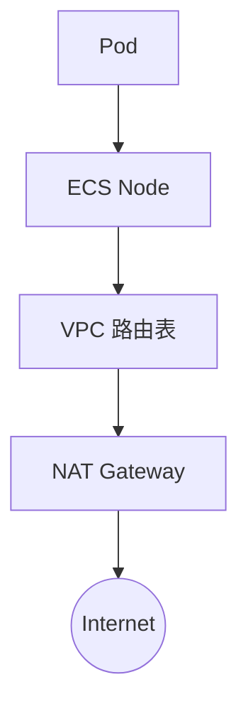

# ACK 关联产品 - VPC 网络

> **适用版本**: ACK v1.25 - v1.32 | **最后更新**: 2026-01

---

## 目录

- [VPC 网络规划](#vpc-网络规划)
- [子网 (vSwitch) 设计策略](#子网-vswitch-设计策略)
- [Terway CNI 与 VPC 集成](#terway-cni-与-vpc-集成)
- [出口流量管理 (NAT Gateway)](#出口流量管理-nat-gateway)
- [多集群与混合云互联](#多集群与混合云互联)

---

## VPC 网络规划

### 核心地址段建议

| 网段类型 | 建议范围 | 覆盖范围 | 约束 |
|:---|:---|:---|:---|
| **VPC 网段** | `192.168.0.0/12` | 整个专有网络 | 后续不可修改，需预留充足空间 |
| **Pod 网段** | `172.20.0.0/16` | 集群 Pod 使用 | 不能与 VPC/Service 网段冲突 |
| **Service 网段** | `172.21.0.0/20` | 集群内部 Service | 必须是私网地址段 |

### IP 地址分配估算公式

```bash
所需 IP 总数 = 节点数 × (每一个 ENI 的 IP 数 × ENI 密度) + 节点本身 IP数
# 建议为业务预留 2-3 倍的弹性空间。
```

---

## 子网 (vSwitch) 设计策略

### 多可用区设计 (HA)

生产环境建议跨至少 **3 个可用区 (AZ)** 分配子网：

- **vSwitch-AZ1 (10.0.1.0/24)**: 用于核心节点。
- **vSwitch-AZ2 (10.0.2.0/24)**: 用于核心节点。
- **vSwitch-AZ3 (10.0.3.0/24)**: 用于弹性节点 (Spot)。

### 虚拟交换机用途划分

| 用途 | 设计建议 |
|:---|:---|
| **Pod 专属子网** | 使用 Terway 时，建议为 Pod 分配独立子网，避免与 ECS 混用 |
| **SLB 专属子网** | 为内网负载均衡器预留小段子网范围 |

---

## Terway CNI 与 VPC 集成

### Terway 优势

- **真·VPC IP**: Pod IP 直接属于 VPC，网络延迟几乎等同于 ECS 到 ECS。
- **安全组集成**: Pod 级别可以直接设置阿里云安全组。
- **无 VXLAN 损耗**: 避免了传统叠加网络 (Overlay) 的封装性能损耗。

### 模式选择

| 模式 | 描述 | 适用规模 |
|:---|:---|:---|
| **ENI 多 IP** | 为 ENI 绑定辅助内网 IP | 推荐，最通用 |
| **Trunk ENI** | 中继 ENI 模式，高密度 | 高密度 Pod 部署场景 |
| **IPv4/IPv6 双栈** | 支持双栈协议 | 全球性业务 |

---

## 出口流量管理 (NAT Gateway)

### 典型架构



### 关键配置

1. **SNAT 规则**: 确保私网 Pod 可以访问外网 (如下载拉取外部镜像)。
2. **固定 EIP**: 许多外部 API 接口需要白名单，通过 NAT Gateway 绑定固定 EIP 实现。
3. **共享带宽包**: 多个 EIP 共享带宽，节省成本。

---

## 多集群与混合云互联

### 互联方案对比

| 方案 | 特点 | 场景 |
|:---|:---|:---|
| **CEN (云企业网)** | 自动路由传播，全球互联 | 跨地域集群互通 |
| **VPC Peering** | 简单对等连接 | 同地域两个 VPC 互通 |
| **VPN 网关** | 加密隧道，成本低 | 办公网与 ACK 集群互联 |
| **高速通道 (Express Connect)** | 物理专线，低延迟 | IDC 机房与 ACK 混合云 |

---

## 相关文档

- [220-network-protocols-stack.md](./220-network-protocols-stack.md) - 网络协议基础
- [203-docker-networking-deep-dive.md](./203-docker-networking-deep-dive.md) - Docker 网络详解
- [156-alibaba-cloud-integration.md](./156-alibaba-cloud-integration.md) - 阿里云集成总表
