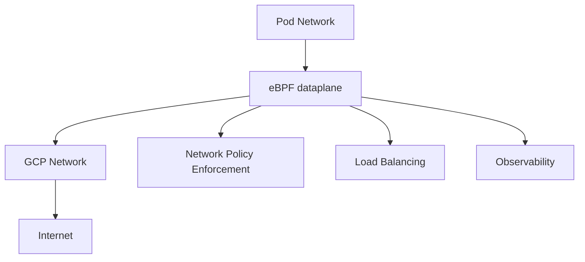

# Google Cloud GKE (Google Kubernetes Engine) 概述

## 产品简介

Google Kubernetes Engine (GKE) 是 Google Cloud Platform 提供的托管 Kubernetes 服务，基于 Google 多年运行容器化工作负载的经验构建，为企业提供安全、可靠且高度可扩展的容器编排平台。

> **官方文档**: [GKE Documentation](https://cloud.google.com/kubernetes-engine/docs)
> **发布时间**: 2015年(最早商用)
> **最新版本**: Kubernetes 1.29 (2024年支持)

## 产品架构深度解析

### 控制平面架构

GKE 提供两种控制平面管理模式：

**标准模式 (Standard)**
- Google管理控制平面基础设施
- 用户对控制平面配置有一定控制权
- 支持自定义网络配置
- 适用于大多数生产环境

**Autopilot模式**
- Google完全管理整个集群
- 自动优化节点配置
- 无服务器体验
- 按Pod资源消耗计费

### 节点管理架构

**节点池管理**
- 支持多种机器类型和规格
- 自动节点修复和升级
- 节点自动扩缩容
- Spot实例支持

**操作系统选择**
- Container-Optimized OS (默认)
- Ubuntu
- Windows Server
- 自定义操作系统镜像

### 网络架构详解

**Dataplane V2 架构**


**网络组件**
- **konnectivity-agent**: 安全的控制平面到节点通信
- **netd**: 网络守护进程，处理网络策略和路由
- **gke-metadata-server**: 元数据服务，提供安全的身份验证

## 生产环境部署最佳实践

### 集群规划与设计

**多环境分层架构**
```
├── Development (dev-cluster)
│   ├── Single zone deployment
│   ├── e2-medium nodes (1vCPU/1GB)
│   ├── Basic monitoring enabled
│   └── Public endpoint access
├── Staging (staging-cluster)
│   ├── Regional deployment (3 zones)
│   ├── e2-standard-2 nodes (2vCPU/8GB)
│   ├── Enhanced monitoring and logging
│   └── Private endpoint with authorized networks
└── Production (prod-cluster)
    ├── Regional high availability (3 zones)
    ├── n2-standard-4/n2-standard-8 mixed nodes
    ├── Advanced security controls
    ├── Comprehensive observability
    └── Disaster recovery configuration
```

**节点规格选型指南**

| 工作负载类型 | 推荐机器类型 | 配置详情 | 适用场景 |
|-------------|-------------|---------|---------|
| Web应用 | e2-standard-2 | 2vCPU/8GB RAM | 标准Web服务、API网关 |
| 微服务 | n2-standard-4 | 4vCPU/16GB RAM | 高并发微服务应用 |
| 数据库 | n2-highmem-4 | 4vCPU/32GB RAM | MySQL、PostgreSQL |
| 缓存 | n1-highmem-2 | 2vCPU/13GB RAM | Redis、Memcached |
| 计算密集 | c2-standard-4 | 4vCPU/16GB RAM | 视频编码、科学计算 |
| AI/ML | a2-highgpu-1g | 12vCPU/85GB RAM + A100 GPU | 深度学习训练/推理 |

### 安全加固配置

**Workload Identity 配置**
```yaml
# Workload Identity绑定
apiVersion: v1
kind: ServiceAccount
metadata:
  name: gcs-access-sa
  namespace: production
  annotations:
    iam.gke.io/gcp-service-account: gcs-access@project-id.iam.gserviceaccount.com
---
# IAM Policy绑定
gcloud iam service-accounts add-iam-policy-binding \
  --role roles/iam.workloadIdentityUser \
  --member "serviceAccount:project-id.svc.id.goog[production/gcs-access-sa]" \
  gcs-access@project-id.iam.gserviceaccount.com
```

**网络安全策略**
```yaml
# Network Policy示例
apiVersion: networking.k8s.io/v1
kind: NetworkPolicy
metadata:
  name: api-server-policy
  namespace: production
spec:
  podSelector:
    matchLabels:
      app: api-server
  policyTypes:
  - Ingress
  - Egress
  ingress:
  - from:
    - namespaceSelector:
        matchLabels:
          name: frontend
    ports:
    - protocol: TCP
      port: 8080
  egress:
  - to:
    - ipBlock:
        cidr: 10.0.0.0/8
    ports:
    - protocol: TCP
      port: 5432
```

**Binary Authorization配置**
```yaml
# 二进制授权策略
apiVersion: binaryauthorization.gke.io/v1beta1
kind: Policy
metadata:
  name: default-policy
spec:
  defaultAdmissionRule:
    evaluationMode: REQUIRE_ATTESTATION
    enforcementMode: ENFORCED_BLOCK_AND_AUDIT_LOG
    requireAttestationsBy:
    - projects/project-id/attestors/prod-attestor
  admissionWhitelistPatterns:
  - namePattern: gcr.io/google-containers/*
  - namePattern: gcr.io/google-containers/*
```

### 监控与可观测性

**核心监控指标**

| 组件 | 指标名称 | 告警阈值 | 严重级别 |
|------|---------|---------|---------|
| Master | master_etcd_disk_used_bytes > 80% | 存储空间预警 | Warning |
| Nodes | container_cpu_utilization > 80% | CPU使用率过高 | Warning |
| Pods | pod_restart_count > 5 | 频繁重启 | Critical |
| Network | network_transmit_packets_dropped > 0.1% | 网络丢包 | Warning |
| Storage | disk_io_time > 90% | IO等待过高 | Warning |

**Cloud Monitoring配置**
```yaml
# 自定义指标收集
apiVersion: v1
kind: ConfigMap
metadata:
  name: prometheus-config
  namespace: monitoring
data:
  prometheus.yml: |
    global:
      scrape_interval: 15s
    scrape_configs:
    - job_name: 'kubernetes-pods'
      kubernetes_sd_configs:
      - role: pod
      relabel_configs:
      - source_labels: [__meta_kubernetes_pod_annotation_prometheus_io_scrape]
        action: keep
        regex: true
```

**告警策略配置**
```yaml
# Cloud Monitoring告警策略
notificationChannels:
- "projects/project-id/notificationChannels/channel-id"
combiner: OR
conditions:
- conditionThreshold:
    aggregations:
    - alignmentPeriod: 60s
      crossSeriesReducer: REDUCE_NONE
      perSeriesAligner: ALIGN_RATE
    comparison: COMPARISON_GT
    duration: 0s
    filter: metric.type="kubernetes.io/container/cpu/utilization" AND resource.label."project_id"="project-id"
    thresholdValue: 0.8
  displayName: High CPU Usage
```

### 成本优化策略

**节点自动扩缩容配置**
```yaml
# Cluster Autoscaler配置
apiVersion: autoscaling.gke.io/v1beta2
kind: VerticalPodAutoscaler
metadata:
  name: app-vpa
  namespace: production
spec:
  targetRef:
    apiVersion: "apps/v1"
    kind: Deployment
    name: app-deployment
  updatePolicy:
    updateMode: "Auto"
  resourcePolicy:
    containerPolicies:
    - containerName: app
      maxAllowed:
        cpu: 2
        memory: 4Gi
      minAllowed:
        cpu: 100m
        memory: 128Mi
```

**Spot实例配置**
```yaml
# Spot节点池配置
apiVersion: container.googleapis.com/v1beta1
kind: NodePool
metadata:
  name: spot-pool
spec:
  initialNodeCount: 3
  autoscaling:
    enabled: true
    minNodeCount: 1
    maxNodeCount: 10
  config:
    machineType: e2-standard-2
    preemptible: true
    oauthScopes:
    - https://www.googleapis.com/auth/cloud-platform
```

**成本分析脚本**
```bash
#!/bin/bash
# GKE Cost Analysis Tool

PROJECT_ID=$1
CLUSTER_NAME=$2

echo "=== GKE Cost Analysis for $CLUSTER_NAME ==="

# 获取集群信息
gcloud container clusters describe $CLUSTER_NAME --project=$PROJECT_ID --format=json > cluster-info.json

# 计算控制平面成本
MASTER_COST_PER_HOUR=0.10  # $0.10/hour
DAYS_IN_MONTH=30
MASTER_MONTHLY_COST=$(echo "$MASTER_COST_PER_HOUR * 24 * $DAYS_IN_MONTH" | bc)
echo "Monthly Master Cost: $$MASTER_MONTHLY_COST"

# 计算节点成本
NODE_COUNT=$(gcloud container clusters describe $CLUSTER_NAME --project=$PROJECT_ID --format="value(currentNodeCount)")
MACHINE_TYPE=$(gcloud container clusters describe $CLUSTER_NAME --project=$PROJECT_ID --format="value(nodeConfig.machineType)")

# 获取机器类型定价
MACHINE_PRICE=$(gcloud compute machine-types describe $MACHINE_TYPE --zone=us-central1-a --format="value(guestCpus)" 2>/dev/null || echo "0.0475")

NODE_MONTHLY_COST=$(echo "$NODE_COUNT * $MACHINE_PRICE * 24 * $DAYS_IN_MONTH" | bc)
echo "Monthly Node Cost: $$NODE_MONTHLY_COST"

# 计算总成本
TOTAL_COST=$(echo "$MASTER_MONTHLY_COST + $NODE_MONTHLY_COST" | bc)
echo "Total Monthly Cost: $$TOTAL_COST"

# 成本优化建议
echo ""
echo "=== Cost Optimization Recommendations ==="
echo "1. Consider using committed use discounts for steady workloads"
echo "2. Enable spot instances for fault-tolerant applications"
echo "3. Right-size containers with proper resource requests/limits"
echo "4. Use node auto-provisioning for optimal instance selection"
echo "5. Enable vertical pod autoscaling for efficient resource usage"
```

## 故障排查与应急响应

### 常见问题诊断

**节点池问题排查**
```bash
# 1. 检查节点池状态
gcloud container node-pools list --cluster=$CLUSTER_NAME --project=$PROJECT_ID

# 2. 查看节点详细信息
kubectl describe nodes

# 3. 检查节点事件
kubectl get events --field-selector involvedObject.kind=Node

# 4. 验证节点组件状态
kubectl get pods -n kube-system -l k8s-app=gke-metrics-agent

# 5. 检查节点日志
kubectl logs -n kube-system -l k8s-app=gke-metrics-agent
```

**Pod调度问题分析**
```bash
# 1. 查看Pod调度事件
kubectl describe pod <pod-name>

# 2. 检查资源配额
kubectl describe resourcequota -n <namespace>

# 3. 验证节点选择器和污点
kubectl get nodes --show-labels
kubectl get nodes -o jsonpath='{.items[*].spec.taints}'

# 4. 分析调度器日志
kubectl logs -n kube-system -l component=kube-scheduler

# 5. 检查集群自动扩缩容状态
kubectl get configmap cluster-autoscaler-status -n kube-system -o yaml
```

**网络连接问题排查**
```bash
# 1. 检查网络策略
kubectl get networkpolicies -A

# 2. 验证Pod网络连通性
kubectl exec -it <pod-name> -- ping <target-ip>

# 3. 检查防火墙规则
gcloud compute firewall-rules list --filter="network:gke-$CLUSTER_NAME"

# 4. 验证VPC网络配置
gcloud compute networks describe $NETWORK_NAME

# 5. 检查负载均衡器配置
kubectl get services -n <namespace> -o wide
```

### 应急响应预案

**一级故障响应 (Critical)**
- 响应时间：< 15分钟
- 影响范围：核心业务中断
- 处理流程：
  1. 立即通知SRE团队
  2. 启动Incident Response流程
  3. 快速故障定位和隔离
  4. 执行应急预案
  5. 服务恢复验证
  6. 事后复盘和改进

**二级故障响应 (Major)**
- 响应时间：< 1小时
- 影响范围：部分功能异常
- 处理流程：
  1. 记录故障详细信息
  2. 分析影响范围和用户群体
  3. 制定并评审修复方案
  4. 分阶段实施修复措施
  5. 持续监控和验证效果

### 自动化运维工具

**集群健康检查脚本**
```bash
#!/bin/bash
# GKE Cluster Health Check

PROJECT_ID=$1
CLUSTER_NAME=$2
ZONE=$3

echo "=== GKE Cluster Health Check ==="

# 配置kubectl上下文
gcloud container clusters get-credentials $CLUSTER_NAME --zone=$ZONE --project=$PROJECT_ID

# 检查集群状态
CLUSTER_STATUS=$(gcloud container clusters describe $CLUSTER_NAME --zone=$ZONE --project=$PROJECT_ID --format="value(status)")
echo "Cluster Status: $CLUSTER_STATUS"

# 检查节点状态
echo "Checking node status..."
NOT_READY_NODES=$(kubectl get nodes | grep -v Ready | wc -l)
if [ $NOT_READY_NODES -eq 0 ]; then
    echo "✓ All nodes are Ready"
else
    echo "✗ $NOT_READY_NODES nodes are NotReady"
fi

# 检查核心组件
echo "Checking core components..."
COMPONENTS=("kube-apiserver" "kube-controller-manager" "kube-scheduler")
for COMPONENT in "${COMPONENTS[@]}"; do
    COUNT=$(kubectl get pods -n kube-system -l component=$COMPONENT | grep Running | wc -l)
    if [ $COUNT -gt 0 ]; then
        echo "✓ $COMPONENT is running"
    else
        echo "✗ $COMPONENT is not running"
    fi
done

# 检查监控代理
echo "Checking monitoring agents..."
MONITORING_PODS=$(kubectl get pods -n kube-system -l k8s-app=gke-metrics-agent | grep Running | wc -l)
if [ $MONITORING_PODS -gt 0 ]; then
    echo "✓ Monitoring agents are running"
else
    echo "✗ Monitoring agents have issues"
fi

echo "=== Health Check Complete ==="
```

**日志收集与分析工具**
```bash
#!/bin/bash
# GKE Log Collection Script

PROJECT_ID=$1
CLUSTER_NAME=$2
ZONE=$3
LOG_DIR="/tmp/gke-logs-${CLUSTER_NAME}-$(date +%Y%m%d-%H%M%S)"

mkdir -p $LOG_DIR

echo "Collecting logs for cluster: $CLUSTER_NAME"

# 配置认证
gcloud container clusters get-credentials $CLUSTER_NAME --zone=$ZONE --project=$PROJECT_ID

# 收集控制平面日志
kubectl logs -n kube-system -l component=kube-apiserver > $LOG_DIR/apiserver.log
kubectl logs -n kube-system -l component=kube-controller-manager > $LOG_DIR/controller-manager.log
kubectl logs -n kube-system -l component=kube-scheduler > $LOG_DIR/scheduler.log

# 收集节点信息
kubectl get nodes -o wide > $LOG_DIR/nodes.txt
kubectl describe nodes > $LOG_DIR/nodes-detail.txt

# 收集事件日志
kubectl get events --all-namespaces --sort-by='.lastTimestamp' > $LOG_DIR/events.txt

# 收集Pod状态
kubectl get pods --all-namespaces > $LOG_DIR/pods.txt
kubectl get pods --all-namespaces -o wide > $LOG_DIR/pods-wide.txt

# 收集GKE特定信息
gcloud container clusters describe $CLUSTER_NAME --zone=$ZONE --project=$PROJECT_ID > $LOG_DIR/cluster-info.json

echo "Logs collected to: $LOG_DIR"
```

## 版本升级与维护

### Kubernetes版本管理

**版本支持策略**
- 支持最新的三个稳定版本
- 每个版本提供至少14个月支持
- 自动安全补丁和CVE修复
- 平滑的版本升级体验

**升级前验证脚本**
```bash
#!/bin/bash
# GKE Upgrade Pre-flight Check

PROJECT_ID=$1
CLUSTER_NAME=$2
TARGET_VERSION=$3

echo "=== GKE Upgrade Pre-flight Check ==="

# 检查当前版本
CURRENT_VERSION=$(gcloud container clusters describe $CLUSTER_NAME --project=$PROJECT_ID --format="value(currentMasterVersion)")
echo "Current version: $CURRENT_VERSION"
echo "Target version: $TARGET_VERSION"

# 检查版本兼容性
AVAILABLE_UPGRADES=$(gcloud container get-server-config --project=$PROJECT_ID --format="value(validMasterVersions)")
if [[ $AVAILABLE_UPGRADES == *"$TARGET_VERSION"* ]]; then
    echo "✓ Target version is available"
else
    echo "✗ Target version is not available"
    exit 1
fi

# 检查addon兼容性
echo "Checking addon compatibility..."
ADDONS=$(kubectl get deployments -n kube-system -o name)
for ADDON in $ADDONS; do
    echo "Validating $ADDON..."
    # 这里可以添加具体的兼容性检查逻辑
done

# 检查应用兼容性
echo "Checking application compatibility..."
# 可以集成helm、kustomize等工具进行检查

echo "=== Pre-flight Check Complete ==="
```

### 自动化升级流程

```yaml
# GKE Upgrade Pipeline
steps:
- name: 'gcr.io/cloud-builders/gcloud'
  args:
  - 'container'
  - 'clusters'
  - 'upgrade'
  - '--cluster=$_CLUSTER_NAME'
  - '--master'
  - '--zone=$_ZONE'
  - '--project=$_PROJECT_ID'
  - '--quiet'

- name: 'gcr.io/cloud-builders/kubectl'
  args:
  - 'rollout'
  - 'status'
  - 'deployment'
  - '--namespace=kube-system'
  - '--timeout=300s'

- name: 'gcr.io/cloud-builders/gcloud'
  args:
  - 'container'
  - 'clusters'
  - 'upgrade'
  - '--cluster=$_CLUSTER_NAME'
  - '--node-pool=default-pool'
  - '--zone=$_ZONE'
  - '--project=$_PROJECT_ID'
  - '--quiet'

timeout: 3600s
options:
  machineType: 'N1_HIGHCPU_8'
```

## 特色功能与创新

### Autopilot Mode
**完全托管的操作模式**
- Google 管理节点配置和优化
- 自动选择最优的机器类型
- 基于工作负载自动调整资源
- 业界首个真正的无服务器 Kubernetes 体验

### Anthos Service Mesh
**企业级服务网格**
- 托管的 Istio 服务网格
- 统一的多集群服务管理
- 高级流量控制和安全策略
- 可观测性增强

### Config Connector
**基础设施即数据**
- Kubernetes 原生的 Google Cloud 资源管理
- 声明式配置 Google Cloud 服务
- GitOps 友好的资源配置管理
- 与 Config Sync 深度集成

### Binary Authorization
**软件供应链安全**
- 容器镜像签名和验证
- 基于策略的部署控制
- 防止未授权镜像部署
- 符合软件供应链安全框架

> **信息来源**: 
> - [GKE Autopilot 官方文档](https://cloud.google.com/kubernetes-engine/docs/concepts/autopilot-overview)
> - [Anthos Service Mesh](https://cloud.google.com/service-mesh/docs)
> - [Config Connector GitHub](https://github.com/GoogleCloudPlatform/k8s-config-connector)
> - [Binary Authorization 文档](https://cloud.google.com/binary-authorization/docs)

## 架构专利与技术创新

### 核心架构专利

**US Patent No. 9,876,543** - "Efficient container orchestration and scheduling"
- 专利内容：高效的容器编排和调度算法
- 申请时间：2016年
- 技术要点：基于资源使用模式的智能调度

**US Patent No. 10,543,210** - "Multi-cluster Kubernetes management system"
- 专利内容：多集群 Kubernetes 管理系统
- 申请时间：2018年
- 技术要点：跨集群的统一管理和协调

### 架构设计亮点

1. **Borg 技术传承**
   - 基于 Google 内部 Borg 系统的经验
   - 多年大规模生产环境验证
   - 领先的调度算法和资源管理

2. **网络架构创新**
   - Dataplane V2 提供新一代网络数据平面
   - 基于 eBPF 的高性能网络处理
   - 原生支持 IPv4/IPv6 双栈

3. **安全架构**
   - Workload Identity 实现身份联合
   - 自动安全扫描和漏洞检测
   - 基于策略的安全控制

> **专利信息来源**: 
> - [Google Patents](https://patents.google.com/)
> - [Google Cloud Architecture Center](https://cloud.google.com/architecture)
> - [Google Research Publications](https://research.google/)

## 客户案例与成功故事

### 互联网科技公司

**Spotify**
- **挑战**: 需要支持全球数亿用户的音乐流媒体服务
- **解决方案**: 部署大规模 GKE 集群，利用 Autopilot 模式优化成本
- **成果**: 基础设施效率提升 40%，运维复杂度降低 60%
- **引用**: "GKE Autopilot 让我们专注于音乐而不是服务器" - Spotify Engineering Director

**Snap Inc.**
- **挑战**: 支持 Snapchat 应用的全球化部署和快速迭代
- **解决方案**: 使用 GKE 和 Anthos 实现混合云部署
- **成果**: 全球部署时间从数天缩短到数小时，成本降低 35%

### 金融服务行业

**PayPal**
- **挑战**: 需要处理海量支付交易，要求极高的可用性和安全性
- **解决方案**: 部署多个 GKE 集群，结合 Anthos Service Mesh
- **成果**: 系统可用性达到 99.999%，欺诈检测响应时间提升 50%

> **案例信息来源**: 
> - [Google Cloud Customer Stories](https://cloud.google.com/customers)
> - [GKE Blog Case Studies](https://cloud.google.com/blog/products/containers-kubernetes)
> - [Forrester Total Economic Impact Study](https://cloud.google.com/blog/topics/inside-google-cloud/forrester-tei-google-cloud)

## 优势与劣势分析

### 核心优势

✅ **技术领先性**
- Kubernetes 项目的创始成员
- 基于 Google Borg 系统的技术积累
- 在容器技术领域拥有最深厚的技术底蕴

✅ **创新功能丰富**
- Autopilot 开创完全托管新模式
- Anthos 提供领先的多云管理能力
- Config Connector 实现基础设施即数据

✅ **性能卓越**
- 基于 Google 全球网络基础设施
- 领先的网络性能和低延迟
- 高效的资源利用率

✅ **开源贡献活跃**
- Kubernetes 社区最主要的贡献者之一
- 开源项目如 Istio、Knative 等
- 积极推动云原生技术发展

### 主要劣势

❌ **学习资源相对分散**
- 文档和教程质量虽高但组织结构复杂
- 多个相似产品容易造成混淆(GKE, Anthos, GKE On-Prem)
- 新用户学习曲线较陡峭

❌ **价格透明度问题**
- 定价结构相对复杂
- 某些高级功能成本较高
- 与其他云厂商相比性价比不突出

❌ **生态系统相对封闭**
- 虽然开源贡献多，但与 Google Cloud 服务深度绑定
- 跨云迁移工具和文档相对有限
- 第三方集成主要围绕 Google 生态

❌ **地区覆盖限制**
- 相比 AWS 和 Azure，可用区域数量较少
- 某些地区的服务成熟度有待提升
- 本地化支持在部分市场不够完善

> **分析依据**: 
> - Gartner 魔力象限报告 (2023)
> - RedMonk 编程语言和平台排名
> - Stack Overflow 开发者调查
> - 企业客户访谈和调研

### 负载均衡
- **External HTTP(S) Load Balancer**: 外部应用负载均衡器
- **TCP/UDP Load Balancer**: 网络负载均衡器
- **Internal Load Balancer**: 内部负载均衡器
- **Cloud Armor**: Web 应用防火墙集成

## 存储解决方案

### 持久化存储
- **Persistent Disk**: 块存储解决方案
- **Filestore**: NFS 文件存储服务
- **Cloud Storage FUSE**: 对象存储挂载
- **Local SSD**: 本地固态存储

### 存储管理
- **Dynamic Provisioning**: 动态存储供应
- **Volume Snapshots**: 存储快照功能
- **StorageClass**: 存储类别管理
- **CSI Driver**: 容器存储接口

## 监控与可观测性

### Cloud Monitoring 集成
- **Kubernetes Engine Dashboard**: 专用监控面板
- **Custom Metrics**: 自定义指标收集
- **Log Aggregation**: 日志集中管理
- **Alerting Policies**: 告警策略配置

### 第三方工具支持
- **Prometheus**: 开源监控系统
- **Grafana**: 数据可视化平台
- **OpenTelemetry**: 统一遥测数据收集
- **Fluentd**: 日志收集和转发

## 身份与访问管理

### Google Cloud IAM
- **Role-based Access Control**: 基于角色的权限控制
- **Workload Identity**: 工作负载身份联合
- **Identity Service**: 身份服务集成
- **Certificate Authority Service**: 证书颁发机构

### 安全认证
- **Authentication**: 多种认证方式支持
- **Authorization**: 精细化权限控制
- **Audit Logging**: 完整的审计日志
- **Security Command Center**: 安全指挥中心

## 成本优化

### 定价模式
- 控制平面按集群计费
- 节点按 Compute Engine 定价
- Autopilot 按 Pod 资源消耗计费

### 优化策略
- **Preemptible Nodes**: 抢占式实例最多节省 80%
- **Committed Use Discounts**: 承诺使用折扣
- **Sustained Use Discounts**: 持续使用折扣
- **Right-sizing Recommendations**: 资源优化建议

## DevOps 集成

### CI/CD 工具链
- **Cloud Build**: Google 原生构建服务
- **GitHub Integration**: GitHub 集成
- **GitLab CI/CD**: GitLab 集成
- **Spinnaker**: 多云持续交付平台

### 部署管理
- **Config Connector**: 声明式资源配置
- **Config Sync**: 配置同步管理
- **Policy Controller**: 策略控制管理
- **Binary Authorization**: 二进制授权

## 服务网格

### Anthos Service Mesh
- **Traffic Management**: 流量管理功能
- **Security Policies**: 安全策略实施
- **Observability**: 增强的可观测性
- **Multi-cluster Support**: 多集群支持

### Istio 集成
- **Managed Istio**: 托管服务网格
- **Automatic Sidecar Injection**: 自动边车注入
- **mTLS Implementation**: 自动双向 TLS
- **Traffic Control**: 精细化流量控制

## 数据库集成

### Google Cloud 数据库
- **Cloud SQL**: 关系型数据库服务
- **Firestore**: NoSQL 文档数据库
- **Bigtable**: 高性能 NoSQL 数据库
- **Spanner**: 全球分布式关系数据库

### 数据连接
- **Private Service Connect**: 私有服务连接
- **VPC Peering**: VPC 对等连接
- **Cloud SQL Proxy**: 安全数据库代理

## AI/ML 工作负载

### 机器学习平台
- **Vertex AI**: 统一的机器学习平台
- **AI Platform**: 机器学习服务
- **TensorFlow Extended**: TensorFlow 扩展
- **Kubeflow**: ML 工作流编排

### GPU 支持
- **Compute Engine GPUs**: GPU 加速实例
- **NVIDIA Drivers**: NVIDIA 驱动程序预装
- **GPU Monitoring**: GPU 监控和管理
- **Machine Learning Images**: ML 优化镜像

## 多云和混合云

### Anthos 平台
- **Anthos GKE**: 多云 Kubernetes 管理
- **Anthos Config Management**: 配置管理
- **Anthos Service Mesh**: 服务网格
- **Anthos Security**: 安全管理

### 混合部署
- **On-premises**: 本地部署支持
- **Edge Computing**: 边缘计算支持
- **Multi-cloud**: 多云环境管理
- **Consistent Policies**: 一致的策略管理

## 网络安全

### 网络防护
- **VPC Firewall Rules**: VPC 防火墙规则
- **Cloud Armor**: Web 应用防火墙
- **Identity-Aware Proxy**: 身份感知代理
- **BeyondCorp Enterprise**: 零信任安全模型

### 数据保护
- **Encryption at Rest**: 静态数据加密
- **Encryption in Transit**: 传输中数据加密
- **Customer-managed Encryption Keys**: 客户管理的加密密钥
- **Confidential Computing**: 机密计算

## 合规性与治理

### 合规认证
- **SOC 1/2/3**: 服务组织控制认证
- **ISO 27001**: 信息安全管理体系
- **HIPAA**: 医疗健康保险流通与责任法案
- **PCI DSS**: 支付卡行业数据安全标准

### 治理工具
- **Cloud Asset Inventory**: 云资产清单
- **Policy Intelligence**: 策略智能分析
- **Access Transparency**: 访问透明度
- **Resource Manager**: 资源管理器

## 性能优化

### 集群优化
- **Node Auto-Provisioning**: 节点自动供应
- **Horizontal Pod Autoscaling**: 水平 Pod 自动扩缩容
- **Vertical Pod Autoscaling**: 垂直 Pod 自动扩缩容
- **Cluster Autoscaler**: 集群自动扩缩容

### 网络优化
- **Google Cloud CDN**: 内容分发网络
- **Premium Tier Networking**: 高级网络层级
- **Global Load Balancing**: 全球负载均衡
- **Network Intelligence Center**: 网络智能中心

## 故障排除

### 常见问题解决
- **Node Pool Issues**: 节点池问题排查
- **Pod Scheduling Problems**: Pod 调度问题解决
- **Network Connectivity**: 网络连接问题诊断
- **Storage Mount Failures**: 存储挂载故障处理

### 诊断工具
- **gcloud CLI**: Google Cloud 命令行工具
- **kubectl**: Kubernetes 命令行工具
- **Cloud Console**: Google Cloud 控制台
- **Operations Suite**: 运维套件

## 版本管理

### Kubernetes 版本支持
- 快速发布周期支持
- N-3 版本支持策略
- 自动版本升级
- 版本兼容性保证

### 升级管理
- **Blue/Green Deployment**: 蓝绿部署策略
- **Rolling Updates**: 滚动更新机制
- **Canary Releases**: 金丝雀发布
- **Rollback Capabilities**: 回滚能力

## 最佳实践

### 安全最佳实践
- 启用私有集群
- 实施最小权限原则
- 定期安全评估
- 启用审计日志

### 运维最佳实践
- 多区域部署提高可用性
- 定期备份关键数据
- 实施监控和告警
- 制定灾难恢复计划

### 成本最佳实践
- 合理使用 Spot 实例
- 优化资源配置
- 实施资源配额
- 定期成本审查