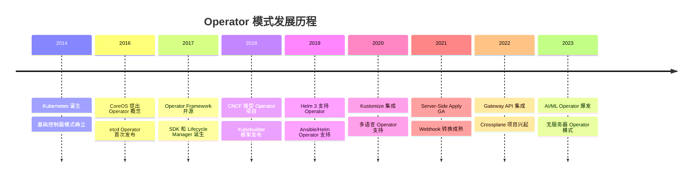
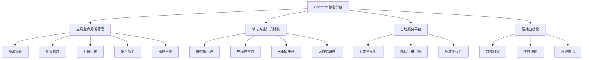

# 22 - Operator 模式与自定义控制器开发指南

## 概述

本文档提供完整的 Operator 开发指南，涵盖从基础概念到高级模式的全方位技术指导，帮助企业构建生产级的 Kubernetes 自定义控制器和 Operator。

---

## 一、Operator 模式核心概念

### 1.1 Operator 模式演进史



### 1.2 Operator 与传统控制器对比

#### 设计理念差异
```yaml
traditional_vs_operator:
  traditional_controller:
    scope: "Kubernetes 原生资源"
    complexity: "相对简单"
    state_management: "被动响应"
    lifecycle: "内置管理"
    
  operator_pattern:
    scope: "自定义应用生命周期"
    complexity: "高度复杂"
    state_management: "主动协调"
    lifecycle: "完整应用管理"
```

#### Operator 核心价值


---

## 二、Operator 开发框架选择

### 2.1 主流框架对比分析

#### 框架特性矩阵
```yaml
framework_comparison:
  kubebuilder:
    language: "Go"
    learning_curve: "Medium-High"
    code_generation: "Excellent"
    testing_support: "Built-in"
    community: "Strong (Kubernetes SIG)"
    best_for: "Production-grade Operators"
    
  operator_sdk:
    language: "Multi-language"
    learning_curve: "Low-Medium"
    code_generation: "Good"
    testing_support: "Scorecard-based"
    community: "Red Hat sponsored"
    best_for: "Enterprise Operators"
    
  controller_runtime:
    language: "Go"
    learning_curve: "High"
    code_generation: "Manual"
    testing_support: "Flexible"
    community: "Core Kubernetes"
    best_for: "Advanced custom logic"
    
  kopf:
    language: "Python"
    learning_curve: "Low"
    code_generation: "Minimal"
    testing_support: "Standard Python"
    community: "Growing"
    best_for: "Rapid prototyping"
```

### 2.2 Kubebuilder 开发流程

#### 项目初始化
```bash
# 安装 Kubebuilder
curl -L -o kubebuilder https://go.kubebuilder.io/dl/latest/$(go env GOOS)/$(go env GOARCH)
chmod +x kubebuilder
sudo mv kubebuilder /usr/local/bin/

# 创建项目
mkdir mysql-operator && cd mysql-operator
kubebuilder init --domain database.example.com --repo github.com/example/mysql-operator

# 创建 API
kubebuilder create api --group database --version v1 --kind MySQLCluster

# 创建 Webhook
kubebuilder create webhook --group database --version v1 --kind MySQLCluster --defaulting --programmatic-validation
```

#### 项目结构分析
```bash
mysql-operator/
├── api/                    # API 定义
│   └── v1/
│       ├── mysqlcluster_types.go    # CRD 结构定义
│       └── zz_generated.deepcopy.go # DeepCopy 方法
├── config/                 # 部署配置
│   ├── crd/               # CRD 清单
│   ├── rbac/              # RBAC 配置
│   ├── manager/           # 控制器部署
│   └── webhook/           # Webhook 配置
├── controllers/           # 控制器实现
│   └── mysqlcluster_controller.go
├── hack/                  # 开发脚本
├── Dockerfile             # 镜像构建
├── main.go                # 程序入口
└── Makefile               # 构建脚本
```

---

## 三、CRD 设计与实现

### 3.1 API 结构设计最佳实践

#### Spec 设计原则
```go
// MySQLCluster API 设计示例
type MySQLClusterSpec struct {
    // 必需字段
    Replicas int32 `json:"replicas"`
    
    // 存储配置
    Storage StorageSpec `json:"storage"`
    
    // 版本配置
    Version string `json:"version,omitempty"`
    
    // 网络配置
    Network NetworkSpec `json:"network,omitempty"`
    
    // 备份配置
    Backup *BackupSpec `json:"backup,omitempty"`
    
    // 监控配置
    Monitoring *MonitoringSpec `json:"monitoring,omitempty"`
    
    // 安全配置
    Security SecuritySpec `json:"security,omitempty"`
}

type StorageSpec struct {
    Size         string `json:"size"`
    StorageClass string `json:"storageClass,omitempty"`
    VolumeMode   string `json:"volumeMode,omitempty"`
}

type NetworkSpec struct {
    ServiceType corev1.ServiceType `json:"serviceType,omitempty"`
    Port        int32              `json:"port,omitempty"`
    TLS         *TLSSpec           `json:"tls,omitempty"`
}
```

#### Status 设计模式
```go
// 状态聚合设计
type MySQLClusterStatus struct {
    // 基础状态
    Phase              ClusterPhase        `json:"phase,omitempty"`
    ObservedGeneration int64               `json:"observedGeneration,omitempty"`
    
    // 资源状态
    ReadyReplicas      int32               `json:"readyReplicas"`
    CurrentReplicas    int32               `json:"currentReplicas"`
    UpdatedReplicas    int32               `json:"updatedReplicas"`
    
    // 组件状态
    Conditions         []metav1.Condition  `json:"conditions,omitempty"`
    
    // 服务端点
    ServiceEndpoints   []ServiceEndpoint   `json:"serviceEndpoints,omitempty"`
    
    // 最后操作时间
    LastTransitionTime *metav1.Time       `json:"lastTransitionTime,omitempty"`
}

type ServiceEndpoint struct {
    Name string `json:"name"`
    Host string `json:"host"`
    Port int32  `json:"port"`
}

// +kubebuilder:object:generate=true
// +groupName=database.example.com
type ClusterPhase string

const (
    ClusterPhasePending    ClusterPhase = "Pending"
    ClusterPhaseCreating   ClusterPhase = "Creating"
    ClusterPhaseRunning    ClusterPhase = "Running"
    ClusterPhaseUpdating   ClusterPhase = "Updating"
    ClusterPhaseFailed     ClusterPhase = "Failed"
    ClusterPhaseTerminating ClusterPhase = "Terminating"
)
```

### 3.2 验证与默认值设置

#### Webhook 验证实现
```go
// Validating Webhook
func (r *MySQLCluster) ValidateCreate() error {
    var allErrs field.ErrorList
    
    // 基本验证
    if r.Spec.Replicas <= 0 {
        allErrs = append(allErrs, field.Invalid(
            field.NewPath("spec").Child("replicas"),
            r.Spec.Replicas,
            "replicas must be positive"))
    }
    
    // 存储验证
    if err := r.validateStorage(); err != nil {
        allErrs = append(allErrs, err)
    }
    
    // 版本验证
    if err := r.validateVersion(); err != nil {
        allErrs = append(allErrs, err)
    }
    
    if len(allErrs) == 0 {
        return nil
    }
    
    return apierrors.NewInvalid(
        schema.GroupKind{Group: "database.example.com", Kind: "MySQLCluster"},
        r.Name, allErrs)
}

func (r *MySQLCluster) validateStorage() *field.Error {
    if r.Spec.Storage.Size == "" {
        return field.Required(
            field.NewPath("spec").Child("storage").Child("size"),
            "storage size is required")
    }
    
    // 验证存储大小格式
    if !isValidSizeFormat(r.Spec.Storage.Size) {
        return field.Invalid(
            field.NewPath("spec").Child("storage").Child("size"),
            r.Spec.Storage.Size,
            "invalid size format, expected format like 100Gi")
    }
    
    return nil
}
```

#### 默认值设置 (Mutating Webhook)
```go
// Mutating Webhook
func (r *MySQLCluster) Default() {
    // 设置默认副本数
    if r.Spec.Replicas == 0 {
        r.Spec.Replicas = 3
    }
    
    // 设置默认存储
    if r.Spec.Storage.Size == "" {
        r.Spec.Storage.Size = "100Gi"
    }
    if r.Spec.Storage.StorageClass == "" {
        r.Spec.Storage.StorageClass = "standard"
    }
    
    // 设置默认网络配置
    if r.Spec.Network.ServiceType == "" {
        r.Spec.Network.ServiceType = corev1.ServiceTypeClusterIP
    }
    if r.Spec.Network.Port == 0 {
        r.Spec.Network.Port = 3306
    }
    
    // 设置默认版本
    if r.Spec.Version == "" {
        r.Spec.Version = "8.0"
    }
    
    // 初始化可选字段
    if r.Spec.Backup == nil {
        r.Spec.Backup = &BackupSpec{
            Enabled:  false,
            Schedule: "0 2 * * *",
        }
    }
}
```

---

## 四、控制器核心逻辑实现

### 4.1 Reconcile 循环设计

#### 状态机驱动的控制器
```go
// MySQLCluster Reconciler
type MySQLClusterReconciler struct {
    client.Client
    Scheme   *runtime.Scheme
    Recorder record.EventRecorder
    Config   OperatorConfig
}

// 主调谐循环
func (r *MySQLClusterReconciler) Reconcile(ctx context.Context, req ctrl.Request) (ctrl.Result, error) {
    log := log.FromContext(ctx)
    
    // 1. 获取资源
    cluster := &databasev1.MySQLCluster{}
    if err := r.Get(ctx, req.NamespacedName, cluster); err != nil {
        return ctrl.Result{}, client.IgnoreNotFound(err)
    }
    
    // 2. 处理删除情况
    if !cluster.DeletionTimestamp.IsZero() {
        return r.reconcileDelete(ctx, cluster)
    }
    
    // 3. 设置 Finalizer
    if !controllerutil.ContainsFinalizer(cluster, mysqlFinalizer) {
        controllerutil.AddFinalizer(cluster, mysqlFinalizer)
        return ctrl.Result{Requeue: true}, r.Update(ctx, cluster)
    }
    
    // 4. 执行正常调谐
    result, err := r.reconcileNormal(ctx, cluster)
    if err != nil {
        r.Recorder.Event(cluster, "Warning", "ReconcileError", err.Error())
        return result, err
    }
    
    // 5. 更新状态
    if err := r.Status().Update(ctx, cluster); err != nil {
        log.Error(err, "unable to update status")
        return ctrl.Result{Requeue: true}, err
    }
    
    return result, nil
}
```

#### 分阶段调谐实现
```go
// 分阶段调谐逻辑
func (r *MySQLClusterReconciler) reconcileNormal(ctx context.Context, cluster *databasev1.MySQLCluster) (ctrl.Result, error) {
    log := log.FromContext(ctx)
    
    // 状态机驱动的调谐
    switch cluster.Status.Phase {
    case "":
        fallthrough
    case databasev1.ClusterPhasePending:
        return r.reconcileInitialize(ctx, cluster)
        
    case databasev1.ClusterPhaseCreating:
        return r.reconcileCreate(ctx, cluster)
        
    case databasev1.ClusterPhaseRunning:
        return r.reconcileRunning(ctx, cluster)
        
    case databasev1.ClusterPhaseUpdating:
        return r.reconcileUpdate(ctx, cluster)
        
    case databasev1.ClusterPhaseFailed:
        return r.reconcileFailed(ctx, cluster)
        
    default:
        log.Info("unknown phase", "phase", cluster.Status.Phase)
        return ctrl.Result{}, nil
    }
}

// 初始化阶段
func (r *MySQLClusterReconciler) reconcileInitialize(ctx context.Context, cluster *databasev1.MySQLCluster) (ctrl.Result, error) {
    log := log.FromContext(ctx)
    
    // 1. 验证配置
    if err := r.validateConfiguration(cluster); err != nil {
        return ctrl.Result{}, fmt.Errorf("configuration validation failed: %w", err)
    }
    
    // 2. 创建命名空间资源
    if err := r.ensureNamespaceResources(ctx, cluster); err != nil {
        return ctrl.Result{}, fmt.Errorf("failed to create namespace resources: %w", err)
    }
    
    // 3. 更新状态
    cluster.Status.Phase = databasev1.ClusterPhaseCreating
    cluster.Status.LastTransitionTime = &metav1.Time{Time: time.Now()}
    
    log.Info("cluster initialized", "name", cluster.Name)
    r.Recorder.Event(cluster, "Normal", "Initialized", "Cluster initialization completed")
    
    return ctrl.Result{}, nil
}
```

### 4.2 资源管理器模式

#### 资源协调器工厂
```go
// 资源管理器接口
type ResourceManager interface {
    EnsureExists(ctx context.Context, cluster *databasev1.MySQLCluster) error
    UpdateIfNeeded(ctx context.Context, cluster *databasev1.MySQLCluster) error
    DeleteOrphaned(ctx context.Context, cluster *databasev1.MySQLCluster) error
}

// StatefulSet 管理器
type StatefulSetManager struct {
    client.Client
    scheme *runtime.Scheme
}

func (m *StatefulSetManager) EnsureExists(ctx context.Context, cluster *databasev1.MySQLCluster) error {
    desired := m.buildStatefulSet(cluster)
    
    // 使用 Server-Side Apply
    return m.Patch(ctx, desired, client.Apply, 
        client.ForceOwnership, 
        client.FieldOwner("mysql-operator"))
}

func (m *StatefulSetManager) UpdateIfNeeded(ctx context.Context, cluster *databasev1.MySQLCluster) error {
    // 获取当前 StatefulSet
    current := &appsv1.StatefulSet{}
    key := types.NamespacedName{
        Name:      cluster.Name + "-mysql",
        Namespace: cluster.Namespace,
    }
    
    if err := m.Get(ctx, key, current); err != nil {
        return err
    }
    
    // 检查是否需要更新
    if m.needsUpdate(current, cluster) {
        desired := m.buildStatefulSet(cluster)
        return m.Update(ctx, desired)
    }
    
    return nil
}

func (m *StatefulSetManager) buildStatefulSet(cluster *databasev1.MySQLCluster) *appsv1.StatefulSet {
    return &appsv1.StatefulSet{
        ObjectMeta: metav1.ObjectMeta{
            Name:      cluster.Name + "-mysql",
            Namespace: cluster.Namespace,
            Labels:    m.getLabels(cluster),
        },
        Spec: appsv1.StatefulSetSpec{
            Replicas: &cluster.Spec.Replicas,
            Selector: &metav1.LabelSelector{
                MatchLabels: m.getSelectorLabels(cluster),
            },
            Template: corev1.PodTemplateSpec{
                ObjectMeta: metav1.ObjectMeta{
                    Labels: m.getLabels(cluster),
                },
                Spec: corev1.PodSpec{
                    Containers: []corev1.Container{
                        {
                            Name:  "mysql",
                            Image: fmt.Sprintf("mysql:%s", cluster.Spec.Version),
                            Ports: []corev1.ContainerPort{
                                {ContainerPort: 3306, Name: "mysql"},
                            },
                            Env: []corev1.EnvVar{
                                {
                                    Name: "MYSQL_ROOT_PASSWORD",
                                    ValueFrom: &corev1.EnvVarSource{
                                        SecretKeyRef: &corev1.SecretKeySelector{
                                            LocalObjectReference: corev1.LocalObjectReference{
                                                Name: cluster.Name + "-auth",
                                            },
                                            Key: "password",
                                        },
                                    },
                                },
                            },
                            VolumeMounts: []corev1.VolumeMount{
                                {
                                    Name:      "data",
                                    MountPath: "/var/lib/mysql",
                                },
                            },
                            LivenessProbe: &corev1.Probe{
                                ProbeHandler: corev1.ProbeHandler{
                                    Exec: &corev1.ExecAction{
                                        Command: []string{"mysqladmin", "ping"},
                                    },
                                },
                                InitialDelaySeconds: 30,
                                PeriodSeconds:       10,
                            },
                            ReadinessProbe: &corev1.Probe{
                                ProbeHandler: corev1.ProbeHandler{
                                    Exec: &corev1.ExecAction{
                                        Command: []string{"mysql", "-h", "127.0.0.1", "-e", "SELECT 1"},
                                    },
                                },
                                InitialDelaySeconds: 5,
                                PeriodSeconds:       2,
                            },
                        },
                    },
                    Volumes: []corev1.Volume{
                        {
                            Name: "data",
                            VolumeSource: corev1.VolumeSource{
                                PersistentVolumeClaim: &corev1.PersistentVolumeClaimVolumeSource{
                                    ClaimName: cluster.Name + "-data",
                                },
                            },
                        },
                    },
                },
            },
            VolumeClaimTemplates: []corev1.PersistentVolumeClaim{
                {
                    ObjectMeta: metav1.ObjectMeta{
                        Name: "data",
                    },
                    Spec: corev1.PersistentVolumeClaimSpec{
                        AccessModes: []corev1.PersistentVolumeAccessMode{
                            corev1.ReadWriteOnce,
                        },
                        Resources: corev1.ResourceRequirements{
                            Requests: corev1.ResourceList{
                                corev1.ResourceStorage: resource.MustParse(cluster.Spec.Storage.Size),
                            },
                        },
                        StorageClassName: &cluster.Spec.Storage.StorageClass,
                    },
                },
            },
        },
    }
}
```

### 4.3 依赖管理与协调

#### 依赖图协调器
```go
// 依赖协调器
type DependencyCoordinator struct {
    managers map[string]ResourceManager
}

func NewDependencyCoordinator() *DependencyCoordinator {
    return &DependencyCoordinator{
        managers: map[string]ResourceManager{
            "secret":      &SecretManager{},
            "service":     &ServiceManager{},
            "statefulset": &StatefulSetManager{},
            "pvc":         &PersistentVolumeClaimManager{},
        },
    }
}

func (dc *DependencyCoordinator) ReconcileAll(ctx context.Context, cluster *databasev1.MySQLCluster) error {
    // 按依赖顺序创建资源
    creationOrder := []string{"secret", "service", "pvc", "statefulset"}
    
    for _, resourceType := range creationOrder {
        manager := dc.managers[resourceType]
        if err := manager.EnsureExists(ctx, cluster); err != nil {
            return fmt.Errorf("failed to ensure %s: %w", resourceType, err)
        }
    }
    
    return nil
}
```

---

## 五、高级 Operator 模式

### 5.1 多集群管理

#### 联邦 Operator 设计
```go
// 多集群管理器
type MultiClusterManager struct {
    localClient  client.Client
    remoteClients map[string]client.Client
    config        MultiClusterConfig
}

func (m *MultiClusterManager) ReconcileCrossCluster(ctx context.Context, cluster *databasev1.MySQLCluster) error {
    // 跨集群资源同步
    for clusterName, remoteClient := range m.remoteClients {
        if err := m.syncToRemoteCluster(ctx, cluster, clusterName, remoteClient); err != nil {
            return fmt.Errorf("failed to sync to cluster %s: %w", clusterName, err)
        }
    }
    
    return nil
}

// 跨集群状态聚合
func (m *MultiClusterManager) AggregateStatus(ctx context.Context, cluster *databasev1.MySQLCluster) error {
    aggregatedStatus := &databasev1.MultiClusterStatus{
        Clusters: make(map[string]databasev1.ClusterStatus),
    }
    
    // 收集各集群状态
    for clusterName, remoteClient := range m.remoteClients {
        remoteCluster := &databasev1.MySQLCluster{}
        key := types.NamespacedName{
            Name:      cluster.Name,
            Namespace: cluster.Namespace,
        }
        
        if err := remoteClient.Get(ctx, key, remoteCluster); err != nil {
            aggregatedStatus.Clusters[clusterName] = databasev1.ClusterStatus{
                Phase:  databasev1.ClusterPhaseFailed,
                Reason: err.Error(),
            }
            continue
        }
        
        aggregatedStatus.Clusters[clusterName] = databasev1.ClusterStatus{
            Phase:          remoteCluster.Status.Phase,
            ReadyReplicas:  remoteCluster.Status.ReadyReplicas,
            CurrentReplicas: remoteCluster.Status.CurrentReplicas,
        }
    }
    
    cluster.Status.MultiCluster = aggregatedStatus
    return nil
}
```

### 5.2 事件驱动架构

#### 事件总线实现
```go
// 事件总线
type EventBus struct {
    subscribers map[string][]EventHandler
    mu          sync.RWMutex
}

type EventHandler func(context.Context, *Event) error

type Event struct {
    Type      EventType
    Object    runtime.Object
    Timestamp time.Time
    Data      map[string]interface{}
}

func (eb *EventBus) Publish(ctx context.Context, event *Event) error {
    eb.mu.RLock()
    defer eb.mu.RUnlock()
    
    handlers, ok := eb.subscribers[string(event.Type)]
    if !ok {
        return nil
    }
    
    // 并发处理事件
    var wg sync.WaitGroup
    errs := make(chan error, len(handlers))
    
    for _, handler := range handlers {
        wg.Add(1)
        go func(h EventHandler) {
            defer wg.Done()
            if err := h(ctx, event); err != nil {
                errs <- err
            }
        }(handler)
    }
    
    wg.Wait()
    close(errs)
    
    // 收集错误
    var allErrors []error
    for err := range errs {
        allErrors = append(allErrors, err)
    }
    
    if len(allErrors) > 0 {
        return fmt.Errorf("event handling errors: %v", allErrors)
    }
    
    return nil
}
```

### 5.3 智能运维集成

#### AI 辅助决策
```go
// 智能运维决策器
type IntelligentOperator struct {
    metricsClient metrics.Client
    predictor     MLModel
    advisor       RecommendationEngine
}

func (io *IntelligentOperator) PredictScaling(ctx context.Context, cluster *databasev1.MySQLCluster) (*ScalingRecommendation, error) {
    // 收集指标数据
    metrics := io.collectMetrics(ctx, cluster)
    
    // 使用 ML 模型预测
    prediction := io.predictor.Predict(metrics)
    
    // 生成推荐
    recommendation := &ScalingRecommendation{
        DesiredReplicas: io.calculateOptimalReplicas(prediction),
        Reason:          prediction.Explanation,
        Confidence:      prediction.Confidence,
    }
    
    return recommendation, nil
}

func (io *IntelligentOperator) RecommendMaintenance(ctx context.Context, cluster *databasev1.MySQLCluster) (*MaintenancePlan, error) {
    // 分析集群健康状况
    healthScore := io.analyzeHealth(ctx, cluster)
    
    // 生成维护计划
    plan := &MaintenancePlan{
        Actions: []MaintenanceAction{},
        Window:  io.findOptimalWindow(ctx, cluster),
    }
    
    if healthScore < 0.7 {
        plan.Actions = append(plan.Actions, MaintenanceAction{
            Type:   "RestartUnhealthyPods",
            Reason: "Low health score detected",
        })
    }
    
    if io.shouldUpgrade(cluster) {
        plan.Actions = append(plan.Actions, MaintenanceAction{
            Type:   "VersionUpgrade",
            Reason: "New version available with security fixes",
        })
    }
    
    return plan, nil
}
```

---

## 六、测试与部署最佳实践

### 6.1 自动化测试策略

#### 测试分层架构
```go
// 单元测试示例
func TestMySQLClusterValidation(t *testing.T) {
    tests := []struct {
        name    string
        cluster *databasev1.MySQLCluster
        wantErr bool
    }{
        {
            name: "valid cluster",
            cluster: &databasev1.MySQLCluster{
                Spec: databasev1.MySQLClusterSpec{
                    Replicas: 3,
                    Storage: databasev1.StorageSpec{
                        Size: "100Gi",
                    },
                    Version: "8.0",
                },
            },
            wantErr: false,
        },
        {
            name: "invalid replicas",
            cluster: &databasev1.MySQLCluster{
                Spec: databasev1.MySQLClusterSpec{
                    Replicas: 0,
                    Storage: databasev1.StorageSpec{
                        Size: "100Gi",
                    },
                },
            },
            wantErr: true,
        },
    }
    
    for _, tt := range tests {
        t.Run(tt.name, func(t *testing.T) {
            err := tt.cluster.ValidateCreate()
            if (err != nil) != tt.wantErr {
                t.Errorf("ValidateCreate() error = %v, wantErr %v", err, tt.wantErr)
            }
        })
    }
}

// 集成测试示例
func TestReconcileMySQLCluster(t *testing.T) {
    // 创建测试环境
    cli := fake.NewClientBuilder().
        WithScheme(scheme.Scheme).
        WithObjects(&databasev1.MySQLCluster{
            ObjectMeta: metav1.ObjectMeta{
                Name:      "test-cluster",
                Namespace: "default",
            },
            Spec: databasev1.MySQLClusterSpec{
                Replicas: 3,
                Storage: databasev1.StorageSpec{
                    Size: "100Gi",
                },
            },
        }).
        Build()
    
    // 创建 reconciler
    r := &MySQLClusterReconciler{
        Client: cli,
        Scheme: scheme.Scheme,
    }
    
    // 执行调谐
    _, err := r.Reconcile(context.Background(), ctrl.Request{
        NamespacedName: types.NamespacedName{
            Name:      "test-cluster",
            Namespace: "default",
        },
    })
    
    // 验证结果
    assert.NoError(t, err)
    
    // 验证创建的资源
    sts := &appsv1.StatefulSet{}
    err = cli.Get(context.Background(), types.NamespacedName{
        Name:      "test-cluster-mysql",
        Namespace: "default",
    }, sts)
    
    assert.NoError(t, err)
    assert.Equal(t, int32(3), *sts.Spec.Replicas)
}
```

### 6.2 部署与运维

#### Helm Chart 最佳实践
```yaml
# values.yaml
# MySQL Operator 配置
operator:
  image:
    repository: example/mysql-operator
    tag: v1.0.0
    pullPolicy: IfNotPresent
    
  resources:
    limits:
      cpu: 500m
      memory: 512Mi
    requests:
      cpu: 100m
      memory: 128Mi
      
  replicaCount: 2
  leaderElection:
    enabled: true
    leaseDuration: 15s
    renewDeadline: 10s
    retryPeriod: 2s

# Webhook 配置
webhook:
  enabled: true
  certManager:
    enabled: true
    issuerName: ca-issuer
    
# 监控配置
monitoring:
  enabled: true
  serviceMonitor:
    enabled: true
    interval: 30s
    
# 日志配置
log:
  level: info
  format: json
```

#### CI/CD 流水线
```yaml
# GitHub Actions 工作流
name: MySQL Operator CI/CD

on:
  push:
    branches: [ main ]
  pull_request:
    branches: [ main ]

jobs:
  test:
    runs-on: ubuntu-latest
    steps:
    - uses: actions/checkout@v3
    
    - name: Set up Go
      uses: actions/setup-go@v3
      with:
        go-version: 1.19
        
    - name: Run tests
      run: make test
      
    - name: Run linters
      run: make lint
      
    - name: Build image
      run: make docker-build IMG=ghcr.io/example/mysql-operator:${{ github.sha }}

  release:
    needs: test
    runs-on: ubuntu-latest
    if: github.ref == 'refs/heads/main'
    steps:
    - uses: actions/checkout@v3
    
    - name: Set up QEMU
      uses: docker/setup-qemu-action@v2
      
    - name: Set up Docker Buildx
      uses: docker/setup-buildx-action@v2
      
    - name: Login to GHCR
      uses: docker/login-action@v2
      with:
        registry: ghcr.io
        username: ${{ github.actor }}
        password: ${{ secrets.GITHUB_TOKEN }}
        
    - name: Extract version
      id: version
      run: echo "::set-output name=version::$(git describe --tags --always)"
      
    - name: Build and push
      uses: docker/build-push-action@v3
      with:
        context: .
        platforms: linux/amd64,linux/arm64
        push: true
        tags: |
          ghcr.io/example/mysql-operator:${{ steps.version.outputs.version }}
          ghcr.io/example/mysql-operator:latest
```

---

## 七、生产就绪检查清单

### 7.1 Operator 成熟度评估

```yaml
operator_maturity_checklist:
  development_practices:
    - code_reviews: true
    - static_analysis: true
    - unit_testing: "coverage > 80%"
    - integration_testing: true
    - e2e_testing: true
    
  security_practices:
    - rbac_minimization: true
    - image_scanning: true
    - vulnerability_assessment: true
    - supply_chain_security: true
    
  reliability_features:
    - leader_election: true
    - graceful_shutdown: true
    - retry_mechanisms: true
    - circuit_breakers: true
    - health_checks: true
    
  observability:
    - metrics_exposure: true
    - structured_logging: true
    - event_recording: true
    - tracing_support: true
    
  documentation:
    - api_documentation: true
    - user_guides: true
    - troubleshooting_guide: true
    - upgrade_documentation: true
```

### 7.2 性能优化建议

#### 控制器性能调优
```go
// 性能优化的控制器配置
func (r *MySQLClusterReconciler) SetupWithManager(mgr ctrl.Manager) error {
    return ctrl.NewControllerManagedBy(mgr).
        For(&databasev1.MySQLCluster{}).
        Owns(&appsv1.StatefulSet{}).
        Owns(&corev1.Service{}).
        Owns(&corev1.Secret{}).
        WithOptions(controller.Options{
            MaxConcurrentReconciles: 10,  // 并发处理数
            RateLimiter: workqueue.NewMaxOfRateLimiter(
                workqueue.NewItemExponentialFailureRateLimiter(5*time.Millisecond, 1000*time.Second),
                &workqueue.BucketRateLimiter{Limiter: rate.NewLimiter(rate.Limit(10), 100)},
            ),
        }).
        Complete(r)
}
```

---