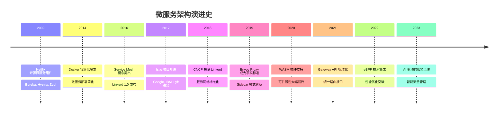
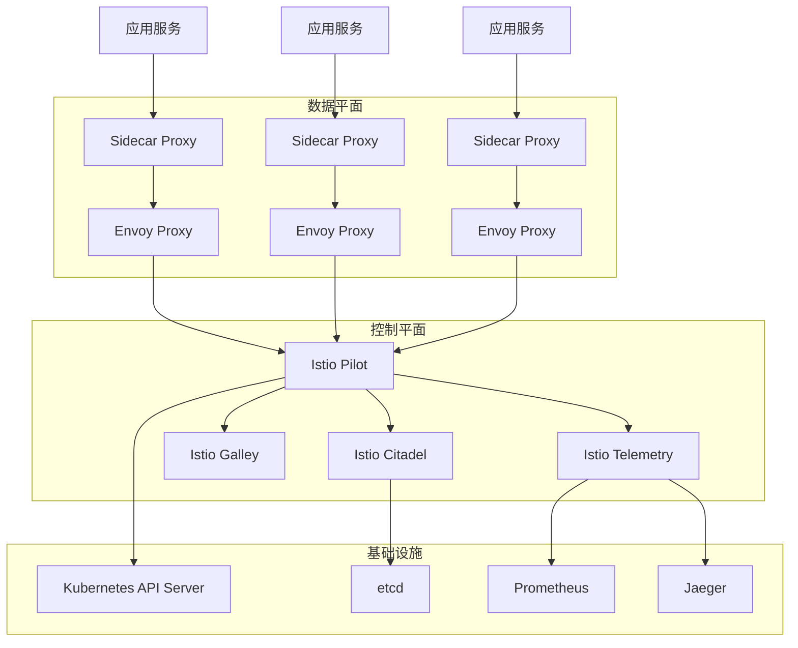
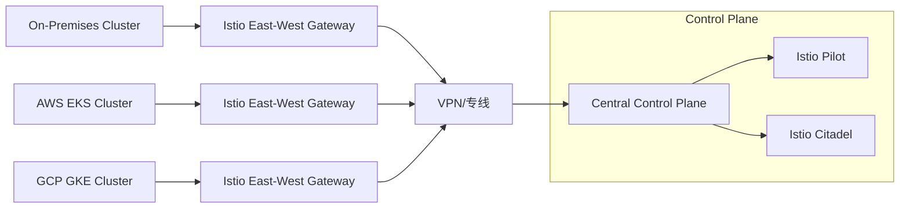

# 24 - 服务网格与微服务架构设计

## 概述

本文档深入探讨服务网格在 Kubernetes 环境中的架构设计、实现模式和最佳实践，涵盖 Istio、Linkerd 等主流服务网格技术，为企业微服务架构转型提供完整的技术指导。

---

## 一、服务网格架构全景

### 1.1 微服务演进历程



### 1.2 服务网格核心组件架构



### 1.3 Sidecar 模式详解

#### Sidecar 注入机制
```yaml
# Sidecar 自动注入配置
apiVersion: admissionregistration.k8s.io/v1
kind: MutatingWebhookConfiguration
metadata:
  name: sidecar-injector-webhook
webhooks:
- name: sidecar-injector.istio.io
  clientConfig:
    service:
      name: istiod
      namespace: istio-system
      path: "/inject"
  rules:
  - operations: ["CREATE"]
    apiGroups: [""]
    apiVersions: ["v1"]
    resources: ["pods"]
  namespaceSelector:
    matchLabels:
      istio-injection: enabled
```

#### Sidecar 配置模板
```yaml
# Sidecar 注入模板
spec:
  initContainers:
  - name: istio-init
    image: docker.io/istio/proxyv2:1.18.0
    args:
    - istio-iptables
    - -p
    - "15001"
    - -z
    - "15006"
    - -u
    - "1337"
    - -m
    - REDIRECT
    - -i
    - "*"
    - -x
    - ""
    - -b
    - "*"
    - -d
    - "15090,15021,15020"
    securityContext:
      allowPrivilegeEscalation: false
      runAsNonRoot: false
      runAsUser: 0
      capabilities:
        add:
        - NET_ADMIN
        - NET_RAW
        drop:
        - ALL

  containers:
  - name: istio-proxy
    image: docker.io/istio/proxyv2:1.18.0
    ports:
    - containerPort: 15090
      protocol: TCP
      name: http-envoy-prom
    args:
    - proxy
    - sidecar
    - --domain
    - $(POD_NAMESPACE).svc.cluster.local
    - --proxyLogLevel=warning
    - --proxyComponentLogLevel=misc:error
    - --log_output_level=default:info
    env:
    - name: JWT_POLICY
      value: third-party-jwt
    - name: PILOT_CERT_PROVIDER
      value: istiod
    - name: CA_ADDR
      value: istiod.istio-system.svc:15012
    - name: POD_NAME
      valueFrom:
        fieldRef:
          fieldPath: metadata.name
    - name: POD_NAMESPACE
      valueFrom:
        fieldRef:
          fieldPath: metadata.namespace
    - name: INSTANCE_IP
      valueFrom:
        fieldRef:
          fieldPath: status.podIP
    - name: SERVICE_ACCOUNT
      valueFrom:
        fieldRef:
          fieldPath: spec.serviceAccountName
    - name: HOST_IP
      valueFrom:
        fieldRef:
          fieldPath: status.hostIP
    - name: PROXY_CONFIG
      value: |
        {}
    - name: ISTIO_META_POD_PORTS
      value: |-
        [
            {"name":"http","containerPort":8080,"protocol":"TCP"}
        ]
    - name: ISTIO_META_APP_CONTAINERS
      value: app-container
    - name: ISTIO_META_CLUSTER_ID
      value: Kubernetes
    - name: ISTIO_META_NODE_NAME
      valueFrom:
        fieldRef:
          fieldPath: spec.nodeName
    - name: ISTIO_META_INTERCEPTION_MODE
      value: REDIRECT
    volumeMounts:
    - name: workload-socket
      mountPath: /var/run/secrets/workload-spiffe-uds
    - name: credential-socket
      mountPath: /var/run/secrets/credential-uds
    - name: workload-certs
      mountPath: /var/run/secrets/workload-spiffe-credentials
    - name: istiod-ca-cert
      mountPath: /var/run/secrets/istio
    - name: istio-envoy
      mountPath: /etc/istio/proxy
    - name: istio-data
      mountPath: /var/lib/istio/data
    resources:
      limits:
        cpu: "2"
        memory: 1Gi
      requests:
        cpu: 100m
        memory: 128Mi
```

---

## 二、Istio 核心功能深度解析

### 2.1 流量管理架构

#### VirtualService 配置模式
```yaml
# 复杂路由配置示例
apiVersion: networking.istio.io/v1beta1
kind: VirtualService
metadata:
  name: bookinfo
  namespace: default
spec:
  hosts:
  - bookinfo.example.com
  gateways:
  - bookinfo-gateway
  http:
  # 金丝雀发布路由
  - match:
    - headers:
        user-agent:
          regex: '.*Firefox.*'
    route:
    - destination:
        host: reviews
        subset: v2
      weight: 100
    retries:
      attempts: 3
      perTryTimeout: 2s
      
  # 基于用户身份的路由
  - match:
    - headers:
        end-user:
          exact: jason
    route:
    - destination:
        host: reviews
        subset: v2
    fault:
      delay:
        percentage:
          value: 100.0
        fixedDelay: 7s
        
  # 默认路由
  - route:
    - destination:
        host: reviews
        subset: v1
      weight: 80
    - destination:
        host: reviews
        subset: v2
      weight: 20
    timeout: 5s
    retries:
      attempts: 3
      perTryTimeout: 2s
      retryOn: connect-failure,refused-stream
      
  # 故障注入测试
  - match:
    - uri:
        prefix: /fault
    fault:
      abort:
        percentage:
          value: 50.0
        httpStatus: 503
    route:
    - destination:
        host: ratings
```

#### DestinationRule 服务策略
```yaml
# 服务级别策略配置
apiVersion: networking.istio.io/v1beta1
kind: DestinationRule
metadata:
  name: reviews
  namespace: default
spec:
  host: reviews
  trafficPolicy:
    # 负载均衡策略
    loadBalancer:
      simple: LEAST_CONN
    # 连接池设置
    connectionPool:
      tcp:
        maxConnections: 100
        connectTimeout: 30ms
      http:
        http1MaxPendingRequests: 1000
        http2MaxRequests: 1000
        maxRequestsPerConnection: 10
        maxRetries: 3
    # 熔断器配置
    outlierDetection:
      consecutive5xxErrors: 7
      interval: 5m
      baseEjectionTime: 15m
    # TLS 设置
    tls:
      mode: ISTIO_MUTUAL
      
  subsets:
  # 版本子集
  - name: v1
    labels:
      version: v1
    trafficPolicy:
      loadBalancer:
        simple: ROUND_ROBIN
        
  - name: v2
    labels:
      version: v2
    trafficPolicy:
      loadBalancer:
        simple: LEAST_REQUEST
      connectionPool:
        http:
          http2MaxRequests: 2000
```

### 2.2 安全架构设计

#### 认证与授权策略
```yaml
# PeerAuthentication mTLS 配置
apiVersion: security.istio.io/v1beta1
kind: PeerAuthentication
metadata:
  name: default
  namespace: istio-system
spec:
  mtls:
    mode: STRICT

---
# RequestAuthentication JWT 验证
apiVersion: security.istio.io/v1beta1
kind: RequestAuthentication
metadata:
  name: jwt-example
  namespace: default
spec:
  selector:
    matchLabels:
      app: httpbin
  jwtRules:
  - issuer: "https://dev-123456.okta.com"
    jwksUri: "https://dev-123456.okta.com/oauth2/default/v1/keys"
    audiences:
    - "api://default"
    forwardOriginalToken: true

---
# AuthorizationPolicy 访问控制
apiVersion: security.istio.io/v1beta1
kind: AuthorizationPolicy
metadata:
  name: httpbin
  namespace: default
spec:
  selector:
    matchLabels:
      app: httpbin
  rules:
  - from:
    - source:
        principals: ["cluster.local/ns/default/sa/bookinfo-productpage"]
        requestPrincipals: ["*"]
    to:
    - operation:
        methods: ["GET"]
        paths: ["/info*"]
    when:
    - key: request.auth.claims[groups]
      values: ["admin"]
  - from:
    - source:
        ipBlocks: ["10.0.0.0/8"]
    to:
    - operation:
        methods: ["POST"]
        paths: ["/data"]
    when:
    - key: request.headers[x-api-key]
      values: ["secret-key-123"]
```

#### 证书管理自动化
```yaml
# 自定义 CA 集成
apiVersion: cert-manager.io/v1
kind: Certificate
metadata:
  name: istio-certs
  namespace: istio-system
spec:
  secretName: istiod-tls
  duration: 2160h  # 90天
  renewBefore: 360h  # 15天提前续签
  subject:
    organizations:
      - example.com
  commonName: istiod.istio-system.svc
  dnsNames:
    - istiod.istio-system.svc
    - istiod.istio-system.svc.cluster.local
  issuerRef:
    name: vault-issuer
    kind: ClusterIssuer
```

### 2.3 可观测性体系

#### 分布式追踪配置
```yaml
# 追踪采样策略
apiVersion: telemetry.istio.io/v1alpha1
kind: Telemetry
metadata:
  name: mesh-default
  namespace: istio-system
spec:
  tracing:
  - providers:
    - name: otel
    randomSamplingPercentage: 100.0
    customTags:
      cluster_id:
        literal:
          value: "kubernetes-cluster-1"
      pod_name:
        environment:
          name: HOSTNAME
      namespace:
        environment:
          name: MY_POD_NAMESPACE
    disableSpanReporting: false
```

#### 指标收集优化
```yaml
# 自定义指标配置
apiVersion: telemetry.istio.io/v1alpha1
kind: Telemetry
metadata:
  name: custom-metrics
  namespace: default
spec:
  metrics:
  - providers:
    - name: prometheus
    overrides:
    - match:
        metric: REQUEST_COUNT
      tagOverrides:
        request_operation:
          value: "string(destination.service.name)"
        grpc_status:
          value: "string(response.grpc_status)"
    - match:
        metric: REQUEST_DURATION
      tagOverrides:
        response_flags:
          value: "string(response.flags)"
```

---

## 三、服务网格部署模式

### 3.1 多集群服务网格

#### 跨集群服务发现
```yaml
# 多集群配置
apiVersion: networking.istio.io/v1beta1
kind: ServiceEntry
metadata:
  name: external-svc
  namespace: istio-system
spec:
  hosts:
  - external-service.example.com
  location: MESH_EXTERNAL
  ports:
  - number: 80
    name: http
    protocol: HTTP
  resolution: DNS
  endpoints:
  - address: 10.0.0.1
    locality: us-east-1/zone-a
  - address: 10.0.0.2
    locality: us-west-1/zone-b
```

#### 集群间流量管理
```yaml
# 多集群路由配置
apiVersion: networking.istio.io/v1beta1
kind: VirtualService
metadata:
  name: multicluster-routing
  namespace: istio-system
spec:
  hosts:
  - "*.local"
  http:
  - match:
    - sourceLabels:
        cluster: cluster-1
    route:
    - destination:
        host: productpage.cluster-1.svc.cluster.local
      weight: 90
    - destination:
        host: productpage.cluster-2.svc.cluster.local
      weight: 10
      
  - match:
    - sourceLabels:
        cluster: cluster-2
    route:
    - destination:
        host: productpage.cluster-2.svc.cluster.local
      weight: 90
    - destination:
        host: productpage.cluster-1.svc.cluster.local
      weight: 10
```

### 3.2 混合云服务网格

#### 多云连接架构


#### 安全连接配置
```yaml
# 多云安全配置
apiVersion: networking.istio.io/v1beta1
kind: Gateway
metadata:
  name: eastwest-gateway
  namespace: istio-system
spec:
  selector:
    istio: eastwestgateway
  servers:
  - port:
      number: 15443
      name: tls
      protocol: TLS
    tls:
      mode: AUTO_PASSTHROUGH
    hosts:
    - "*.local"
    
---
apiVersion: networking.istio.io/v1beta1
kind: DestinationRule
metadata:
  name: eastwest-gateway
  namespace: istio-system
spec:
  host: istio-eastwestgateway.istio-system.svc.cluster.local
  trafficPolicy:
    portLevelSettings:
    - port:
        number: 15443
      tls:
        mode: ISTIO_MUTUAL
        sni: "*.local"
```

---

## 四、高级服务治理模式

### 4.1 智能路由策略

#### 基于延迟的路由
```yaml
# 延迟感知路由
apiVersion: networking.istio.io/v1beta1
kind: VirtualService
metadata:
  name: latency-based-routing
  namespace: default
spec:
  hosts:
  - recommendation-service
  http:
  # 优先路由到低延迟实例
  - match:
    - headers:
        x-user-tier:
          exact: "premium"
    route:
    - destination:
        host: recommendation-v1
      weight: 70
    - destination:
        host: recommendation-v2
      weight: 30
    headers:
      response:
        set:
          x-routing-strategy: "latency-based-premium"
          
  # 标准用户按地域路由
  - match:
    - headers:
        x-region:
          exact: "us-east"
    route:
    - destination:
        host: recommendation-us-east
      weight: 100
      
  # 默认路由
  - route:
    - destination:
        host: recommendation-v1
      weight: 60
    - destination:
        host: recommendation-v2
      weight: 40
```

#### 故障恢复策略
```yaml
# 高级故障恢复配置
apiVersion: networking.istio.io/v1beta1
kind: VirtualService
metadata:
  name: resilient-service
  namespace: default
spec:
  hosts:
  - backend-service
  http:
  - route:
    - destination:
        host: backend-primary
      weight: 90
    - destination:
        host: backend-secondary
      weight: 10
    retries:
      attempts: 3
      perTryTimeout: 2s
      retryOn: connect-failure,refused-stream,cancelled,deadline-exceeded
    timeout: 10s
    fault:
      delay:
        percentage:
          value: 0.1
        fixedDelay: 5s
      abort:
        percentage:
          value: 0.1
        httpStatus: 503
```

### 4.2 服务级别目标 (SLO) 管理

#### SLO 监控配置
```yaml
# SLO 定义和监控
apiVersion: monitoring.coreos.com/v1
kind: PrometheusRule
metadata:
  name: service-slos
  namespace: monitoring
spec:
  groups:
  - name: service-slos.rules
    rules:
    # 可用性 SLO (99.9%)
    - record: service:availability_30d
      expr: |
        sum(rate(istio_requests_total{reporter="destination",response_code!~"5.."}[30d]))
        /
        sum(rate(istio_requests_total{reporter="destination"}[30d]))
        
    # 延迟 SLO (95% 请求 < 200ms)
    - record: service:latency_95p_30d
      expr: |
        histogram_quantile(0.95, 
          sum(rate(istio_request_duration_milliseconds_bucket{reporter="destination"}[30d])) 
          by (le, service)
        )
        
    # 错误预算告警
    - alert: ServiceErrorBudgetBurn
      expr: |
        (1 - service:availability_30d) > (1 - 0.999) * 14.4
      for: 5m
      labels:
        severity: critical
      annotations:
        summary: "Service error budget burning too fast"
        description: "Availability is {{ $value }}%, below SLO threshold"
```

### 4.3 服务目录与治理

#### 服务注册发现
```yaml
# 服务目录配置
apiVersion: networking.istio.io/v1beta1
kind: ServiceEntry
metadata:
  name: external-apis
  namespace: default
spec:
  hosts:
  - api.external-service.com
  ports:
  - number: 443
    name: https
    protocol: HTTPS
  location: MESH_EXTERNAL
  resolution: DNS
  endpoints:
  - address: api.external-service.com
    ports:
      https: 443
    labels:
      version: v1
      environment: production
      tier: external-api
      
---
# 服务健康检查
apiVersion: networking.istio.io/v1beta1
kind: WorkloadEntry
metadata:
  name: external-workload
  namespace: default
spec:
  address: 10.0.0.1
  ports:
    http: 8080
  labels:
    app: external-service
    version: v1
  serviceAccount: external-service-sa
```

---

## 五、性能优化与调优

### 5.1 网格性能基准测试

#### 基准测试配置
```yaml
# 性能测试环境配置
apiVersion: apps/v1
kind: Deployment
metadata:
  name: fortio-client
  namespace: perf-test
spec:
  replicas: 3
  selector:
    matchLabels:
      app: fortio-client
  template:
    metadata:
      labels:
        app: fortio-client
        version: perf-v1
    spec:
      containers:
      - name: fortio
        image: fortio/fortio:latest
        command:
        - /usr/bin/fortio
        - load
        - -c
        - "50"
        - -qps
        - "1000"
        - -t
        - "300s"
        - -payload-size
        - "1024"
        - http://target-service:8080/
        resources:
          requests:
            cpu: 2
            memory: 2Gi
          limits:
            cpu: 4
            memory: 4Gi
```

#### 性能指标收集
```yaml
# 性能监控配置
apiVersion: telemetry.istio.io/v1alpha1
kind: Telemetry
metadata:
  name: performance-telemetry
  namespace: istio-system
spec:
  metrics:
  - providers:
    - name: prometheus
    overrides:
    - match:
        metric: REQUEST_DURATION
      tagOverrides:
        source_workload:
          operation: UPSERT
        destination_workload:
          operation: UPSERT
        response_code:
          operation: UPSERT
    - match:
        metric: REQUEST_BYTES
      tagOverrides:
        source_workload:
          operation: UPSERT
        destination_workload:
          operation: UPSERT
```

### 5.2 资源优化配置

#### Sidecar 资源调优
```yaml
# Sidecar 资源优化配置
apiVersion: v1
kind: ConfigMap
metadata:
  name: istio-sidecar-injector
  namespace: istio-system
data:
  values: |-
    global:
      proxy:
        resources:
          requests:
            cpu: 50m
            memory: 64Mi
          limits:
            cpu: 500m
            memory: 256Mi
        logLevel: warning
        componentLogLevel: misc:error
        concurrency: 2
        drainDuration: 45s
        parentShutdownDuration: 1m0s
        proxyAdminPort: 15000
        proxyLogLevel: warning
        statusPort: 15020
        tracer: zipkin
```

#### Envoy 优化参数
```yaml
# Envoy 高级配置
apiVersion: networking.istio.io/v1alpha3
kind: EnvoyFilter
metadata:
  name: proxy-config
  namespace: istio-system
spec:
  configPatches:
  - applyTo: NETWORK_FILTER
    match:
      context: SIDECAR_OUTBOUND
      listener:
        filterChain:
          filter:
            name: "envoy.filters.network.tcp_proxy"
    patch:
      operation: MERGE
      value:
        typed_config:
          "@type": "type.googleapis.com/envoy.extensions.filters.network.tcp_proxy.v3.TcpProxy"
          stat_prefix: outbound_tcp
          cluster: outbound|80||
          idle_timeout: 300s
          
  - applyTo: HTTP_FILTER
    match:
      context: SIDECAR_INBOUND
      listener:
        filterChain:
          filter:
            name: "envoy.filters.network.http_connection_manager"
    patch:
      operation: INSERT_FIRST
      value:
        name: envoy.filters.http.adaptive_concurrency
        typed_config:
          "@type": "type.googleapis.com/envoy.extensions.filters.http.adaptive_concurrency.v3.AdaptiveConcurrency"
          gradient_controller_config:
            sample_aggregate_percentile:
              value: 95
            jitter:
              value: 0.1
```

---

## 六、服务网格最佳实践

### 6.1 渐进式采用策略

#### 分阶段部署路线图
```yaml
adoption_phases:
  phase_1_evaluation:
    duration: "1-2 months"
    scope: "非关键业务服务"
    objectives:
      - 技术可行性验证
      - 性能基准测试
      - 团队技能培养
    success_criteria:
      - 无明显性能下降
      - 故障恢复时间缩短
      - 团队掌握基本操作
      
  phase_2_pilot:
    duration: "2-3 months"
    scope: "部分核心服务"
    objectives:
      - 生产环境验证
      - 监控告警完善
      - 运维流程建立
    success_criteria:
      - SLA 指标达标
      - 运维成本可控
      - 故障处理流程成熟
      
  phase_3_scale:
    duration: "3-6 months"
    scope: "全量服务网格化"
    objectives:
      - 全面服务治理
      - 高级功能启用
      - 自动化运维
    success_criteria:
      - 服务间通信标准化
      - 运维效率提升 50%+
      - 故障平均恢复时间 < 5分钟
```

### 6.2 安全加固指南

#### 零信任网络实现
```yaml
# 零信任安全配置
apiVersion: security.istio.io/v1beta1
kind: AuthorizationPolicy
metadata:
  name: zero-trust-policy
  namespace: default
spec:
  action: ALLOW
  rules:
  # 服务到服务认证
  - from:
    - source:
        principals: ["cluster.local/ns/*/sa/*"]
    to:
    - operation:
        ports: ["8080"]
    when:
    - key: request.auth.principal
      notValues: ["*"]
      
  # 用户访问控制
  - from:
    - source:
        requestPrincipals: ["*"]
    to:
    - operation:
        methods: ["GET", "POST"]
        paths: ["/api/*"]
    when:
    - key: request.auth.claims[scope]
      values: ["api-access"]
      
  # 管理员访问
  - from:
    - source:
        requestPrincipals: ["admin@company.com"]
    to:
    - operation:
        methods: ["*"]
        paths: ["/*"]
```

### 6.3 运维管理最佳实践

#### 自动化运维配置
```yaml
# 自动化运维策略
automation_policies:
  auto_scaling:
    horizontal_pod_autoscaler:
      min_replicas: 2
      max_replicas: 20
      target_cpu_utilization_percentage: 70
      
  auto_healing:
    readiness_probe:
      initial_delay_seconds: 10
      period_seconds: 5
      timeout_seconds: 3
      failure_threshold: 3
      
    liveness_probe:
      initial_delay_seconds: 60
      period_seconds: 30
      timeout_seconds: 5
      failure_threshold: 3
      
  auto_update:
    rollout_strategy:
      type: RollingUpdate
      rollingUpdate:
        maxSurge: 25%
        maxUnavailable: 25%
        
  auto_cleanup:
    revision_history_limit: 10
    termination_grace_period_seconds: 30
```

#### 监控告警体系
```yaml
# 核心监控告警规则
alerting_rules:
  service_mesh_alerts:
    - name: HighErrorRate
      expr: |
        sum(rate(istio_requests_total{response_code=~"5.."}[5m])) 
        / 
        sum(rate(istio_requests_total[5m])) > 0.05
      for: 5m
      labels:
        severity: critical
      annotations:
        summary: "High error rate detected in service mesh"
        
    - name: HighLatency
      expr: |
        histogram_quantile(0.99, 
          rate(istio_request_duration_milliseconds_bucket[5m])
        ) > 1000
      for: 10m
      labels:
        severity: warning
      annotations:
        summary: "High latency detected in service mesh"
        
    - name: CircuitBreakerTripped
      expr: |
        sum(rate(istio_requests_total{response_code="503"}[5m])) > 10
      for: 2m
      labels:
        severity: critical
      annotations:
        summary: "Circuit breaker tripped"
```

---

## 七、未来发展与趋势

### 7.1 新兴技术集成

#### WebAssembly 插件生态
```yaml
# WASM 插件配置示例
apiVersion: extensions.istio.io/v1alpha1
kind: WasmPlugin
metadata:
  name: custom-auth-plugin
  namespace: istio-system
spec:
  selector:
    matchLabels:
      istio: ingressgateway
  url: oci://registry/company/wasm-plugins/custom-auth:1.0.0
  phase: AUTHN
  priority: 1000
  pluginConfig:
    auth_server: "https://auth.company.com"
    timeout: "5s"
    cache_ttl: "300s"
```

#### eBPF 技术融合
```yaml
# Cilium Service Mesh 配置
apiVersion: cilium.io/v2
kind: CiliumClusterwideNetworkPolicy
metadata:
  name: service-mesh-policy
spec:
  endpointSelector:
    matchLabels:
      io.kubernetes.pod.namespace: default
  egress:
  - toEndpoints:
    - matchLabels:
        app: backend-service
    toPorts:
    - ports:
      - port: "8080"
        protocol: TCP
      rules:
        http:
        - method: "GET"
          path: "/api/*"
        - method: "POST"
          path: "/api/data"
```

### 7.2 AI 驱动的服务治理

#### 智能流量管理
```python
# AI 驱动的流量路由决策
class AITrafficRouter:
    def __init__(self):
        self.ml_model = self.load_model()
        self.metrics_collector = MetricsCollector()
        
    def predict_optimal_route(self, request_context: RequestContext) -> RouteDecision:
        # 收集实时指标
        metrics = self.metrics_collector.get_service_metrics()
        
        # 特征工程
        features = self.extract_features(request_context, metrics)
        
        # ML 模型预测
        prediction = self.ml_model.predict(features)
        
        # 生成路由决策
        return RouteDecision(
            destination_service=prediction['service'],
            weight_distribution=prediction['weights'],
            timeout=prediction['timeout'],
            retry_policy=prediction['retry']
        )
    
    def extract_features(self, context: RequestContext, metrics: dict) -> np.ndarray:
        features = []
        
        # 用户特征
        features.extend([
            context.user_tier.value,
            context.geolocation.lat,
            context.geolocation.lon
        ])
        
        # 服务特征
        for service in metrics['services']:
            features.extend([
                service['latency_95p'],
                service['error_rate'],
                service['cpu_usage'],
                service['memory_usage']
            ])
            
        return np.array(features)
```

---