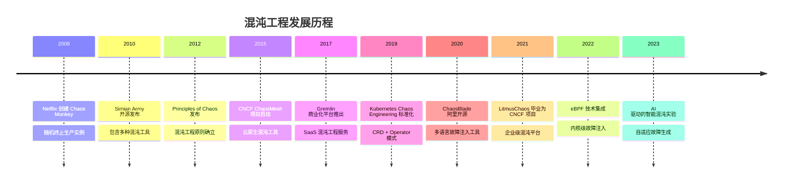
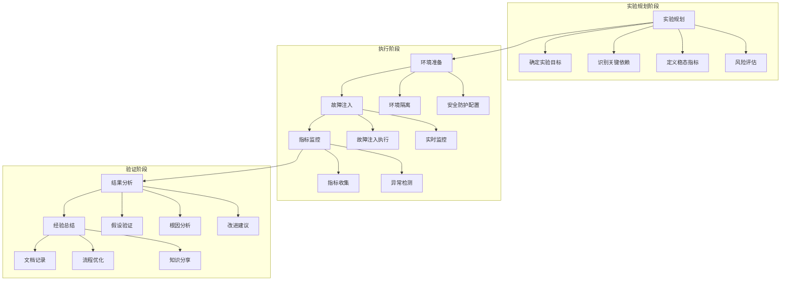

# 25 - 混沌工程与故障注入设计

## 概述

本文档深入探讨混沌工程在 Kubernetes 环境中的实践方法，涵盖故障注入技术、实验设计原则和系统韧性验证，为企业构建高可用分布式系统提供科学的工程方法论。

---

## 一、混沌工程理论基础

### 1.1 混沌工程发展史



### 1.2 混沌工程核心原则

#### 混沌实验四原则
```yaml
chaos_engineering_principles:
  principle_1_hypothesis_driven:
    description: "基于假设的科学实验方法"
    practice:
      - 明确实验假设
      - 定义可衡量的稳态指标
      - 设计对照实验
    example: "假设：订单服务单节点故障不会影响整体下单成功率 > 99.5%"
    
  principle_2_real_world_conditions:
    description: "在生产环境中进行真实故障模拟"
    practice:
      - 使用真实的生产流量
      - 模拟真实的故障场景
      - 避免人工构造的理想环境
    example: "模拟网络分区而不是简单的服务停机"
    
  principle_3_automated_execution:
    description: "自动化实验执行和验证"
    practice:
      - 自动化故障注入
      - 自动化指标收集
      - 自动化结果验证
    example: "CI/CD 流水线集成混沌实验"
    
  principle_4_minimize_blast_radius:
    description: "控制实验影响范围"
    practice:
      - 渐进式实验扩大
      - 快速回滚机制
      - 安全防护措施
    example: "先在单个 Pod 进行实验，再扩展到服务级别"
```

### 1.3 混沌实验生命周期



---

## 二、Kubernetes 故障注入技术

### 2.1 Pod 级别故障注入

#### Pod 杀手实现
```go
// Pod 杀手控制器
type PodKiller struct {
    client    client.Client
    recorder  record.EventRecorder
    scheduler *fault.Scheduler
}

func (pk *PodKiller) InjectPodFailure(ctx context.Context, experiment *chaosv1alpha1.PodChaos) error {
    log := log.FromContext(ctx)
    
    // 1. 验证实验配置
    if err := pk.validateExperiment(experiment); err != nil {
        return fmt.Errorf("experiment validation failed: %w", err)
    }
    
    // 2. 选择目标 Pod
    targetPods, err := pk.selectTargetPods(ctx, experiment)
    if err != nil {
        return fmt.Errorf("failed to select target pods: %w", err)
    }
    
    // 3. 执行故障注入
    results := make([]FaultResult, len(targetPods))
    var wg sync.WaitGroup
    
    for i, pod := range targetPods {
        wg.Add(1)
        go func(idx int, targetPod corev1.Pod) {
            defer wg.Done()
            results[idx] = pk.injectSinglePodFailure(ctx, experiment, targetPod)
        }(i, pod)
    }
    
    wg.Wait()
    
    // 4. 记录实验结果
    return pk.recordResults(ctx, experiment, results)
}

func (pk *PodKiller) injectSinglePodFailure(ctx context.Context, exp *chaosv1alpha1.PodChaos, pod corev1.Pod) FaultResult {
    result := FaultResult{
        PodName:      pod.Name,
        Namespace:    pod.Namespace,
        StartTime:    time.Now(),
        Injected:     false,
        ErrorMessage: "",
    }
    
    switch exp.Spec.Action {
    case chaosv1alpha1.PodKillAction:
        result.ErrorMessage = pk.killPod(ctx, &pod)
        result.Injected = (result.ErrorMessage == "")
        
    case chaosv1alpha1.PodFailureAction:
        result.ErrorMessage = pk.failPod(ctx, &pod, exp.Spec.Duration)
        result.Injected = (result.ErrorMessage == "")
        
    case chaosv1alpha1.ContainerKillAction:
        result.ErrorMessage = pk.killContainer(ctx, &pod, exp.Spec.ContainerNames)
        result.Injected = (result.ErrorMessage == "")
    }
    
    result.EndTime = time.Now()
    return result
}

func (pk *PodKiller) killPod(ctx context.Context, pod *corev1.Pod) string {
    // 优雅删除 Pod
    gracePeriod := int64(30)
    if err := pk.client.Delete(ctx, pod, &client.DeleteOptions{
        GracePeriodSeconds: &gracePeriod,
    }); err != nil {
        return fmt.Sprintf("failed to delete pod: %v", err)
    }
    return ""
}
```

#### Pod 故障 CRD 定义
```yaml
# PodChaos CRD 定义
apiVersion: chaos-mesh.org/v1alpha1
kind: PodChaos
metadata:
  name: pod-kill-example
  namespace: chaos-testing
spec:
  action: pod-kill
  mode: one
  selector:
    namespaces:
      - default
    labelSelectors:
      app: web-server
    podPhaseSelectors:
      - Running
  scheduler:
    cron: "@every 10m"
  duration: 30s
  gracePeriod: 0
```

### 2.2 网络故障注入

#### 网络延迟和丢包
```go
// 网络故障注入器
type NetworkChaosInjector struct {
    client   client.Client
    executor *CommandExecutor
}

func (nci *NetworkChaosInjector) InjectNetworkFault(ctx context.Context, experiment *chaosv1alpha1.NetworkChaos) error {
    // 1. 获取目标 Pod
    targetPods, err := nci.getTargetPods(ctx, experiment)
    if err != nil {
        return err
    }
    
    // 2. 在每个 Pod 中执行网络故障
    for _, pod := range targetPods {
        if err := nci.injectNetworkChaos(ctx, pod, experiment); err != nil {
            return fmt.Errorf("failed to inject network chaos on pod %s: %w", pod.Name, err)
        }
    }
    
    return nil
}

func (nci *NetworkChaosInjector) injectNetworkChaos(ctx context.Context, pod corev1.Pod, exp *chaosv1alpha1.NetworkChaos) error {
    // 进入 Pod 网络命名空间
    cmd := []string{
        "nsenter",
        "-t", "1",
        "-n",
        "--",
    }
    
    switch exp.Spec.Action {
    case chaosv1alpha1.DelayAction:
        return nci.injectNetworkDelay(ctx, cmd, exp.Spec.Delay)
        
    case chaosv1alpha1.LossAction:
        return nci.injectPacketLoss(ctx, cmd, exp.Spec.Loss)
        
    case chaosv1alpha1.DuplicateAction:
        return nci.injectPacketDuplication(ctx, cmd, exp.Spec.Duplicate)
        
    case chaosv1alpha1.CorruptAction:
        return nci.injectPacketCorruption(ctx, cmd, exp.Spec.Corrupt)
        
    case chaosv1alpha1.PartitionAction:
        return nci.injectNetworkPartition(ctx, cmd, exp.Spec.Partition)
    }
    
    return nil
}

func (nci *NetworkChaosInjector) injectNetworkDelay(ctx context.Context, baseCmd []string, delay *chaosv1alpha1.DelaySpec) error {
    cmd := append(baseCmd, "tc", "qdisc", "add", "dev", "eth0", "root", "netem")
    
    if delay.Latency != "" {
        cmd = append(cmd, "delay", delay.Latency)
    }
    
    if delay.Jitter != "" {
        cmd = append(cmd, delay.Jitter)
    }
    
    if delay.Correlation != "" {
        cmd = append(cmd, "correlation", delay.Correlation)
    }
    
    return nci.executor.Execute(ctx, cmd)
}
```

#### 网络故障 CRD 配置
```yaml
# 网络延迟故障
apiVersion: chaos-mesh.org/v1alpha1
kind: NetworkChaos
metadata:
  name: network-delay-example
  namespace: chaos-testing
spec:
  action: delay
  mode: all
  selector:
    namespaces:
      - default
    labelSelectors:
      app: payment-service
  delay:
    latency: 300ms
    jitter: 50ms
    correlation: "25"
  duration: 2m
  scheduler:
    cron: "0 */30 * * * *"
```

### 2.3 资源故障注入

#### CPU/Memory 压力测试
```go
// 资源压力注入器
type StressChaosInjector struct {
    client   client.Client
    executor *CommandExecutor
}

func (sci *StressChaosInjector) InjectResourceStress(ctx context.Context, experiment *chaosv1alpha1.StressChaos) error {
    targetPods, err := sci.getTargetPods(ctx, experiment)
    if err != nil {
        return err
    }
    
    stressCmd := sci.buildStressCommand(experiment.Spec.Stressors)
    
    for _, pod := range targetPods {
        if err := sci.injectStress(ctx, pod, stressCmd, experiment.Spec.Duration); err != nil {
            return fmt.Errorf("failed to inject stress on pod %s: %w", pod.Name, err)
        }
    }
    
    return nil
}

func (sci *StressChaosInjector) buildStressCommand(stressors chaosv1alpha1.Stressors) []string {
    var cmd []string
    
    // CPU 压力
    if stressors.CPU != nil {
        cmd = append(cmd, "stress-ng")
        cmd = append(cmd, "--cpu", fmt.Sprintf("%d", stressors.CPU.Workers))
        
        if stressors.CPU.Load != nil {
            cmd = append(cmd, "--cpu-load", fmt.Sprintf("%d", *stressors.CPU.Load))
        }
        
        if stressors.CPU.Options != nil {
            cmd = append(cmd, stressors.CPU.Options...)
        }
    }
    
    // 内存压力
    if stressors.Memory != nil {
        if len(cmd) == 0 {
            cmd = append(cmd, "stress-ng")
        }
        
        cmd = append(cmd, "--vm", fmt.Sprintf("%d", stressors.Memory.Workers))
        cmd = append(cmd, "--vm-bytes", stressors.Memory.Size)
        
        if stressors.Memory.Options != nil {
            cmd = append(cmd, stressors.Memory.Options...)
        }
    }
    
    return cmd
}
```

#### 资源压力 CRD 配置
```yaml
# CPU 压力测试
apiVersion: chaos-mesh.org/v1alpha1
kind: StressChaos
metadata:
  name: cpu-stress-test
  namespace: chaos-testing
spec:
  duration: 1m
  scheduler:
    cron: "@every 15m"
  mode: one
  selector:
    namespaces:
      - default
    labelSelectors:
      app: cpu-intensive-service
  stressors:
    cpu:
      workers: 4
      load: 80
      options: ["--timeout", "60s"]
```

---

## 三、混沌实验设计方法论

### 3.1 实验框架设计

#### 混沌实验 CRD 结构
```go
// 混沌实验核心结构
type ChaosExperiment struct {
    metav1.TypeMeta   `json:",inline"`
    metav1.ObjectMeta `json:"metadata,omitempty"`
    
    Spec   ChaosSpec   `json:"spec"`
    Status ChaosStatus `json:"status,omitempty"`
}

type ChaosSpec struct {
    // 实验基本信息
    Target     ChaosTarget     `json:"target"`
    Action     ChaosAction     `json:"action"`
    Duration   metav1.Duration `json:"duration,omitempty"`
    
    // 实验配置
    Configuration ChaosConfiguration `json:"configuration"`
    
    // 调度配置
    Schedule ChaosSchedule `json:"schedule,omitempty"`
    
    // 安全防护
    Safety ChaosSafety `json:"safety"`
}

type ChaosStatus struct {
    Phase          ExperimentPhase     `json:"phase"`
    StartTime      *metav1.Time       `json:"startTime,omitempty"`
    CompletionTime *metav1.Time       `json:"completionTime,omitempty"`
    Conditions     []ChaosCondition   `json:"conditions"`
    Statistics     ExperimentStats    `json:"statistics"`
}

// 稳态指标定义
type SteadyStateMetric struct {
    Name        string            `json:"name"`
    Query       string            `json:"query"`
    Threshold   float64           `json:"threshold"`
    Comparator  ComparisonOperator `json:"comparator"`
    Aggregation AggregationFunc   `json:"aggregation"`
}

type ComparisonOperator string
const (
    OpGreaterThan    ComparisonOperator = ">"
    OpLessThan       ComparisonOperator = "<"
    OpGreaterEqual   ComparisonOperator = ">="
    OpLessEqual      ComparisonOperator = "<="
    OpEqual          ComparisonOperator = "=="
    OpNotEqual       ComparisonOperator = "!="
)
```

### 3.2 实验场景库设计

#### 典型故障场景分类
```yaml
fault_scenarios_library:
  infrastructure_faults:
    node_failure:
      description: "模拟节点宕机或不可达"
      injection_methods:
        - drain_node
        - stop_kubelet
        - network_partition_node
      impact_analysis:
        - pod_eviction
        - service_disruption
        - data_loss_risk
        
    disk_failure:
      description: "模拟磁盘故障或满载"
      injection_methods:
        - fill_disk_space
        - corrupt_filesystem
        - io_throttling
      impact_analysis:
        - write_operation_failure
        - pod_crash_loop
        - persistent_volume_issues
        
    network_issues:
      description: "模拟各种网络故障"
      injection_methods:
        - packet_loss
        - network_delay
        - bandwidth_limitation
        - dns_failure
      impact_analysis:
        - service_communication_failure
        - timeout_errors
        - cascade_failures

  application_faults:
    process_crash:
      description: "模拟应用进程崩溃"
      injection_methods:
        - kill_process
        - segfault_injection
        - oom_kill_simulation
      impact_analysis:
        - service_unavailable
        - request_failure
        - automatic_recovery
        
    resource_exhaustion:
      description: "模拟资源耗尽场景"
      injection_methods:
        - cpu_saturation
        - memory_leak_simulation
        - file_descriptor_exhaustion
      impact_analysis:
        - performance_degradation
        - service_slowdown
        - cascading_failures
        
    dependency_failure:
      description: "模拟依赖服务故障"
      injection_methods:
        - downstream_service_timeout
        - upstream_service_error
        - database_connection_failure
      impact_analysis:
        - error_propagation
        - retry_mechanism_testing
        - circuit_breaker_activation
```

### 3.3 实验编排引擎

#### 实验工作流引擎
```go
// 实验编排器
type ExperimentOrchestrator struct {
    client          client.Client
    metricClient    metrics.Client
    notificationSvc NotificationService
    safetyGuard     SafetyGuard
}

func (eo *ExperimentOrchestrator) ExecuteExperiment(ctx context.Context, experiment *chaosv1alpha1.ChaosExperiment) error {
    log := log.FromContext(ctx)
    
    // 1. 预检和准备工作
    if err := eo.preFlightCheck(ctx, experiment); err != nil {
        return fmt.Errorf("preflight check failed: %w", err)
    }
    
    // 2. 建立稳态基线
    baseline, err := eo.establishBaseline(ctx, experiment)
    if err != nil {
        return fmt.Errorf("failed to establish baseline: %w", err)
    }
    
    // 3. 执行故障注入
    injectionResult, err := eo.injectFault(ctx, experiment)
    if err != nil {
        return fmt.Errorf("fault injection failed: %w", err)
    }
    
    // 4. 持续监控和验证
    validationResult, err := eo.validateHypothesis(ctx, experiment, baseline)
    if err != nil {
        return fmt.Errorf("hypothesis validation failed: %w", err)
    }
    
    // 5. 清理和恢复
    if err := eo.cleanup(ctx, experiment, injectionResult); err != nil {
        log.Error(err, "cleanup failed")
    }
    
    // 6. 生成实验报告
    report := eo.generateReport(experiment, baseline, injectionResult, validationResult)
    return eo.publishReport(ctx, report)
}

func (eo *ExperimentOrchestrator) establishBaseline(ctx context.Context, exp *chaosv1alpha1.ChaosExperiment) (*BaselineMetrics, error) {
    metrics := &BaselineMetrics{
        CollectionStartTime: time.Now(),
    }
    
    // 收集各项稳态指标
    for _, metric := range exp.Spec.SteadyState.Metrics {
        value, err := eo.metricClient.Query(ctx, metric.Query)
        if err != nil {
            return nil, fmt.Errorf("failed to collect metric %s: %w", metric.Name, err)
        }
        
        metrics.Values = append(metrics.Values, MetricValue{
            Name:  metric.Name,
            Value: value,
        })
    }
    
    metrics.CollectionEndTime = time.Now()
    return metrics, nil
}

func (eo *ExperimentOrchestrator) validateHypothesis(ctx context.Context, exp *chaosv1alpha1.ChaosExperiment, baseline *BaselineMetrics) (*ValidationResult, error) {
    result := &ValidationResult{
        StartTime: time.Now(),
    }
    
    ticker := time.NewTicker(exp.Spec.Validation.Interval.Duration)
    defer ticker.Stop()
    
    timeoutCtx, cancel := context.WithTimeout(ctx, exp.Spec.Duration.Duration)
    defer cancel()
    
    for {
        select {
        case <-ticker.C:
            validationResult, err := eo.performValidation(ctx, exp, baseline)
            if err != nil {
                return nil, err
            }
            
            result.Validations = append(result.Validations, validationResult)
            
            // 检查是否满足停止条件
            if eo.shouldStopValidation(validationResult) {
                result.EndTime = time.Now()
                return result, nil
            }
            
        case <-timeoutCtx.Done():
            result.EndTime = time.Now()
            result.Timeout = true
            return result, nil
        }
    }
}
```

---

## 四、安全防护与风险控制

### 4.1 安全防护机制

#### 实验安全守卫
```go
// 安全守卫系统
type SafetyGuard struct {
    client       client.Client
    alertClient  alerting.Client
    config       SafetyConfig
    safetyRules  []SafetyRule
}

type SafetyRule interface {
    Name() string
    Evaluate(context.Context, *chaosv1alpha1.ChaosExperiment) (bool, string)
}

// 核心安全规则实现
type SLABreachGuard struct{}

func (s *SLABreachGuard) Name() string {
    return "SLA_Breach_Detection"
}

func (s *SLABreachGuard) Evaluate(ctx context.Context, exp *chaosv1alpha1.ChaosExperiment) (bool, string) {
    // 检查关键 SLA 指标
    criticalMetrics := []string{
        "service_availability",
        "response_time_95p",
        "error_rate",
    }
    
    for _, metricName := range criticalMetrics {
        currentValue, err := s.getCurrentMetricValue(ctx, metricName)
        if err != nil {
            continue
        }
        
        threshold := s.getSLAThreshold(metricName)
        if s.isSLAViolated(currentValue, threshold) {
            return false, fmt.Sprintf("SLA violation detected: %s = %.2f, threshold = %.2f", 
                metricName, currentValue, threshold)
        }
    }
    
    return true, ""
}

type ResourceConsumptionGuard struct{}

func (r *ResourceConsumptionGuard) Name() string {
    return "Resource_Consumption_Limit"
}

func (r *ResourceConsumptionGuard) Evaluate(ctx context.Context, exp *chaosv1alpha1.ChaosExperiment) (bool, string) {
    // 检查资源使用情况
    nodeMetrics, err := r.getNodeResourceUsage(ctx)
    if err != nil {
        return false, fmt.Sprintf("failed to get node metrics: %v", err)
    }
    
    for nodeName, usage := range nodeMetrics {
        if usage.CPU > 0.8 || usage.Memory > 0.85 {
            return false, fmt.Sprintf("resource usage too high on node %s: CPU=%.2f, Memory=%.2f", 
                nodeName, usage.CPU, usage.Memory)
        }
    }
    
    return true, ""
}
```

#### 安全配置 CRD
```yaml
# 安全防护配置
apiVersion: chaos-mesh.org/v1alpha1
kind: ChaosSafety
metadata:
  name: production-safety-policy
  namespace: chaos-system
spec:
  # SLA 保护阈值
  slaProtection:
    availabilityThreshold: 99.9
    latencyThreshold: 500ms
    errorRateThreshold: 0.1%
    
  # 资源使用限制
  resourceLimits:
    maxCPUUsage: 80%
    maxMemoryUsage: 85%
    maxNetworkBandwidth: 1Gbps
    
  # 自动回滚条件
  autoRollback:
    enabled: true
    conditions:
      - metric: service_availability
        threshold: 99.5
        duration: 2m
      - metric: error_rate
        threshold: 5%
        duration: 1m
        
  # 通知配置
  notifications:
    onFailure:
      - webhook: https://alerts.company.com/chaos
      - email: sre-team@company.com
    onSuccess:
      - slack: "#chaos-experiments"
```

### 4.2 权限控制与审计

#### RBAC 权限模型
```yaml
# Chaos Engineering RBAC 配置
apiVersion: rbac.authorization.k8s.io/v1
kind: Role
metadata:
  name: chaos-experiment-runner
  namespace: chaos-testing
rules:
# 实验资源操作权限
- apiGroups: ["chaos-mesh.org"]
  resources: ["podchaos", "networkchaos", "stresschaos"]
  verbs: ["get", "list", "watch", "create", "update", "patch", "delete"]

# 目标资源读取权限
- apiGroups: [""]
  resources: ["pods", "services", "endpoints"]
  verbs: ["get", "list", "watch"]

# 事件记录权限
- apiGroups: [""]
  resources: ["events"]
  verbs: ["create", "patch"]

# 状态更新权限
- apiGroups: ["chaos-mesh.org"]
  resources: ["podchaos/status", "networkchaos/status"]
  verbs: ["update", "patch"]
---
apiVersion: rbac.authorization.k8s.io/v1
kind: RoleBinding
metadata:
  name: chaos-experiment-runner-binding
  namespace: chaos-testing
subjects:
- kind: ServiceAccount
  name: chaos-experiment-sa
  namespace: chaos-testing
roleRef:
  kind: Role
  name: chaos-experiment-runner
  apiGroup: rbac.authorization.k8s.io
```

#### 审计日志系统
```go
// 混沌实验审计系统
type ChaosAuditor struct {
    logger      logr.Logger
    eventClient client.Client
    storage     AuditStorage
}

type AuditEvent struct {
    Timestamp     time.Time              `json:"timestamp"`
    ExperimentID  string                 `json:"experimentId"`
    ActionType    string                 `json:"actionType"`
    Actor         string                 `json:"actor"`
    Target        string                 `json:"target"`
    Parameters    map[string]interface{} `json:"parameters"`
    Result        string                 `json:"result"`
    ErrorMessage  string                 `json:"errorMessage,omitempty"`
    Duration      time.Duration          `json:"duration"`
    ImpactMetrics map[string]float64     `json:"impactMetrics,omitempty"`
}

func (ca *ChaosAuditor) RecordExperimentStart(ctx context.Context, exp *chaosv1alpha1.ChaosExperiment) error {
    event := &AuditEvent{
        Timestamp:    time.Now(),
        ExperimentID: string(exp.UID),
        ActionType:   "EXPERIMENT_START",
        Actor:        ca.getCurrentUser(ctx),
        Target:       fmt.Sprintf("%s/%s", exp.Namespace, exp.Name),
        Parameters: map[string]interface{}{
            "target":   exp.Spec.Target,
            "action":   exp.Spec.Action,
            "duration": exp.Spec.Duration,
        },
    }
    
    return ca.logEvent(ctx, event)
}

func (ca *ChaosAuditor) RecordFaultInjection(ctx context.Context, exp *chaosv1alpha1.ChaosExperiment, result FaultInjectionResult) error {
    event := &AuditEvent{
        Timestamp:    time.Now(),
        ExperimentID: string(exp.UID),
        ActionType:   "FAULT_INJECTION",
        Actor:        "chaos-controller",
        Target:       result.Target,
        Parameters: map[string]interface{}{
            "faultType": result.FaultType,
            "severity":  result.Severity,
        },
        Result:        result.Success,
        ErrorMessage:  result.ErrorMessage,
        Duration:      result.Duration,
        ImpactMetrics: result.ImpactMetrics,
    }
    
    return ca.logEvent(ctx, event)
}
```

---

## 五、监控与可视化

### 5.1 实验监控仪表板

#### Grafana 仪表板配置
```json
{
  "dashboard": {
    "id": null,
    "title": "Chaos Engineering Dashboard",
    "timezone": "browser",
    "schemaVersion": 36,
    "version": 1,
    "panels": [
      {
        "type": "graph",
        "title": "Service Availability During Experiments",
        "datasource": "Prometheus",
        "targets": [
          {
            "expr": "avg_over_time(service_availability{job=\"chaos-experiment\"}[5m])",
            "legendFormat": "Availability (%)"
          }
        ],
        "thresholds": [
          {
            "colorMode": "critical",
            "op": "lt",
            "value": 99.5,
            "fill": true
          }
        ]
      },
      {
        "type": "heatmap",
        "title": "Error Rate Distribution",
        "datasource": "Prometheus",
        "targets": [
          {
            "expr": "rate(http_requests_total{status=~\"5..\"}[1m])",
            "legendFormat": "Error Rate"
          }
        ]
      },
      {
        "type": "stat",
        "title": "Active Experiments",
        "datasource": "Prometheus",
        "targets": [
          {
            "expr": "count(chaos_experiment_running == 1)",
            "instant": true
          }
        ]
      },
      {
        "type": "table",
        "title": "Recent Experiment Results",
        "datasource": "Loki",
        "targets": [
          {
            "expr": "{job=\"chaos-audit\"} | json | __error__=``",
            "legendFormat": ""
          }
        ]
      }
    ]
  }
}
```

### 5.2 实时告警系统

#### 告警规则配置
```yaml
# Chaos 实验告警规则
groups:
- name: chaos.experiment.alerts
  rules:
  # 实验异常告警
  - alert: ChaosExperimentFailed
    expr: chaos_experiment_status{phase="Failed"} == 1
    for: 1m
    labels:
      severity: critical
    annotations:
      summary: "Chaos experiment failed"
      description: "Experiment {{ $labels.experiment }} in namespace {{ $labels.namespace }} has failed"
      
  # SLA 违规告警
  - alert: ServiceSLAViolation
    expr: service_availability < 99.5
    for: 2m
    labels:
      severity: critical
    annotations:
      summary: "Service SLA violation during chaos experiment"
      description: "Service availability dropped to {{ $value }}% during experiment"
      
  # 资源使用异常告警
  - alert: HighResourceConsumption
    expr: node_cpu_usage > 0.8 or node_memory_usage > 0.85
    for: 5m
    labels:
      severity: warning
    annotations:
      summary: "High resource consumption detected"
      description: "Node {{ $labels.node }} resource usage: CPU={{ $labels.cpu_usage }}, Memory={{ $labels.memory_usage }}"
      
  # 自动回滚触发告警
  - alert: AutoRollbackTriggered
    expr: chaos_auto_rollback_triggered == 1
    for: 30s
    labels:
      severity: info
    annotations:
      summary: "Automatic rollback triggered"
      description: "Chaos experiment automatically rolled back due to safety violation"
```

### 5.3 实验报告生成

#### 自动化报告模板
```go
// 实验报告生成器
type ReportGenerator struct {
    templateEngine *template.Template
    dataSource     ReportDataSource
}

type ExperimentReport struct {
    Metadata ExperimentMetadata `json:"metadata"`
    Summary  ExperimentSummary  `json:"summary"`
    Analysis ReportAnalysis     `json:"analysis"`
    Metrics  []MetricData       `json:"metrics"`
    Timeline []TimelineEvent    `json:"timeline"`
    Recommendations []Recommendation `json:"recommendations"`
}

func (rg *ReportGenerator) GenerateReport(ctx context.Context, experiment *chaosv1alpha1.ChaosExperiment) (*ExperimentReport, error) {
    report := &ExperimentReport{
        Metadata: rg.extractMetadata(experiment),
        Summary:  rg.generateSummary(experiment),
        Analysis: rg.performAnalysis(experiment),
        Metrics:  rg.collectMetrics(experiment),
        Timeline: rg.buildTimeline(experiment),
    }
    
    report.Recommendations = rg.generateRecommendations(report.Analysis)
    
    return report, nil
}

func (rg *ReportGenerator) generateSummary(exp *chaosv1alpha1.ChaosExperiment) ExperimentSummary {
    return ExperimentSummary{
        ExperimentID:    string(exp.UID),
        StartTime:       exp.Status.StartTime.Time,
        EndTime:         exp.Status.CompletionTime.Time,
        Duration:        exp.Status.CompletionTime.Sub(exp.Status.StartTime.Time),
        TargetServices:  rg.extractTargetServices(exp),
        FaultTypes:      rg.extractFaultTypes(exp),
        SuccessCriteria: exp.Spec.Validation.Criteria,
        Result:          rg.determineOverallResult(exp),
    }
}

func (rg *ReportGenerator) performAnalysis(exp *chaosv1alpha1.ChaosExperiment) ReportAnalysis {
    analysis := ReportAnalysis{
        HypothesisTest:   rg.testHypothesis(exp),
        ImpactAssessment: rg.assessImpact(exp),
        RootCause:        rg.identifyRootCause(exp),
        RiskEvaluation:   rg.evaluateRisk(exp),
    }
    
    return analysis
}
```

---

## 六、最佳实践与实施指南

### 6.1 企业实施路线图

#### 混沌工程成熟度模型
```yaml
chaos_maturity_model:
  level_1_adhoc:
    characteristics:
      - 偶尔手动执行简单故障测试
      - 缺乏系统性的实验规划
      - 无自动化工具支持
    metrics:
      experiments_per_month: "< 1"
      automation_level: "0%"
      
  level_2_repeatable:
    characteristics:
      - 定期执行预定义的故障场景
      - 建立基础的监控和告警
      - 使用开源混沌工具
    metrics:
      experiments_per_month: "1-4"
      automation_level: "30%"
      
  level_3_defined:
    characteristics:
      - 建立标准化的实验流程
      - 完善的稳态指标体系
      - 自动化的实验执行
    metrics:
      experiments_per_month: "4-12"
      automation_level: "70%"
      
  level_4_managed:
    characteristics:
      - 基于风险的实验规划
      - 智能化的故障场景生成
      - 与其他 DevOps 流程集成
    metrics:
      experiments_per_month: "12+"
      automation_level: "90%"
      
  level_5_optimizing:
    characteristics:
      - AI 驱动的混沌实验
      - 预测性故障预防
      - 全栈韧性优化
    metrics:
      experiments_per_month: "continuous"
      automation_level: "99%+"
```

### 6.2 组织文化建设和推广

#### 混沌工程文化建设
```yaml
culture_building_initiatives:
  leadership_support:
    executive_sponsorship: true
    budget_allocation: "adequate"
    policy_endorsement: formal_document
    
  team_enablement:
    training_programs:
      - chaos_engineering_fundamentals
      - tool_specific_workshops
      - hands_on_labs
    skill_development:
      - certification_paths
      - mentorship_programs
      - community_contributions
      
  psychological_safety:
    blameless_postmortems: standard_practice
    learning_focus: emphasized_over_blame
    experiment_transparency: open_communication
    
  continuous_improvement:
    feedback_loops: regular_retrospectives
    knowledge_sharing: internal_conferences
    innovation_incentives: recognition_programs
```

### 6.3 ROI 评估与价值证明

#### 混沌工程价值量化
```go
// ROI 计算模型
type ChaosROIAnalyzer struct {
    costCalculator    CostCalculator
    benefitCalculator BenefitCalculator
    riskAssessor      RiskAssessor
}

type ROIMetrics struct {
    InvestmentCost     float64 `json:"investmentCost"`
    IncidentReduction  float64 `json:"incidentReduction"`
    MTTRImprovement    float64 `json:"mttrImprovement"`
    AvailabilityGain   float64 `json:"availabilityGain"`
    RevenueProtection  float64 `json:"revenueProtection"`
    ROI                float64 `json:"roi"`
    PaybackPeriod      string  `json:"paybackPeriod"`
}

func (ra *ChaosROIAnalyzer) CalculateROI(ctx context.Context, period time.Duration) (*ROIMetrics, error) {
    // 计算投资成本
    investment := ra.costCalculator.TotalInvestment(period)
    
    // 计算收益
    benefits := ra.benefitCalculator.CalculateBenefits(period)
    
    // 风险评估
    riskReduction := ra.riskAssessor.EvaluateRiskReduction()
    
    roi := ROIMetrics{
        InvestmentCost:    investment.Total,
        IncidentReduction: benefits.IncidentsPrevented * benefits.AvgIncidentCost,
        MTTRImprovement:   benefits.MTTRReduction * benefits.BusinessImpactPerHour,
        AvailabilityGain:  benefits.AvailabilityImprovement * benefits.RevenuePerHour,
        RevenueProtection: benefits.RevenueProtected,
    }
    
    roi.ROI = (roi.IncidentReduction + roi.MTTRImprovement + roi.AvailabilityGain + roi.RevenueProtection - investment.Total) / investment.Total * 100
    
    roi.PaybackPeriod = ra.calculatePaybackPeriod(investment.Total, 
        roi.IncidentReduction+roi.MTTRImprovement+roi.AvailabilityGain+roi.RevenueProtection)
    
    return &roi, nil
}
```

---

## 七、未来发展与趋势

### 7.1 AI 驱动的智能混沌

#### 自适应故障生成
```python
# AI 驱动的故障场景生成
class AIFaultGenerator:
    def __init__(self):
        self.ml_model = self.load_failure_prediction_model()
        self.dependency_graph = self.build_service_dependency_graph()
        self.anomaly_detector = AnomalyDetector()
        
    def generate_intelligent_faults(self, system_state: SystemState) -> List[FaultScenario]:
        """基于系统状态智能生成故障场景"""
        
        # 1. 分析当前系统状态
        vulnerabilities = self.analyze_vulnerabilities(system_state)
        
        # 2. 预测潜在故障点
        failure_probabilities = self.predict_failure_points(system_state)
        
        # 3. 生成故障组合
        fault_combinations = self.generate_fault_combinations(
            vulnerabilities, failure_probabilities)
        
        # 4. 评估影响范围
        impact_analysis = self.assess_impact(fault_combinations)
        
        # 5. 优化故障序列
        optimized_scenarios = self.optimize_fault_sequences(
            fault_combinations, impact_analysis)
        
        return optimized_scenarios
    
    def analyze_vulnerabilities(self, state: SystemState) -> VulnerabilityReport:
        """分析系统脆弱点"""
        
        report = VulnerabilityReport()
        
        # 资源瓶颈分析
        for service in state.services:
            if service.cpu_usage > 0.8:
                report.add_vulnerability(Vulnerability(
                    type="RESOURCE_BOTTLENECK",
                    service=service.name,
                    severity="HIGH",
                    confidence=0.9
                ))
        
        # 依赖链薄弱环节
        weak_links = self.find_weak_dependency_links(state.dependencies)
        for link in weak_links:
            report.add_vulnerability(Vulnerability(
                type="DEPENDENCY_WEAKNESS",
                service=link.source,
                target=link.target,
                severity="MEDIUM",
                confidence=0.7
            ))
            
        return report

class AdaptiveChaosController:
    def __init__(self):
        self.feedback_loop = FeedbackController()
        self.safety_monitor = RealTimeSafetyMonitor()
        
    def execute_adaptive_experiment(self, initial_scenario: FaultScenario) -> ExperimentResult:
        """执行自适应混沌实验"""
        
        current_scenario = initial_scenario
        experiment_history = []
        
        while not self.should_stop_experiment(current_scenario):
            # 执行当前故障
            result = self.execute_fault_injection(current_scenario)
            experiment_history.append(result)
            
            # 实时安全监控
            if self.safety_monitor.detect_violation(result):
                self.trigger_safety_protocol()
                break
                
            # 基于反馈调整下一故障
            current_scenario = self.feedback_loop.adjust_scenario(
                current_scenario, result, experiment_history)
                
        return self.compile_final_result(experiment_history)
```

---