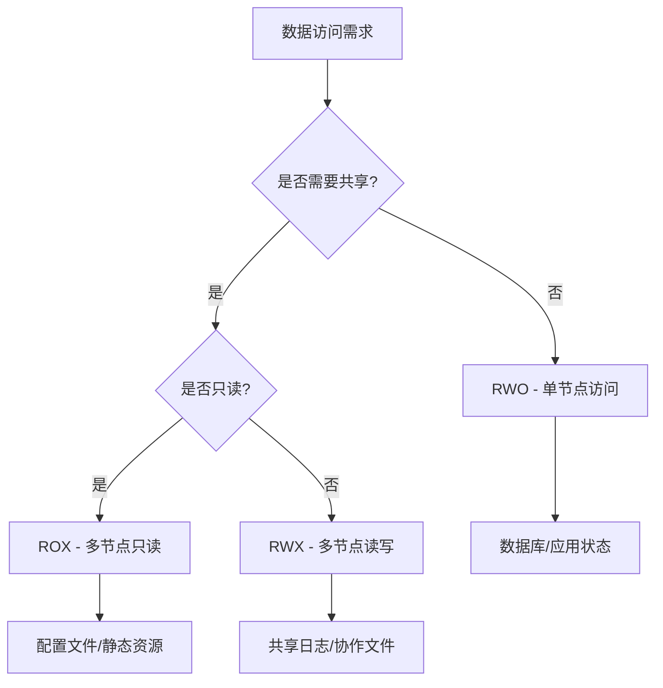

# 09 - 存储基础概念详解

> **适用版本**: v1.25 - v1.32 | **最后更新**: 2026-02 | **运维重点**: 存储抽象、生命周期、访问模式

## 目录

1. [存储基本概念](#存储基本概念)
2. [PV/PVC工作机制](#pvpvc工作机制)
3. [存储类与动态供给](#存储类与动态供给)
4. [访问模式详解](#访问模式详解)
5. [回收策略机制](#回收策略机制)
6. [存储生命周期管理](#存储生命周期管理)
7. [运维最佳实践](#运维最佳实践)

---

## 存储基本概念

### Kubernetes存储抽象层次

```
应用层 (Containers)
    ↓
Volume (卷) - Pod级别的存储抽象
    ↓
PersistentVolumeClaim (PVC) - 命名空间级声明
    ↓
PersistentVolume (PV) - 集群级资源
    ↓
StorageClass - 存储类型模板
    ↓
CSI Driver - 存储插件接口
    ↓
底层存储系统 (云盘/NAS/Ceph/Local)
```

### 核心组件职责划分

| 组件 | 职责 | 运维关注点 |
|------|------|-----------|
| **Volume** | Pod内容器间共享存储 | 生命周期与Pod绑定 |
| **PVC** | 用户存储需求声明 | 命名空间隔离，资源申请 |
| **PV** | 实际存储资源实例 | 集群全局可见，持久化 |
| **StorageClass** | 存储类型定义模板 | 动态供给策略 |
| **CSI Driver** | 存储系统对接接口 | 插件化扩展 |

### 存储类型分类体系

| 存储类型 | 特点 | 适用场景 | 运维复杂度 |
|---------|------|---------|-----------|
| **块存储 (Block)** | 高性能，独占访问 | 数据库，高性能应用 | 中 |
| **文件存储 (File)** | 共享访问，标准文件接口 | 共享文件，日志存储 | 低 |
| **对象存储 (Object)** | 海量存储，REST API | 静态资源，备份归档 | 低 |
| **本地存储 (Local)** | 最高性能，节点绑定 | 缓存，临时数据 | 高 |

---

## PV/PVC工作机制

### PVC创建到绑定完整流程

```
用户创建PVC
    ↓
1. PVC进入Pending状态
    ↓
2. PV Controller匹配合适PV
   ├─ 静态匹配：查找已有PV
   └─ 动态供给：创建新PV
    ↓
3. PV状态变为Bound
    ↓
4. PVC状态变为Bound
    ↓
5. Pod可以使用PVC
```

### 静态供给 vs 动态供给

#### 静态供给 (Static Provisioning)

```yaml
# 管理员预先创建PV
apiVersion: v1
kind: PersistentVolume
metadata:
  name: static-pv-01
spec:
  capacity:
    storage: 100Gi
  accessModes:
    - ReadWriteOnce
  persistentVolumeReclaimPolicy: Retain
  storageClassName: manual
  hostPath:
    path: /mnt/data/pv01

---
# 用户创建PVC引用现有PV
apiVersion: v1
kind: PersistentVolumeClaim
metadata:
  name: my-pvc
spec:
  accessModes:
    - ReadWriteOnce
  storageClassName: manual  # 必须匹配PV的StorageClass
  resources:
    requests:
      storage: 50Gi
  selector:
    matchLabels:
      type: static-pv
```

**运维要点：**
- 需要预先规划存储容量
- 手动管理PV生命周期
- 适用于固定存储需求场景

#### 动态供给 (Dynamic Provisioning)

```yaml
# StorageClass定义自动供给策略
apiVersion: storage.k8s.io/v1
kind: StorageClass
metadata:
  name: fast-ssd
provisioner: diskplugin.csi.alibabacloud.com
parameters:
  type: cloud_essd
  performanceLevel: PL1
reclaimPolicy: Delete
volumeBindingMode: WaitForFirstConsumer
allowVolumeExpansion: true

---
# 用户只需创建PVC
apiVersion: v1
kind: PersistentVolumeClaim
metadata:
  name: dynamic-pvc
spec:
  accessModes:
    - ReadWriteOnce
  storageClassName: fast-ssd  # 引用StorageClass
  resources:
    requests:
      storage: 100Gi
```

**运维优势：**
- 按需自动创建存储
- 减少人工干预
- 更好的资源利用率

### 绑定匹配条件

PVC与PV成功绑定必须满足以下所有条件：

```yaml
# 匹配检查清单
checks:
  - storage_size: PV.capacity >= PVC.request  # 容量足够
  - access_modes: PV.modes ⊇ PVC.modes        # 访问模式兼容
  - storage_class: PV.class == PVC.class      # StorageClass匹配
  - selector: PV.labels 匹配 PVC.selector     # 标签选择器
  - volume_mode: PV.mode == PVC.mode          # Filesystem/Block一致
```

---

## 存储类与动态供给

### StorageClass核心参数详解

```yaml
apiVersion: storage.k8s.io/v1
kind: StorageClass
metadata:
  name: production-storage
  annotations:
    storageclass.kubernetes.io/is-default-class: "false"
provisioner: diskplugin.csi.alibabacloud.com  # 存储供给器
parameters:  # 传递给CSI驱动的参数
  type: cloud_essd
  performanceLevel: PL2
  encrypted: "true"
  kmsKeyId: "kms-key-123"
reclaimPolicy: Delete  # Delete/Retain/Recycle
volumeBindingMode: WaitForFirstConsumer  # Immediate/WaitForFirstConsumer
allowVolumeExpansion: true  # 是否允许扩容
mountOptions:  # 挂载选项
  - noatime
  - discard
allowedTopologies:  # 拓扑约束
  - matchLabelExpressions:
      - key: topology.kubernetes.io/zone
        values: ["cn-hangzhou-a", "cn-hangzhou-b"]
```

### VolumeBindingMode对比分析

| 模式 | 行为 | 优点 | 缺点 | 适用场景 |
|-----|------|------|------|---------|
| **Immediate** | PVC创建后立即绑定 | 快速响应 | 可能跨可用区 | 无地域要求的应用 |
| **WaitForFirstConsumer** | 等待Pod调度后再绑定 | 确保地域亲和 | 首次启动稍慢 | 多可用区部署 |

### 多StorageClass策略管理

```yaml
# 存储分级策略
storage_tiers:
  tier_fast:
    name: fast-ssd-pl3
    type: ESSD
    performance: PL3
    iops: 1000000
    cost: 高
    usage: 核心数据库
    
  tier_standard:
    name: standard-ssd-pl1
    type: ESSD
    performance: PL1
    iops: 50000
    cost: 中
    usage: 一般应用
    
  tier_economy:
    name: economy-ssd-pl0
    type: ESSD
    performance: PL0
    iops: 10000
    cost: 低
    usage: 开发测试
```

---

## 访问模式详解

### 四种访问模式详细说明

| 模式 | 缩写 | 描述 | 支持存储类型 | 典型应用场景 |
|-----|------|------|------------|-------------|
| **ReadWriteOnce** | RWO | 单节点读写 | 块存储，本地盘 | 数据库，应用状态存储 |
| **ReadOnlyMany** | ROX | 多节点只读 | 文件存储，对象存储 | 配置文件，静态资源 |
| **ReadWriteMany** | RWX | 多节点读写 | NAS，分布式文件系统 | 共享日志，媒体文件 |
| **ReadWriteOncePod** | RWOP | 单Pod独占(v1.22+) | 块存储 | 严格单写场景 |

### 访问模式兼容性矩阵

```yaml
# 各存储类型的访问模式支持情况
storage_compatibility:
  aliyun_disk:
    RWO: ✓
    ROX: ✗
    RWX: ✗
    RWOP: ✓ (v1.27+)
    
  aliyun_nas:
    RWO: ✓
    ROX: ✓
    RWX: ✓
    RWOP: ✓ (v1.27+)
    
  ceph_rbd:
    RWO: ✓
    ROX: ✗
    RWX: ✗
    RWOP: ✓ (v1.27+)
    
  local_path:
    RWO: ✓
    ROX: ✗
    RWX: ✗
    RWOP: ✓ (v1.27+)
```

### 访问模式选择指南



---

## 回收策略机制

### 三种回收策略对比

| 策略 | 行为 | 数据安全性 | 适用场景 | 运维复杂度 |
|-----|------|----------|---------|-----------|
| **Retain** | 保留PV和底层数据 | 高 | 生产环境关键数据 | 需要手动清理 |
| **Delete** | 删除PV和底层存储 | 低 | 临时数据，开发测试 | 自动清理 |
| **Recycle** | 清空数据后重用(已废弃) | 不推荐 | 不再使用 | 不推荐 |

### 生产环境回收策略配置

```yaml
# 推荐的生产环境配置
apiVersion: storage.k8s.io/v1
kind: StorageClass
metadata:
  name: production-disk
provisioner: diskplugin.csi.alibabacloud.com
reclaimPolicy: Retain  # 生产环境必须Retain
parameters:
  type: cloud_essd
  performanceLevel: PL2

---
# 重要数据PVC额外保护
apiVersion: v1
kind: PersistentVolumeClaim
metadata:
  name: critical-data-pvc
  annotations:
    pv.kubernetes.io/bind-completed: "yes"
    pv.kubernetes.io/bound-by-controller: "yes"
spec:
  accessModes:
    - ReadWriteOnce
  storageClassName: production-disk
  resources:
    requests:
      storage: 1Ti
```

### 回收策略运维操作

```bash
# 1. 查看当前回收策略
kubectl get sc -o custom-columns=NAME:.metadata.name,POLICY:.reclaimPolicy

# 2. 修改已有PV的回收策略
kubectl patch pv <pv-name> -p '{"spec":{"persistentVolumeReclaimPolicy":"Retain"}}'

# 3. 手动清理Released状态的PV
# 检查PV状态
kubectl get pv --field-selector=status.phase=Released

# 备份重要数据后删除PV
kubectl delete pv <pv-name>

# 4. 重新使用已释放的PV
# 修改回收策略为Retain
kubectl patch pv <pv-name> -p '{"spec":{"persistentVolumeReclaimPolicy":"Retain"}}'

# 清理claimRef引用
kubectl patch pv <pv-name> -p '{"spec":{"claimRef": null}}'

# PV变回Available状态，可重新绑定
```

---

## 存储生命周期管理

### 完整生命周期状态流转

```
[PVC Lifecycle]
Pending → Bound → Lost
    ↑              ↓
    └──────←───────┘

[PV Lifecycle]
Available → Bound → Released → (Retain/Delete) → Available/Removed
```

### 关键状态转换触发条件

| 状态转换 | 触发条件 | 运维关注点 |
|---------|---------|-----------|
| **Pending→Bound** | 找到匹配PV或动态创建 | 绑定时间，成功率 |
| **Bound→Lost** | 关联PV被删除 | 数据风险预警 |
| **Bound→Released** | PVC被删除 | 回收策略执行 |
| **Released→Available** | Retain策略清理完成 | 手动干预需求 |

### 生命周期监控指标

```yaml
# 关键监控指标
lifecycle_metrics:
  pvc_pending_duration:  # PVC Pending时长
    threshold: 300s
    alert: PVC绑定超时
    
  pv_released_count:  # Released状态PV数量
    threshold: 5
    alert: 需要手动清理的PV过多
    
  binding_success_rate:  # 绑定成功率
    threshold: 95%
    alert: 存储供给异常
    
  reclaim_failure_rate:  # 回收失败率
    threshold: 5%
    alert: 存储回收异常
```

---

## 运维最佳实践

### 存储资源配置规范

```yaml
# 生产环境推荐配置模板
production_storage_config:
  # StorageClass配置
  storage_class:
    reclaim_policy: Retain
    volume_binding_mode: WaitForFirstConsumer
    allow_expansion: true
    mount_options:
      - noatime
      - discard
      
  # PVC配置
  pvc_template:
    access_modes: [ReadWriteOnce]
    storage_request_buffer: 20%  # 预留20%空间
    backup_enabled: true
    
  # 监控告警
  monitoring:
    pvc_usage_threshold: 85%
    pv_health_check_interval: 300s
```

### 常见配置错误及预防

| 错误类型 | 原因 | 预防措施 |
|---------|------|---------|
| **PVC Pending** | StorageClass不存在 | 统一管理StorageClass |
| **绑定失败** | 参数不匹配 | 标准化PVC模板 |
| **数据丢失** | Delete策略误用 | 生产环境强制Retain |
| **性能问题** | 访问模式不当 | 明确应用需求 |

### 运维检查清单

```markdown
## 存储健康检查清单

### 每日检查
- [ ] PVC Pending状态数量 < 5
- [ ] PV Released状态数量 = 0
- [ ] StorageClass配置一致性检查
- [ ] CSI Driver运行状态正常

### 每周检查
- [ ] 存储使用率统计分析
- [ ] 回收策略合规性审计
- [ ] 备份策略执行情况检查
- [ ] 性能指标趋势分析

### 每月检查
- [ ] 存储成本分析优化
- [ ] 容量规划和扩容准备
- [ ] 灾备演练执行
- [ ] 安全合规性评估
```

---