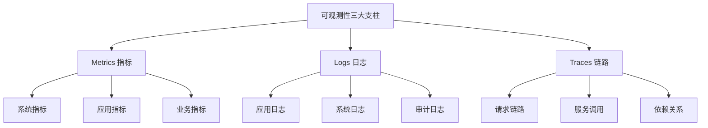

# 01 - Kubernetes 可观测性架构体系 (Observability Architecture)

> **适用版本**: v1.25 - v1.32 | **最后更新**: 2026-01 | **参考**: [kubernetes.io/docs/concepts/cluster-administration/monitoring](https://kubernetes.io/docs/concepts/cluster-administration/monitoring/)

## 概述

本文档全面阐述 Kubernetes 可观测性架构的设计理念、技术组件和实施策略，涵盖指标监控、日志收集、链路追踪和告警管理等核心领域，为企业构建完整的可观测性平台提供指导。

---

## 一、可观测性架构设计原则

### 1.1 三大支柱理论

#### 可观测性核心要素


#### 数据特征对比分析
```yaml
observability_data_characteristics:
  metrics:
    data_structure: time_series
    sampling_rate: high_frequency
    storage_efficiency: high
    query_complexity: low
    use_cases:
      - system_monitoring
      - capacity_planning
      - performance_benchmarking
      
  logs:
    data_structure: text_unstructured
    sampling_rate: event_driven
    storage_efficiency: medium
    query_complexity: high
    use_cases:
      - troubleshooting
      - security_auditing
      - compliance_reporting
      
  traces:
    data_structure: distributed_spans
    sampling_rate: selective_sampling
    storage_efficiency: low
    query_complexity: medium
    use_cases:
      - performance_analysis
      - dependency_mapping
      - error_diagnosis
```

### 1.2 架构设计原则

#### 统一数据平面
```yaml
unified_observability_plane:
  data_ingestion:
    standardized_formats: 
      - opentelemetry_protocol
      - prometheus_exposition
      - fluent_bit_forward
      
  data_processing:
    stream_processing: true
    batch_processing: true
    real_time_analytics: true
    
  data_storage:
    hot_storage: in_memory_timeseries
    warm_storage: columnar_database
    cold_storage: object_storage
    
  data_access:
    unified_query_interface: true
    multi_tenancy_support: true
    rbac_integration: true
```

---

## 二、指标监控体系架构

### 2.1 Prometheus 生态系统

#### 监控架构拓扑
```yaml
prometheus_monitoring_stack:
  data_collection:
    node_exporter:
      metrics: system_resources
      scrape_interval: 15s
      
    kube_state_metrics:
      metrics: kubernetes_objects
      scrape_interval: 30s
      
    cadvisor:
      metrics: container_resources
      scrape_interval: 15s
      
  data_storage:
    prometheus_server:
      retention: 15d
      storage_tsdb_retention: 15d
      wal_compression: true
      
  data_query:
    prometheus_ui: native_interface
    grafana: visualization_layer
    alertmanager: alert_routing
    
  federation:
    thanos_sidecar: long_term_storage
    thanos_querier: global_query
    thanos_store: object_storage_integration
```

### 2.2 关键监控指标分类

#### 核心组件指标
| 组件类别 | 关键指标 | 告警阈值 | 运维价值 |
|---------|---------|---------|---------|
| **API Server** | 请求延迟、错误率、QPS | P99>1s, 5xx>1% | API健康度 |
| **etcd** | Leader切换、磁盘延迟、数据库大小 | >3次/小时, P99>10ms | 数据存储稳定性 |
| **Scheduler** | 调度延迟、待调度Pod数 | P99>5s, >100个 | 调度性能 |
| **Controller** | 队列深度、处理延迟 | >100个, P99>30s | 控制器健康 |
| **Kubelet** | PLEG延迟、Pod启动时间 | P99>3s, >60s | 节点稳定性 |

---

## 三、日志收集架构

### 3.1 日志架构模式

#### 三层日志架构
```
应用层日志
    ├─ 业务日志 (stdout/stderr)
    ├─ 访问日志 (access.log)
    └─ 错误日志 (error.log)
          ↓
容器运行时层
    ├─ Docker/Containerd日志驱动
    └─ 日志文件 (/var/log/containers/*.log)
          ↓
基础设施层
    ├─ 节点级采集器 (DaemonSet)
    ├─ Sidecar采集器
    └─ 应用直推
```

### 3.2 日志组件选型

#### 生产级日志栈
| 组件 | 类型 | 特点 | 版本要求 | ACK替代 |
|-----|------|------|---------|---------|
| **Fluent Bit** | 收集器 | 轻量级，高性能 | v2.2+ | Logtail |
| **Loki** | 存储/查询 | 标签索引，低成本 | v2.9+ | SLS |
| **Grafana** | 可视化 | 统一日志查询界面 | v9.0+ | 原生 |
| **Promtail** | 采集器 | Loki专用采集器 | v2.9+ | Logtail |

### 3.3 结构化日志最佳实践

#### 推荐日志格式
```json
{
  "timestamp": "2026-01-18T10:30:00.123Z",
  "level": "ERROR",
  "service": "user-api",
  "trace_id": "abc123def456",
  "span_id": "span789",
  "user_id": "12345",
  "method": "POST",
  "path": "/api/users",
  "status": 500,
  "duration_ms": 234,
  "error": "Database connection timeout",
  "stack_trace": "...",
  "kubernetes": {
    "namespace": "production",
    "pod": "user-api-7d4f5b8c9-xk2p4",
    "container": "app",
    "node": "node-1"
  }
}
```

---

## 四、分布式追踪体系

### 4.1 OpenTelemetry 标准

#### 统一可观测性框架
```yaml
opentelemetry_components:
  instrumentation:
    auto_instrumentation: true
    manual_instrumentation: true
    language_support:
      - java
      - go
      - python
      - nodejs
      
  collector:
    receivers: [otlp, jaeger, zipkin]
    processors: [batch, memory_limiter, attributes]
    exporters: [jaeger, prometheus, loki]
    
  backend:
    traces: jaeger/tempo
    metrics: prometheus/victoria_metrics
    logs: loki/elasticsearch
```

### 4.2 链路追踪最佳实践

#### Trace设计原则
| 原则 | 说明 | 实施要点 |
|-----|------|---------|
| **Trace粒度** | 合理的Span拆分 | 每个重要业务操作一个Span |
| **上下文传递** | TraceID跨服务传播 | HTTP Header: traceparent |
| **采样策略** | 成本与覆盖率平衡 | 生产环境10%采样率 |
| **属性标注** | 关键业务信息 | 用户ID、订单号等 |
| **错误标记** | 明确标识异常 | StatusCode: ERROR |

---

## 五、告警管理体系

### 5.1 告警策略设计

#### SLO驱动的告警层次
```yaml
alert_hierarchy:
  tier_1_critical:
    response_time: 15分钟
    channels: [phone, sms]
    examples:
      - KubeAPIServerDown
      - EtcdNoLeader
      - NodeNotReady
      
  tier_2_warning:
    response_time: 1小时
    channels: [email, slack]
    examples:
      - HighErrorRate
      - DiskPressure
      - MemoryPressure
      
  tier_3_info:
    response_time: 4小时
    channels: [slack]
    examples:
      - DeploymentRollout
      - HPAScaling
      - CertificateExpiring
```

### 5.2 告警规则最佳实践

#### Prometheus告警模板
```yaml
groups:
- name: kubernetes.system
  rules:
  # Critical Alerts
  - alert: KubeAPIServerDown
    expr: absent(up{job="kubernetes-apiservers"} == 1)
    for: 5m
    labels:
      severity: critical
      tier: 1
    annotations:
      summary: "Kubernetes API Server is down"
      description: "API Server has been unreachable for more than 5 minutes"
      
  # Warning Alerts
  - alert: NodeMemoryPressure
    expr: (1 - node_memory_MemAvailable_bytes / node_memory_MemTotal_bytes) > 0.9
    for: 10m
    labels:
      severity: warning
      tier: 2
    annotations:
      summary: "Node {{ $labels.instance }} memory pressure"
      description: "Memory usage is above 90%"
```

---

## 六、可视化仪表盘

### 6.1 Grafana仪表盘设计

#### 核心监控面板
| 仪表盘类别 | 关键指标 | 更新频率 | 用途 |
|-----------|---------|---------|------|
| **集群概览** | 节点状态、Pod分布、资源使用 | 30秒 | 全局健康监控 |
| **节点详情** | CPU/Memory/Disk使用率 | 15秒 | 节点性能分析 |
| **Pod监控** | 重启次数、资源使用、状态变化 | 30秒 | 应用稳定性 |
| **网络监控** | 流量、连接数、错误率 | 15秒 | 网络性能 |
| **存储监控** | PVC使用率、IOPS、延迟 | 30秒 | 存储健康度 |

### 6.2 变量与模板

#### 推荐Dashboard变量
```json
{
  "templating": {
    "list": [
      {
        "name": "datasource",
        "type": "datasource",
        "query": "prometheus"
      },
      {
        "name": "cluster",
        "type": "query",
        "query": "label_values(up, cluster)",
        "multi": true
      },
      {
        "name": "namespace",
        "type": "query",
        "query": "label_values(kube_pod_info{cluster=\"$cluster\"}, namespace)",
        "multi": true
      },
      {
        "name": "pod",
        "type": "query",
        "query": "label_values(kube_pod_info{cluster=\"$cluster\", namespace=~\"$namespace\"}, pod)",
        "multi": true
      }
    ]
  }
}
```

---

## 七、成本优化策略

### 7.1 数据存储优化

#### 分层存储架构
| 存储层级 | 数据类型 | 保留期限 | 存储介质 | 成本优化 |
|---------|---------|---------|---------|---------|
| **热数据** | 实时指标、近期日志 | 7天 | SSD | 高频访问 |
| **温数据** | 历史指标、月度日志 | 90天 | SATA | 定期查询 |
| **冷数据** | 年度统计、审计日志 | 3年 | 对象存储 | 归档备份 |

### 7.2 采样与过滤策略

#### 数据降采样方案
```yaml
sampling_strategies:
  metrics_sampling:
    high_priority: 15s intervals
    medium_priority: 60s intervals
    low_priority: 300s intervals
    
  trace_sampling:
    production: 10%
    staging: 50%
    development: 100%
    
  log_filtering:
    debug_level: discard_after_24h
    info_level: retain_7days
    error_level: retain_90days
    audit_logs: retain_1year
```

---

## 八、生产实施路线图

### 8.1 部署阶段规划

#### 分阶段实施策略
```
Phase 1: 基础监控 (Weeks 1-2)
├─ 部署Prometheus + Grafana
├─ 配置核心组件监控
└─ 建立基础告警规则

Phase 2: 日志体系 (Weeks 3-4)
├─ 部署EFK/Loki栈
├─ 配置应用日志收集
└─ 建立日志分析流程

Phase 3: 链路追踪 (Weeks 5-6)
├─ 集成OpenTelemetry
├─ 部署Jaeger/Tempo
└─ 应用埋点实施

Phase 4: 优化完善 (Weeks 7-8)
├─ 告警调优
├─ 仪表盘优化
└─ 成本控制实施
```

### 8.2 运维最佳实践

#### 生产运维清单
| 实践领域 | 具体措施 | 检查周期 |
|---------|---------|---------|
| **监控覆盖** | 100%核心组件监控 | 每周 |
| **告警有效性** | 告警演练和调优 | 每月 |
| **数据备份** | 监控数据定期备份 | 每日 |
| **容量规划** | 存储容量趋势分析 | 每季度 |
| **安全合规** | 访问控制和审计日志 | 持续 |

---

## 九、ACK可观测性集成

### 9.1 阿里云产品集成

#### 一站式可观测性
| 功能 | ACK产品 | 配置方式 | 优势 |
|-----|---------|---------|------|
| **指标监控** | ARMS Prometheus | 控制台一键开启 | 免运维，自动发现 |
| **日志收集** | SLS | Logtail DaemonSet | 高性能，免存储管理 |
| **应用监控** | ARMS APM | Agent自动注入 | 代码无侵入 |
| **链路追踪** | ARMS Tracing | SDK集成 | 全链路可视化 |
| **告警通知** | 云监控 | 控制台配置 | 多渠道通知 |

### 9.2 混合部署策略

#### 本地+云服务混合架构
```yaml
hybrid_observability:
  metrics:
    primary: arams_prometheus
    fallback: local_prometheus
    
  logs:
    primary: sls
    backup: local_loki
    
  traces:
    primary: arms_tracing
    secondary: local_jaeger
    
  alerting:
    primary: arms_alerting
    notification: aliyun_sms_email
```

---

**核心原则**: 以SLO为导向，三大支柱并重，分层实施，持续优化

---

**架构演进**: 从被动监控到主动预警，从单一指标到全栈可观测，从业务黑盒到透明洞察

---

**表格维护**: Kusheet Project | **作者**: Allen Galler (allengaller@gmail.com)