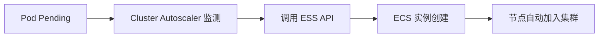

# ACK 关联产品 - ECS 计算资源

> **适用版本**: ACK v1.25 - v1.32 | **最后更新**: 2026-01

---

## 目录

- [ECS 规格选型](#ecs-规格选型)
- [节点池配置最佳实践](#节点池配置最佳实践)
- [抢占式实例 (Spot) 策略](#抢占式实例-spot-策略)
- [弹性伸缩组 (ESS) 集成](#弹性伸缩组-ess-集成)
- [资源预留与性能调优](#资源预留与性能调优)

---

## ECS 规格选型

### ACK 推荐规格族

| 规格族 | 特点 | 适用场景 | 对应 K8s 标签 |
|:---|:---|:---|:---|
| **计算型 (c7/c8i)** | 高 CPU 性能，1:2 比例 | Web 服务、API、CI/CD | `node.kubernetes.io/instance-type=ecs.c7.xlarge` |
| **通用型 (g7/g8i)** | 性能均衡，1:4 比例 | 一般生产应用、微服务 | `node.kubernetes.io/instance-type=ecs.g7.xlarge` |
| **内存型 (r7/r8i)** | 高内存，1:8 比例 | 数据库、缓存 (Redis)、大数据 | `node.kubernetes.io/instance-type=ecs.r7.xlarge` |
| **GPU 型 (gn6v/gn7i)** | 硬件加速 | AI 训练/推理、视频转码 | `aliyun.com/gpu-mem` |
| **大数据型 (d2c/d3c)** | 高本地盘吞吐 | HDFS、Kafka | `alibabacloud.com/local-disk` |

### 规格建议矩阵

| 集群规模 | 推荐规格规格 | 原因 |
|:---|:---|:---|
| **开发测试** | 2核 4G / 4核 8G | 成本优先 |
| **核心生产** | 8核 32G / 16核 64G | 减少节点数，降低管理开销，提高资源利用率 |
| **高并发 API** | 16核 32G (计算型) | 追求单核性能与低延迟 |
| **AI 推理** | ecs.gn7i-c8g1.2xlarge | NVIDIA A10 性能均衡 |

---

## 节点池配置最佳实践

### 生产级节点池模板

```yaml
# 推荐配置组合
节点池类型: 托管节点池 (Manage NodePool)
付费类型: 包年包月 (核心) / 按量付费 (弹性)
操作系统: Alibaba Cloud Linux 3
容器运行时: containerd
网络模式: Terway
安全组: 最小化权限规则
```

### 关键配置参数

| 参数 | 推荐设置 | 说明 |
|:---|:---|:---|
| **SystemDisk** | ESSD PL1 (100GB+) | 保证系统组件及容器镜像解压性能 |
| **UserData** | 自定义脚本 | 用于节点初始化、内核参数调整、挂载额外磁盘 |
| **Labels/Taints** | 根据业务分配 | 强制调度业务到特定节点池 |
| **CPU 管理策略** | static (可选) | 绑定 CPU 核，适用于延迟极敏感应用 |

---

## 抢占式实例 (Spot) 策略

### Spot 实例优势与风险

| 维度 | 说明 |
|:---|:---|
| **节省成本** | 相比按量付费可节省 50% - 90% |
| **回收特征** | 只有 5 分钟回收通知 (Termination Notice) |
| **适用范围** | 无状态、可容错的业务、批处理计算 |

### 生产环境 Spot 配置建议

```yaml
# 节点池混合实例策略
多实例配置:
  - ecs.c7.2xlarge (基础)
  - ecs.c7.4xlarge (备选)
  - ecs.g7.2xlarge (备选)
Spot 策略: 
  - 成本优先 (Price-First)
  - 系统自动选配 (Multi-Instance-Type)
```

---

## 弹性伸缩组 (ESS) 集成

### 自动伸缩触发链



### 扩缩容优化

| 优化点 | 配置方式 |
|:---|:---|
| **快速扩容** | 启用云盘预热、镜像预热 |
| **优雅缩容** | 配置 `drain-priority`，确保 Pod 正常迁移 |
| **防护配置** | 设置 `scale-in-threshold`，防止过度频繁缩容 |

---

## 资源预留与性能调优

### Kubelet 资源预留计算

对于一台 16核 64G 的机器，推荐预留：

```bash
# /etc/kubernetes/kubelet.conf (示例)
system-reserved: cpu=500m,memory=1Gi,ephemeral-storage=1Gi
kube-reserved: cpu=500m,memory=1Gi,ephemeral-storage=1Gi
eviction-hard: memory.available<500Mi,nodefs.available<10%
```

### ECS 级内核优化 (UserData)

```bash
# sysctl.conf 优化建议
net.core.somaxconn = 65535
net.ipv4.tcp_max_syn_backlog = 65535
fs.file-max = 2000000
```

---

## 相关文档

- [156-alibaba-cloud-integration.md](./156-alibaba-cloud-integration.md) - 阿里云集成总表
- [245-ack-ebs-storage.md](./245-ack-ebs-storage.md) - 云盘存储详解
- [39-kubelet-deep-dive.md](./39-kubelet-deep-dive.md) - Kubelet 深度解析
