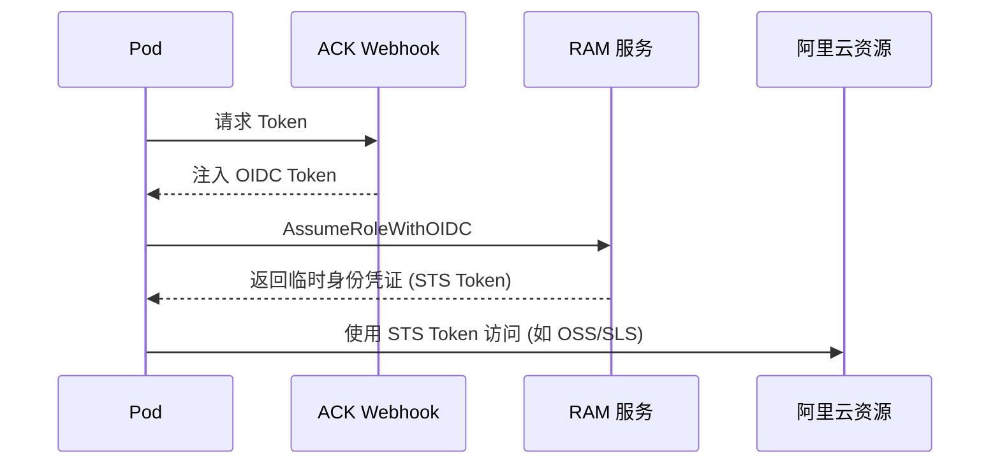

# ACK 关联产品 - RAM 权限与授权 (RAM & RRSA)

> **适用版本**: ACK v1.25 - v1.32 | **最后更新**: 2026-01

---

## 目录

- [RAM 基础权限架构](#ram-基础权限架构)
- [ACK 集群级服务账号](#ack-集群级服务账号)
- [RRSA (Pod 级精细化授权)](#rrsa-pod-级精细化授权)
- [最小权限原则实施 (RBAC + RAM)](#最小权限原则实施-rbac--ram)
- [安全审计与监控](#安全审计与监控)

---

## RAM 基础权限架构

### 核心概念

| 实体 | 说明 | K8s 对应物 |
|:---|:---|:---|
| **RAM 用户** | 独立的身份凭证 (AK/AS) | User |
| **RAM 角色** | 虚拟身份，可被其他实体扮演 | ServiceAccount / Role |
| **权限策略 (Policy)** | 定义允许/拒绝的操作集合 | RoleBinding / ClusterRole |

### ACK 默认权限矩阵

| 场景 | 所需角色/策略 | 说明 |
|:---|:---|:---|
| **集群初始化** | `AliyunCSDefaultRole` | 允许 ACK 管理 ECS/VPC/SLB 等资源 |
| **双向链接** | `AliyunCSServerRole` | 允许集群控制面与云资源交互 |
| **日志采集** | `AliyunLogArchiveRole` | 允许日志组件写入 SLS |

---

## ACK 集群级服务账号

在 ACK 控制台中，您可以为不同的节点池配置不同的 **Worker RAM Role**。所有运行在该节点池上的 Pod，默认共享该角色的权限。

> [!WARNING]
> **风险提示**: 节点池级别角色权限过大会导致横向越权。建议仅赋予基础权限，如拉取 ACR 镜像等。

---

## RRSA (Pod 级精细化授权)

RRSA (RAM Roles for Service Accounts) 是 ACK 提供的一种使 Pod 能够以独立身份访问云服务的能力，类似于 AWS 的 IRSA。

### RRSA 工作流



### 配置步骤简述

1. **启用 OIDC**: 集群设置中开启 "启用 RRSA"。
2. **创建 RAM 角色**: 配置信任策略为 OIDC 身份提供商。
3. **绑定 ServiceAccount**: 使用注解标记。

```yaml
# 示例 ServiceAccount 绑定
apiVersion: v1
kind: ServiceAccount
metadata:
  name: my-oss-accessor
  annotations:
    # 替换为您的 RAM 角色 ARN
    oss.alibabacloud.com/role-arn: "acs:ram::123456789:role/ack-oss-role"
```

---

## 最小权限原则实施 (RBAC + RAM)

### 实施建议表

| 应用类型 | 建议授权方式 | 策略级别 |
|:---|:---|:---|
| **前端应用** | 仅需要私有镜像下载权 | 只读 (ReadOnly) |
| **日志采集组件** | 仅允许写入特定的 SLS 日志库 | 限定资源 (Resource-Specific) |
| **数据库同步** | 允许访问特定 KMS 密钥 | 条件限制 (Condition-Based) |
| **备份管理** | 读写 OSS 备份 Bucket | 临时令牌 (STS) |

---

## 安全审计与监控

### 常见风险排查

- **AccessKey 泄露风险**: 严禁将 AK/AS 写入 YAML 或 Dockerfile 环境变量中，优先使用 RAM 角色。
- **权限过大监控**: 定期配合 "配置审计" 产品检查 `AliyunCSFullAccess` 等高危权限的使用。
- **API 审计**: 通过 "操作审计" (ActionTrail) 监控 `cs.aliyuncs.com` 相关的 API 调用记录。

---

## 相关文档

- [84-rbac-matrix-configuration.md](./84-rbac-matrix-configuration.md) - Kubernetes RBAC 矩阵
- [206-docker-security-best-practices.md](./206-docker-security-best-practices.md) - 容器安全实践
- [156-alibaba-cloud-integration.md](./156-alibaba-cloud-integration.md) - 阿里云集成总表
