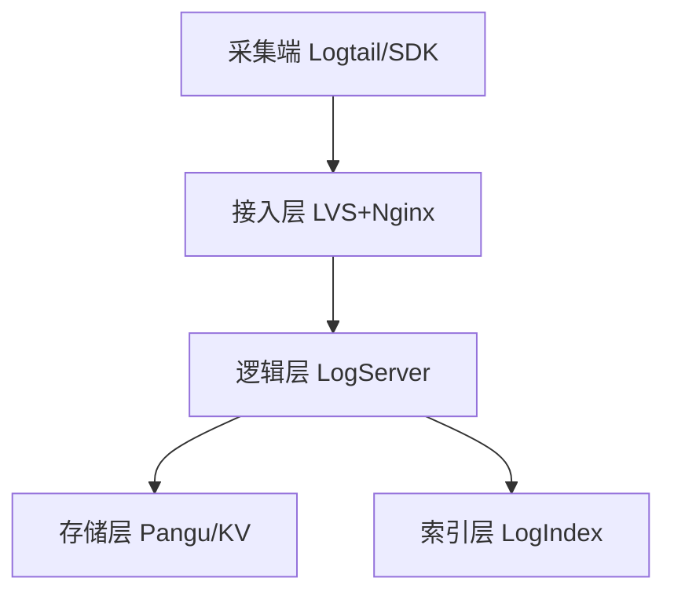

# 专有云 (Apsara Stack) - SLS 日志服务

> **环境**: Apsara Stack 企业版/精简版 | **最后更新**: 2026-01

---

## 目录

- [专有云 SLS 架构深度解析](#专有云-sls-架构深度解析)
- [日志采集方案 (Logtail)](#日志采集方案-logtail)
- [机房级日志审计与安全](#机房级日志审计与安全)
- [高性能查询与仪表盘](#高性能查询与仪表盘)
- [专有云运维最佳实践](#专有云运维最佳实践)

---

## 专有云 SLS 架构深度解析

专有云 SLS 采用三层架构设计，确保在私有化部署环境下的大吞吐量与稳定性。



| 组件 | 专有云特点 |
|:---|:---|
| **LogServer** | 负责 API 解析、读写分发，支持水平扩容 |
| **LogIndex** | 负责倒排索引构建，支持秒级 GB 级搜索 |
| **存储底座** | 基于盘古 (Pangu) 分布式文件系统 |

---

## 日志采集方案 (Logtail)

### Logtail 部署最佳实践 (ACK)

在专有云 ACK 环境中，Logtail 以 **DaemonSet** 形式运行。

```yaml
# 采集配置示例 (AliyunLogConfig)
apiVersion: log.alibabacloud.com/v1alpha1
kind: AliyunLogConfig
metadata:
  name: apsara-stdout-log
spec:
  project: apsara-stack-project
  logstore: app-stdout
  shardCount: 2
  lifeCycle: 7 # 专有云通常存储 7-15 天
  logtailConfig:
    inputType: plugin
    configName: app-stdout
    inputDetail:
      plugin:
        inputs:
        - type: service_docker_stdout
          detail:
            Stdout: true
            Stderr: true
```

### 关键配置优化

- **Shard 规划**: 单个 Shard 在专有云通常支撑 5MB/s 写入。根据总流量预分配 Shard 数量。
- **接入地址 (Endpoint)**: 必须根据专有云提供的 POP 地址段配置，通常为私网 VIP。

---

## 机房级日志审计与安全

专有云环境对安全性有极高要求，SLS 是审计的核心。

### 审计日志集成

1. **ASOP 审计**: 记录平台管理员的操作日志。
2. **ACK 审计**: 记录 Kubernetes API Server 的所有请求。
3. **RDS/OSS 审计**: 存储日志需定期同步至 SLS 进行合规性检查。

### 导出与转发

- **OSS 归档**: 将长期不查询的日志冷存至 OSS。
- **SIEM 集成**: 支持对接第三方安全态势感知系统。

---

## 高性能查询与仪表盘

### 查询优化技巧

| 技巧 | 说明 |
|:---|:---|
| **前缀匹配** | 使用 `key: val*` 加快长字符串匹配 |
| **全文索引 vs 字段索引** | 优先开启特定高频查询字段的索引，降低存储压力 |
| **Shard 均衡** | 观察发现 Shard 倾斜时，及时重新哈希 |

### 仪表盘配置 (DataV 风格)

专有云控制台支持直接将 SQL 统计结果可视化。
- **示例**: `* | select count(1) as pv, status group by status` (实时监控 HTTP 状态码分布)

---

## 专有云运维最佳实践

1. **租户配额管理**: SLS 资源在专有云受限于 `Quota`，需在 ASOP 中提前分配存储容量。
2. **机房级容灾**: 在双机房部署场景下，务必确认日志采集的负载均衡策略。
3. **Logtail 版本**: 专有云环境 Logtail 版本更新较慢，需确认与 ACK 插件版本的兼容性。

---

## 相关文档

- [95-logging-auditing.md](./95-logging-auditing.md) - Kubernetes 日志总表
- [241-ack-slb-nlb-alb.md](./241-ack-slb-nlb-alb.md) - 专有云负载均衡集成
- [252-apsara-stack-pop-operations.md](./252-apsara-stack-pop-operations.md) - 专有云平台运维 (POP)
