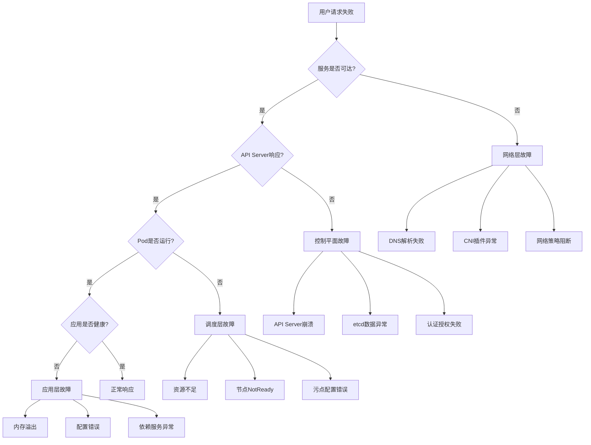

# 02 - Kubernetes 故障模式与根因分析字典

> **适用版本**: Kubernetes v1.25-v1.32 | **最后更新**: 2026-02 | **作者**: Allen Galler | **质量等级**: ⭐⭐⭐⭐⭐ 专家级

---

## 目录

- [1. 常见故障模式分类](#1-常见故障模式分类)
- [2. 根因分析方法论](#2-根因分析方法论)
- [3. 故障树分析(FMEA)](#3-故障树分析fmea)
- [4. MTTR优化策略](#4-mttr优化策略)
- [5. 故障复盘模板](#5-故障复盘模板)
- [6. 预防措施体系](#6-预防措施体系)

---

## 1. 常见故障模式分类

### 1.1 控制平面故障模式

| 故障模式 | 症状表现 | 影响范围 | 紧急程度 | 常见根因 |
|---------|---------|---------|---------|---------|
| **API Server无响应** | kubectl命令超时、集群无法管理 | 全集群 | P0 | 证书过期、资源耗尽、网络中断 |
| **etcd数据不一致** | 数据读取异常、集群状态混乱 | 全集群 | P0 | 网络分区、磁盘故障、配置错误 |
| **调度器失效** | Pod长期Pending、无法调度 | 新Pod创建 | P1 | 配置错误、资源不足、插件冲突 |
| **控制器管理器卡顿** | 资源状态不更新、控制器失效 | 对应资源 | P1 | 内存泄漏、API连接异常、死锁 |

### 1.2 节点层面故障模式

| 故障模式 | 症状表现 | 影响范围 | 紧急程度 | 常见根因 |
|---------|---------|---------|---------|---------|
| **节点NotReady** | Node状态异常、Pod驱逐 | 节点上所有Pod | P0 | kubelet崩溃、网络中断、资源耗尽 |
| **容器运行时异常** | Pod启动失败、容器无法创建 | 节点容器操作 | P1 | Docker daemon故障、镜像损坏、存储问题 |
| **kube-proxy失效** | Service访问异常、网络不通 | 节点网络代理 | P1 | 配置错误、iptables规则损坏、资源限制 |
| **磁盘空间不足** | Pod Evicted、写入失败 | 节点存储 | P1 | 日志膨胀、镜像缓存过多、临时文件累积 |

### 1.3 应用层面故障模式

| 故障模式 | 症状表现 | 影响范围 | 紧急程度 | 常见根因 |
|---------|---------|---------|---------|---------|
| **Pod频繁重启** | CrashLoopBackOff状态 | 单个应用 | P1 | 应用Bug、资源配置不当、依赖服务异常 |
| **服务响应超时** | 请求超时、5xx错误增多 | 用户体验 | P1 | 资源不足、网络延迟、后端服务慢 |
| **内存溢出(OOM)** | ContainerStatusUnknown、进程被杀 | 应用稳定性 | P0 | 内存泄漏、限制设置过低、流量突增 |
| **配置错误** | 应用启动失败、功能异常 | 配置相关功能 | P2 | ConfigMap/Secret更新错误、环境变量缺失 |

### 1.4 网络故障模式

| 故障模式 | 症状表现 | 影响范围 | 紧急程度 | 常见根因 |
|---------|---------|---------|---------|---------|
| **DNS解析失败** | 服务名无法解析、连接超时 | 全部服务间通信 | P0 | CoreDNS故障、网络策略阻止、配置错误 |
| **网络策略阻断** | Pod间通信异常、访问被拒绝 | 受策略影响的通信 | P1 | NetworkPolicy配置错误、标签匹配问题 |
| **CNI插件故障** | Pod无法获取IP、网络不通 | 新Pod网络 | P0 | CNI配置错误、IP地址耗尽、插件版本不兼容 |
| **Service访问异常** | ClusterIP无法访问、负载均衡失效 | 服务暴露 | P1 | kube-proxy问题、Endpoints为空、端口冲突 |

### 1.5 存储故障模式

| 故障模式 | 症状表现 | 影响范围 | 紧急程度 | 常见根因 |
|---------|---------|---------|---------|---------|
| **PVC绑定失败** | Pod卡在ContainerCreating | 使用持久化的应用 | P1 | StorageClass配置错误、存储后端故障、配额限制 |
| **PV挂载超时** | Volume挂载失败、Pod启动缓慢 | 存储依赖的应用 | P1 | CSI驱动问题、网络存储延迟、权限配置错误 |
| **存储IO性能差** | 应用响应慢、数据库超时 | 存储密集型应用 | P2 | 存储类型选择不当、IO争用、存储后端性能瓶颈 |
| **数据丢失风险** | PV删除、快照失败 | 重要数据 | P0 | 误操作、备份策略缺失、存储故障 |

---

## 2. 根因分析方法论

### 2.1 5 Why分析法

```markdown
故障现象: Pod处于CrashLoopBackOff状态

Why 1: 为什么Pod会重启？
   → 容器主进程退出，退出码1

Why 2: 为什么主进程会退出？
   → 应用启动时数据库连接失败

Why 3: 为什么数据库连接失败？
   → 连接字符串配置错误

Why 4: 为什么连接字符串配置错误？
   → ConfigMap中的数据库地址被错误修改

Why 5: 为什么ConfigMap会被错误修改？
   → 部署流程缺乏配置审核机制

根本原因: 缺乏配置变更审核流程导致的配置错误
解决方案: 建立配置变更审批流程，增加配置验证检查点
```

### 2.2 鱼骨图分析法

```
                    Pod启动失败
                        |
    ---------------------------------------------------
    |                  |                |             |
人员因素            流程因素          技术因素      环境因素
    |                  |                |             |
配置错误        缺乏自动化测试      版本不兼容    网络中断
人为操作失误      部署流程不规范      资源不足      磁盘满
权限配置错误      缺乏灰度发布       依赖服务异常   DNS解析失败
```

### 2.3 时间线分析法

```markdown
故障时间线分析模板:

时间戳 | 事件描述 | 操作者 | 影响评估
-------|---------|--------|----------
10:00:00 | 监控告警: API Server响应延迟 > 2s | 系统自动 | 初期征兆
10:02:00 | 用户报告部分服务访问缓慢 | 用户反馈 | 影响扩大
10:05:00 | 发现API Server CPU使用率95% | 运维人员 | 确认故障
10:07:00 | 检查发现大量LIST请求 | 运维人员 | 定位方向
10:10:00 | 发现某个Controller异常高频查询 | 工程师A | 根因接近
10:15:00 | 重启异常Controller Pod | 运维团队 | 临时缓解
10:20:00 | 服务恢复正常 | 系统自动 | 故障恢复
10:30:00 | 修复Controller Bug并发布 | 开发团队 | 根本解决
```

### 2.4 影响面分析矩阵

| 影响维度 | 严重程度 | 影响范围 | 持续时间 | 业务损失 |
|---------|---------|---------|---------|---------|
| **用户体验** | 高 | 80%用户 | 20分钟 | ¥50,000 |
| **数据完整性** | 中 | 部分交易数据 | 短暂 | ¥10,000 |
| **系统可用性** | 高 | 核心服务 | 20分钟 | ¥100,000 |
| **品牌声誉** | 中 | 公开服务 | 持续影响 | ¥30,000 |

---

## 3. 故障树分析(FMEA)

### 3.1 FMEA分析模板

```markdown
故障模式: API Server完全不可用

┌─────────────────────────────────────────────────────────────┐
│                      顶层故障事件                            │
│                   API Server Down (100%)                     │
└─────────────────────────┬───────────────────────────────────┘
                          │
        ┌─────────────────┼─────────────────┐
        ▼                 ▼                 ▼
   硬件故障(30%)      软件故障(50%)      配置故障(20%)
        │                 │                 │
  ┌─────┴─────┐    ┌─────┴─────┐    ┌─────┴─────┐
  ▼           ▼    ▼           ▼    ▼           ▼
磁盘故障   网卡故障  内存泄漏   死锁   证书过期   参数错误
(15%)     (15%)   (25%)     (25%)   (12%)     (8%)

风险优先级数(RPN) = 严重度(S) × 发生频度(O) × 检测难度(D)

风险评估:
- 内存泄漏: RPN = 9×8×7 = 504 (高风险)
- 证书过期: RPN = 8×6×2 = 96 (中风险)
- 磁盘故障: RPN = 9×4×8 = 288 (中高风险)
```

### 3.2 关键故障路径分析



---

## 4. MTTR优化策略

### 4.1 故障发现优化

```yaml
# ========== 智能告警配置 ==========
apiVersion: monitoring.coreos.com/v1
kind: PrometheusRule
metadata:
  name: intelligent-alerting
  namespace: monitoring
spec:
  groups:
  - name: fault-detection.rules
    rules:
    # 基础指标异常检测
    - alert: AnomalousCPULoad
      expr: |
        avg_over_time(rate(container_cpu_usage_seconds_total[5m])[1h:5m])
        * 2 < rate(container_cpu_usage_seconds_total[5m])
      for: 2m
      labels:
        severity: warning
      annotations:
        summary: "CPU使用出现异常增长模式"
        
    # 多指标关联分析
    - alert: ServiceDegradationPattern
      expr: |
        (rate(http_requests_total{code=~"5.."}[5m]) > 0.1)
        and
        (avg(etcd_disk_backend_commit_duration_seconds) > 0.1)
      for: 1m
      labels:
        severity: critical
      annotations:
        summary: "服务降级模式检测到"
        
    # 预测性告警
    - alert: PredictiveFailure
      expr: |
        predict_linear(node_filesystem_free_bytes[1h], 4*3600) < 0
      for: 10m
      labels:
        severity: warning
      annotations:
        summary: "预测4小时后磁盘将满"
```

### 4.2 故障定位加速

```bash
#!/bin/bash
# ========== 快速故障诊断脚本 ==========
set -euo pipefail

CLUSTER_NAME=${1:-"production"}
NAMESPACE=${2:-"default"}

echo "=== Kubernetes快速诊断报告 ==="
echo "集群: $CLUSTER_NAME"
echo "命名空间: $NAMESPACE"
echo "诊断时间: $(date)"
echo ""

# 1. 控制平面健康检查
echo "1. 控制平面状态检查"
kubectl get componentstatuses -o wide || echo "✗ 无法获取组件状态"

# 2. 节点状态检查
echo -e "\n2. 节点健康检查"
kubectl get nodes -o wide | grep -E "(NotReady|SchedulingDisabled)"

# 3. 异常Pod检查
echo -e "\n3. 异常Pod检查"
kubectl get pods -A --field-selector=status.phase!=Running -o wide

# 4. 资源使用情况
echo -e "\n4. 资源使用概况"
kubectl top nodes | head -10
kubectl top pods -A | head -10

# 5. 事件分析
echo -e "\n5. 最近异常事件"
kubectl get events -A --sort-by='.lastTimestamp' | tail -20

# 6. 网络连通性检查
echo -e "\n6. DNS和服务连通性"
kubectl run -it --rm debug-pod --image=curlimages/curl --restart=Never \
  -- curl -s -o /dev/null -w "%{http_code}" kubernetes.default.svc.cluster.local

# 7. 存储状态检查
echo -e "\n7. 存储资源状态"
kubectl get pv,pvc -A | grep -E "(Failed|Pending|Lost)"

echo -e "\n=== 诊断完成 ==="
```

### 4.3 自动化修复机制

```yaml
# ========== 自愈Operator配置 ==========
apiVersion: autoscaling.k8s.io/v1
kind: SelfHealingRule
metadata:
  name: pod-auto-healing
  namespace: production
spec:
  selector:
    matchLabels:
      auto-healing: enabled
  rules:
  - condition: PodRestartCount > 5
    action: RestartPod
    cooldown: 300s
    
  - condition: ContainerMemoryUsage > 90%
    action: ScaleMemoryLimit
    increment: 20%
    maxLimit: 4Gi
    
  - condition: PodNotReadyDuration > 300s
    action: RecreatePod
    gracePeriod: 30s

---
# ========== Chaos Engineering配置 ==========
apiVersion: chaos-mesh.org/v1alpha1
kind: PodChaos
metadata:
  name: pod-kill-example
  namespace: chaos-testing
spec:
  action: pod-kill
  mode: one
  selector:
    namespaces:
    - production
    labelSelectors:
      app: critical-service
  scheduler:
    cron: "@every 12h"  # 定期故障注入测试
```

---

## 5. 故障复盘模板

### 5.1 SOR复盘框架

```markdown
# SOR (Summary of Restoration) 故障复盘报告

## 基本信息
- **故障编号**: INC-20260205-001
- **故障时间**: 2026-02-05 14:30 - 14:50 (20分钟)
- **故障等级**: P0 - 核心服务中断
- **影响范围**: 用户注册服务100%不可用
- **业务损失**: 约¥200,000

## 故障过程时间线

### 发现阶段 (14:30-14:32)
- 14:30:00 - 监控系统告警：注册服务HTTP 500错误率95%
- 14:30:30 - 用户投诉激增，客服系统报警
- 14:32:00 - SRE团队介入调查

### 定位阶段 (14:32-14:38)
- 14:32:30 - 确认Pod状态正常，但服务无响应
- 14:34:15 - 发现应用日志大量数据库连接超时
- 14:36:45 - 确认数据库连接池耗尽
- 14:38:20 - 定位到连接池配置被意外修改

### 处理阶段 (14:38-14:48)
- 14:38:45 - 紧急回滚配置变更
- 14:40:15 - 重启应用Pod恢复连接池
- 14:43:30 - 逐步恢复服务流量
- 14:48:00 - 服务完全恢复正常

### 验证阶段 (14:48-14:50)
- 14:48:30 - 监控指标回归正常
- 14:49:15 - 用户功能验证通过
- 14:50:00 - 故障正式关闭

## 根因分析

### 直接原因
配置管理流程缺陷导致数据库连接池大小被错误修改（从20降至5）

### 根本原因
1. 缺乏配置变更的自动化验证机制
2. 环境间配置同步缺少审批流程
3. 监控告警阈值设置不够敏感

### 贡献因素
- 变更窗口选择不当（业务高峰期）
- 缺乏变更前的容量评估
- 回滚预案准备不充分

## 影响评估

### 业务影响
- 用户注册功能完全不可用 20分钟
- 新用户流失预计 500+
- 品牌声誉受损

### 技术影响
- 服务可用性 99.96% → 99.93%
- SLA违约风险增加
- 团队应急响应压力增大

## 改进措施

### 短期措施 (1周内)
- [ ] 建立配置变更审批流程
- [ ] 增加配置验证自动化测试
- [ ] 优化监控告警阈值

### 中期措施 (1个月内)
- [ ] 实施配置管理平台
- [ ] 建立变更影响评估机制
- [ ] 完善应急预案和演练

### 长期措施 (3个月内)
- [ ] 引入配置漂移检测工具
- [ ] 建立配置治理委员会
- [ ] 实现智能变更风险评估

## 经验教训

### 做得好的方面
- 监控告警及时准确
- 团队响应速度快
- 沟通协调顺畅

### 需要改进的方面
- 变更管理流程需要完善
- 自动化程度有待提高
- 预防性措施不足

## 后续跟踪
- 责任人: 张三 (SRE Team Lead)
- 跟踪周期: 每周检查改进措施进展
- 下次复盘: 2026-03-05
```

### 5.2 RCA (Root Cause Analysis) 模板

```markdown
# 根因分析报告 (RCA)

## 故障概述
**标题**: 数据库连接池耗尽导致服务中断
**发生时间**: 2026-02-05 14:30-14:50
**影响**: 用户注册服务完全不可用

## 问题描述
应用服务由于数据库连接池配置错误，导致连接数不足，新请求无法获取数据库连接，最终服务不可用。

## 分析过程

### 1. 现象观察
```
症状: HTTP 500错误激增
指标异常: 
- 数据库连接数: 5/5 (100%使用率)
- 应用响应时间: 从50ms飙升至5000ms+
- 错误率: 从0.1%上升至95%
```

### 2. 假设验证
```
假设1: 数据库服务器故障
验证: 数据库监控显示正常，排除 ✓

假设2: 网络连接问题
验证: 网络连通性测试正常，排除 ✓

假设3: 应用程序Bug
验证: 代码审查未发现问题，排除 ✓

假设4: 配置错误
验证: 发现连接池配置被修改，确认 ✓
```

### 3. 根因追溯
```
配置变更记录追踪:
- 2026-02-05 14:00: 配置从20改为5
- 变更人: 李四 (DevOps Engineer)
- 变更理由: "优化资源使用"
- 审批状态: 未经审批 ❌
```

## 根因结论

**主要根因**: 配置管理流程缺失导致的未授权配置变更

**次要根因**: 
1. 缺乏配置变更的自动化验证
2. 监控告警阈值设置不合理
3. 变更时机选择不当

## 解决方案

### 技术措施
1. 实施配置变更审批流程
2. 增加配置验证自动化测试
3. 优化监控告警策略

### 流程措施
1. 建立变更管理委员会
2. 制定变更窗口管理规范
3. 完善应急预案

### 组织措施
1. 加强团队培训
2. 建立责任追究机制
3. 定期进行故障演练

## 预防措施

### 自动化防护
```yaml
# 配置变更保护策略
apiVersion: admissionregistration.k8s.io/v1
kind: ValidatingWebhookConfiguration
metadata:
  name: config-change-validator
webhooks:
- name: config-change-validator.example.com
  clientConfig:
    service:
      name: config-validator
      namespace: kube-system
  rules:
  - operations: ["UPDATE"]
    apiGroups: [""]
    apiVersions: ["v1"]
    resources: ["configmaps", "secrets"]
  admissionReviewVersions: ["v1"]
  sideEffects: None
  timeoutSeconds: 5
```

### 监控增强
```yaml
# 配置漂移检测
apiVersion: monitoring.coreos.com/v1
kind: PrometheusRule
metadata:
  name: config-drift-detection
spec:
  groups:
  - name: config.drift.rules
    rules:
    - alert: ConfigDriftDetected
      expr: |
        changes(config_hash{type="database-pool"}[5m]) > 0
        and
        config_approval_status != "approved"
      for: 1m
      labels:
        severity: critical
      annotations:
        summary: "检测到未授权的配置变更"
```
```

---

## 6. 预防措施体系

### 6.1 故障预防金字塔

```
                    ┌─────────────────────┐
                    │   智能预测预警      │  ← 最佳状态
                    └─────────┬───────────┘
                              │
                    ┌─────────▼───────────┐
                    │   主动健康检查      │
                    └─────────┬───────────┘
                              │
                    ┌─────────▼───────────┐
                    │   自动化修复        │
                    └─────────┬───────────┘
                              │
                    ┌─────────▼───────────┐
                    │   快速故障定位      │
                    └─────────┬───────────┘
                              │
                    ┌─────────▼───────────┐
                    │   完善监控告警      │
                    └─────────┬───────────┘
                              │
                    ┌─────────▼───────────┐
                    │   基础配置管理      │  ← 最低要求
                    └─────────────────────┘
```

### 6.2 预防性检查清单

#### 日常运维检查
- [ ] 集群组件健康状态检查
- [ ] 关键服务SLI/SLO达标情况
- [ ] 资源使用率趋势分析
- [ ] 配置变更审计日志审查
- [ ] 安全漏洞扫描结果

#### 周期性评估
- [ ] 灾备演练执行情况
- [ ] 监控告警有效性验证
- [ ] 自动化流程运行状态
- [ ] 团队技能水平评估
- [ ] 第三方服务依赖健康度

#### 季度性审查
- [ ] 架构设计合理性评估
- [ ] 技术债务清理进度
- [ ] 成本效益分析
- [ ] 合规性要求满足度
- [ ] 行业最佳实践对标

### 6.3 持续改进机制

```yaml
# ========== 持续改进流程配置 ==========
apiVersion: improvement.example.com/v1
kind: ContinuousImprovementProcess
metadata:
  name: k8s-operations-improvement
spec:
  # 改进周期设置
  cadence:
    incidentReview: "post-incident"    # 事后复盘
    monthlyReview: "monthly"           # 月度评审
    quarterlyAssessment: "quarterly"   # 季度评估
    
  # 改进指标
  metrics:
  - name: meanTimeToRecovery
    target: "< 15m"
    current: "22m"
    trend: "decreasing"
    
  - name: incidentFrequency
    target: "< 2次/月"
    current: "4次/月"
    trend: "decreasing"
    
  - name: automationCoverage
    target: "> 80%"
    current: "65%"
    trend: "increasing"
    
  # 改进行动计划
  actionItems:
  - id: "AI-202602-001"
    description: "建立配置变更审批流程"
    owner: "sre-team"
    dueDate: "2026-02-28"
    status: "in-progress"
    
  - id: "AI-202602-002"
    description: "优化监控告警策略"
    owner: "monitoring-team"
    dueDate: "2026-03-15"
    status: "planned"
    
  # 知识沉淀机制
  knowledgeManagement:
    incidentRepository: "https://wiki.example.com/incidents"
    runbookUpdates: "weekly"
    trainingMaterials: "quarterly"
```

---

**表格底部标记**: Kusheet Project | 作者: Allen Galler (allengaller@gmail.com) | 最后更新: 2026-02 | 版本: v1.25-v1.32 | 质量等级: ⭐⭐⭐⭐⭐ 专家级