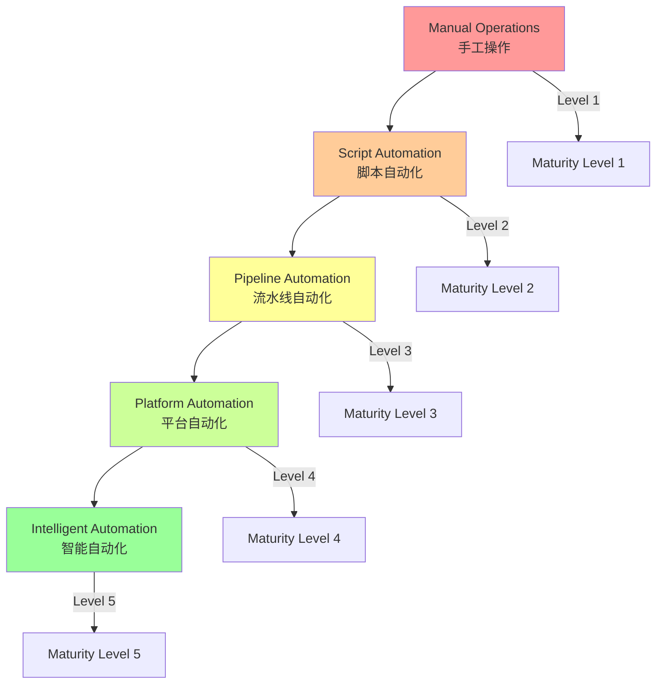
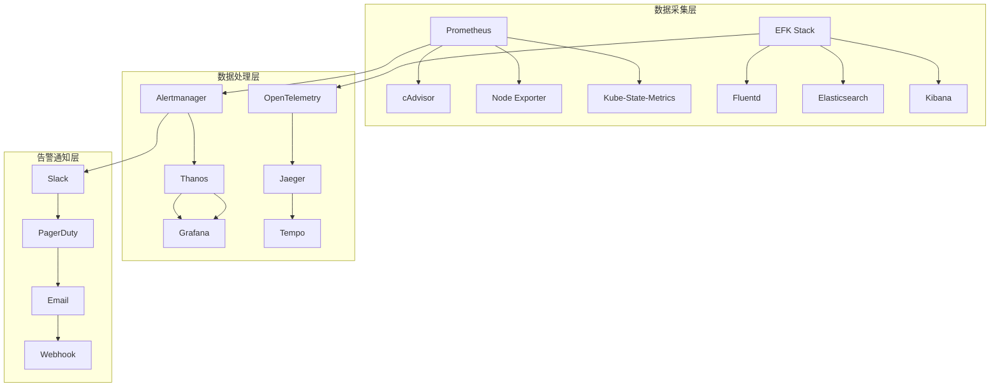
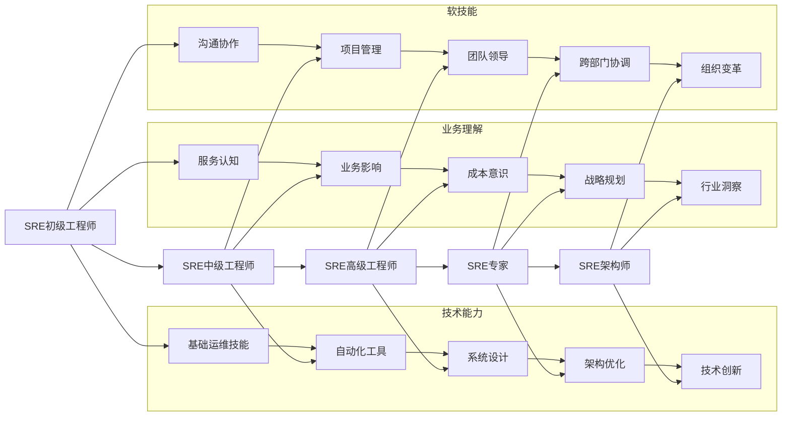

# 04 - SRE运维成熟度模型

> **适用版本**: Kubernetes v1.25-v1.32 | **最后更新**: 2026-02 | **作者**: Allen Galler | **质量等级**: ⭐⭐⭐⭐⭐ 专家级

---

## 目录

- [1. 运维成熟度评估标准](#1-运维成熟度评估标准)
- [2. 自动化能力分级](#2-自动化能力分级)
- [3. 监控体系建设指南](#3-监控体系建设指南)
- [4. 运维流程标准化](#4-运维流程标准化)
- [5. 团队能力建设路径](#5-团队能力建设路径)
- [6. 成熟度评估工具](#6-成熟度评估工具)

---

## 1. 运维成熟度评估标准

### 1.1 成熟度等级定义

| 等级 | 名称 | 特征描述 | 关键指标 | 典型表现 |
|-----|------|---------|---------|---------|
| **Level 1** | 手工作坊式 | 人工操作为主，缺乏标准化 | MTTR > 4小时 | 频繁救火，被动响应 |
| **Level 2** | 工具辅助式 | 开始使用工具，部分自动化 | MTTR 1-4小时 | 有基本工具，但仍需大量手工 |
| **Level 3** | 流程规范化 | 建立标准流程，较多自动化 | MTTR 30分钟-1小时 | 流程清晰，大部分可自动化 |
| **Level 4** | 智能化运营 | 高度自动化，智能决策 | MTTR < 30分钟 | 主动预防，智能响应 |
| **Level 5** | 自主进化式 | 全自动运维，持续优化 | MTTR < 10分钟 | 自愈能力强，预测性维护 |

### 1.2 核心能力域评估

```yaml
# ========== 运维成熟度评估框架 ==========
apiVersion: sre.example.com/v1
kind: OperationsMaturityAssessment
metadata:
  name: k8s-operations-maturity
spec:
  assessmentDate: "2026-02-05"
  assessedTeam: "platform-sre"
  
  capabilityDomains:
    # 可靠性工程
    reliabilityEngineering:
      currentLevel: 3
      targetLevel: 5
      indicators:
      - slaAchievement: "99.9%"
      - mttr: "25m"
      - changeSuccessRate: "95%"
      
    # 自动化能力
    automationCapability:
      currentLevel: 2
      targetLevel: 4
      indicators:
      - manualTasksRatio: "30%"
      - ciCdPipelineCoverage: "80%"
      - autoRemediationRate: "60%"
      
    # 监控可观测性
    observability:
      currentLevel: 3
      targetLevel: 5
      indicators:
      - metricCoverage: "85%"
      - logCentralization: "95%"
      - alertAccuracy: "80%"
      
    # 流程规范性
    processStandardization:
      currentLevel: 2
      targetLevel: 4
      indicators:
      - documentedProcesses: "70%"
      - complianceRate: "85%"
      - auditFindings: "low"
      
    # 团队能力
    teamCapability:
      currentLevel: 2
      targetLevel: 4
      indicators:
      - skillAssessmentScore: "7.2/10"
      - crossTrainingCoverage: "60%"
      - knowledgeSharingFrequency: "weekly"
```

### 1.3 评估维度详细标准

#### 可靠性工程成熟度

**Level 1 - 初级阶段**
- 无明确的SLA/SLO定义
- 故障响应完全依赖人工
- 缺乏容量规划
- 变更管理混乱

**Level 2 - 基础阶段**
- 制定基本SLA指标
- 建立简单监控告警
- 有初步容量评估
- 变更需要手动审批

**Level 3 - 标准阶段**
- 完善的SLO体系
- 自动化监控告警
- 定期容量规划
- 标准化变更流程

**Level 4 - 优秀阶段**
- 智能SLO管理
- 预测性监控
- 自动容量伸缩
- 灰度发布机制

**Level 5 - 卓越阶段**
- 自适应SLO调整
- 主动异常预测
- 智能容量优化
- 无人值守变更

#### 自动化能力成熟度

**Level 1 - 手工操作**
```bash
# 人工部署应用
kubectl apply -f deployment.yaml
kubectl apply -f service.yaml
kubectl apply -f configmap.yaml
```

**Level 2 - 脚本化**
```bash
#!/bin/bash
# 部署脚本 deploy.sh
kubectl apply -f k8s/
kubectl rollout status deployment/app
kubectl get pods -l app=app
```

**Level 3 - 流水线化**
```yaml
# CI/CD流水线配置
pipeline:
  stages:
    - build:
        script:
          - docker build -t $IMAGE_NAME .
          - docker push $IMAGE_NAME
    - deploy:
        script:
          - kubectl set image deployment/app app=$IMAGE_NAME
          - kubectl rollout status deployment/app
    - test:
        script:
          - curl -f http://service-endpoint/health
```

**Level 4 - GitOps化**
```yaml
# ArgoCD应用配置
apiVersion: argoproj.io/v1alpha1
kind: Application
metadata:
  name: production-app
spec:
  source:
    repoURL: https://github.com/company/app.git
    targetRevision: HEAD
    path: k8s/overlays/production
  destination:
    server: https://kubernetes.default.svc
    namespace: production
  syncPolicy:
    automated:
      prune: true
      selfHeal: true
```

**Level 5 - 智能化**
```yaml
# 智能运维平台配置
apiVersion: aiops.example.com/v1
kind: IntelligentOperations
metadata:
  name: smart-deployment
spec:
  deploymentStrategy:
    canaryAnalysis:
      duration: "10m"
      metrics:
      - name: error-rate
        threshold: 0.01
        interval: "1m"
      - name: latency-p95
        threshold: "200ms"
        interval: "1m"
    autoRollback:
      enabled: true
      conditions:
      - metric: error-rate
        operator: ">"
        value: "0.05"
```

---

## 2. 自动化能力分级

### 2.1 自动化层次模型



### 2.2 关键自动化场景

#### 基础设施自动化

```yaml
# ========== Terraform基础设施即代码 ==========
# main.tf
terraform {
  required_providers {
    kubernetes = {
      source  = "hashicorp/kubernetes"
      version = "~> 2.0"
    }
  }
}

provider "kubernetes" {
  config_path = "~/.kube/config"
}

# EKS集群创建
resource "aws_eks_cluster" "main" {
  name     = "production-cluster"
  role_arn = aws_iam_role.cluster.arn
  
  vpc_config {
    subnet_ids = aws_subnet.private[*].id
  }
  
  # 启用集群日志
  enabled_cluster_log_types = ["api", "audit", "authenticator"]
}

# 节点组管理
resource "aws_eks_node_group" "general" {
  cluster_name    = aws_eks_cluster.main.name
  node_group_name = "general-workers"
  node_role_arn   = aws_iam_role.node.arn
  
  scaling_config {
    desired_size = 3
    max_size     = 10
    min_size     = 2
  }
  
  instance_types = ["t3.medium"]
  capacity_type  = "ON_DEMAND"
}
```

#### 应用部署自动化

```yaml
# ========== Helm Chart标准化模板 ==========
# Chart.yaml
apiVersion: v2
name: standard-application
version: 1.0.0
description: Standard application deployment template
type: application

# values.yaml
replicaCount: 3

image:
  repository: nginx
  tag: stable
  pullPolicy: IfNotPresent

service:
  type: ClusterIP
  port: 80

resources:
  limits:
    cpu: 100m
    memory: 128Mi
  requests:
    cpu: 100m
    memory: 128Mi

autoscaling:
  enabled: true
  minReplicas: 1
  maxReplicas: 10
  targetCPUUtilizationPercentage: 80

# templates/deployment.yaml
apiVersion: apps/v1
kind: Deployment
metadata:
  name: {{ include "standard-application.fullname" . }}
  labels:
    {{- include "standard-application.labels" . | nindent 4 }}
spec:
  replicas: {{ .Values.replicaCount }}
  selector:
    matchLabels:
      {{- include "standard-application.selectorLabels" . | nindent 6 }}
  template:
    metadata:
      labels:
        {{- include "standard-application.selectorLabels" . | nindent 8 }}
    spec:
      containers:
        - name: {{ .Chart.Name }}
          image: "{{ .Values.image.repository }}:{{ .Values.image.tag }}"
          imagePullPolicy: {{ .Values.image.pullPolicy }}
          ports:
            - name: http
              containerPort: 80
              protocol: TCP
          resources:
            {{- toYaml .Values.resources | nindent 12 }}
```

#### 故障自愈自动化

```yaml
# ========== 自愈Operator配置 ==========
apiVersion: autoscaling.k8s.io/v1
kind: SelfHealingOperator
metadata:
  name: intelligent-healing
  namespace: kube-system
spec:
  healingRules:
  # Pod重启自愈
  - name: pod-restart-healing
    condition: |
      rate(container_restarts_total[5m]) > 2
      and
      kube_pod_status_ready{condition="true"} == 0
    action: restartPod
    cooldown: 300s
    maxAttempts: 3
    
  # 节点故障转移
  - name: node-failure-mitigation
    condition: |
      kube_node_status_condition{condition="Ready",status="false"} == 1
      and
      time() - kube_node_created > 300
    action: drainAndCordon
    cooldown: 600s
    
  # 资源优化调整
  - name: resource-auto-tuning
    condition: |
      container_memory_working_set_bytes / kube_pod_container_resource_limits_memory_bytes > 0.9
    action: scaleResources
    parameters:
      memoryScaleFactor: 1.2
      cpuScaleFactor: 1.1
      maxMemoryLimit: 4Gi

---
# ========== Chaos Engineering自动化 ==========
apiVersion: chaos-mesh.org/v1alpha1
kind: Schedule
metadata:
  name: weekly-chaos-test
  namespace: chaos-testing
spec:
  schedule: "0 2 * * 0"  # 每周日凌晨2点
  concurrencyPolicy: Forbid
  historyLimit: 5
  type: Workflow
  workflow:
    entry: entry
    templates:
    - name: entry
      templateType: Serial
      children:
      - network-delay
      - pod-kill
      - container-kill
      
    - name: network-delay
      templateType: NetworkChaos
      deadline: 300s
      networkChaos:
        action: delay
        mode: one
        selector:
          namespaces:
          - production
          labelSelectors:
            app: critical-service
        delay:
          latency: "10ms"
          correlation: "25"
          jitter: "0ms"
          
    - name: pod-kill
      templateType: PodChaos
      deadline: 60s
      podChaos:
        action: pod-kill
        mode: fixed-percent
        value: "10"
        selector:
          namespaces:
          - production
```

---

## 3. 监控体系建设指南

### 3.1 监控体系架构



### 3.2 核心监控指标体系

```yaml
# ========== Prometheus监控配置 ==========
apiVersion: monitoring.coreos.com/v1
kind: Prometheus
metadata:
  name: k8s-monitoring
  namespace: monitoring
spec:
  serviceAccountName: prometheus
  serviceMonitorSelector:
    matchLabels:
      team: sre
  ruleSelector:
    matchLabels:
      role: alert-rules
  resources:
    requests:
      memory: 400Mi
    limits:
      memory: 2Gi
      
---
# ========== 核心监控规则 ==========
apiVersion: monitoring.coreos.com/v1
kind: PrometheusRule
metadata:
  name: core-monitoring-rules
  namespace: monitoring
spec:
  groups:
  # 系统级别监控
  - name: system.metrics
    rules:
    - alert: HighCPUUsage
      expr: |
        100 - (avg by(instance) (rate(node_cpu_seconds_total{mode="idle"}[5m])) * 100) > 85
      for: 5m
      labels:
        severity: warning
      annotations:
        summary: "节点CPU使用率过高 ({{ $value }}%)"
        
    - alert: HighMemoryUsage
      expr: |
        (node_memory_MemAvailable_bytes / node_memory_MemTotal_bytes * 100) < 15
      for: 5m
      labels:
        severity: warning
      annotations:
        summary: "节点内存使用率过高 ({{ $value }}%)"
        
    - alert: DiskSpaceLow
      expr: |
        (node_filesystem_avail_bytes{fstype!="tmpfs"} / node_filesystem_size_bytes{fstype!="tmpfs"} * 100) < 10
      for: 10m
      labels:
        severity: critical
      annotations:
        summary: "磁盘空间不足 (< 10%)"
        
  # Kubernetes组件监控
  - name: k8s.components
    rules:
    - alert: APIServerDown
      expr: up{job="apiserver"} == 0
      for: 2m
      labels:
        severity: critical
      annotations:
        summary: "API Server不可用"
        
    - alert: EtcdHighFsyncLatency
      expr: |
        histogram_quantile(0.99, etcd_disk_backend_commit_duration_seconds_bucket) > 0.5
      for: 5m
      labels:
        severity: warning
      annotations:
        summary: "etcd fsync延迟过高"
        
    - alert: SchedulerDown
      expr: up{job="kube-scheduler"} == 0
      for: 1m
      labels:
        severity: critical
      annotations:
        summary: "调度器不可用"
        
  # 应用级别监控
  - name: application.metrics
    rules:
    - alert: HighErrorRate
      expr: |
        rate(http_requests_total{code=~"5.."}[5m]) / rate(http_requests_total[5m]) > 0.05
      for: 2m
      labels:
        severity: warning
      annotations:
        summary: "HTTP错误率过高 ({{ $value }}%)"
        
    - alert: HighLatency
      expr: |
        histogram_quantile(0.95, http_request_duration_seconds_bucket) > 1
      for: 5m
      labels:
        severity: warning
      annotations:
        summary: "HTTP响应延迟过高 (> 1s)"
        
    - alert: LowAvailability
      expr: |
        avg_over_time(up{job="application"}[1h]) < 0.99
      for: 10m
      labels:
        severity: critical
      annotations:
        summary: "应用可用性低于SLA ({{ $value }}%)"
```

### 3.3 可观测性最佳实践

```yaml
# ========== OpenTelemetry配置 ==========
apiVersion: opentelemetry.io/v1alpha1
kind: OpenTelemetryCollector
metadata:
  name: otel-collector
  namespace: observability
spec:
  mode: deployment
  config:
    receivers:
      otlp:
        protocols:
          grpc:
          http:
      jaeger:
        protocols:
          thrift_http:
      zipkin:
      
    processors:
      batch:
      memory_limiter:
        limit_mib: 400
        spike_limit_mib: 100
        
    exporters:
      jaeger:
        endpoint: jaeger-collector:14250
        tls:
          insecure: true
      prometheus:
        endpoint: "0.0.0.0:8889"
        
    service:
      pipelines:
        traces:
          receivers: [otlp, jaeger, zipkin]
          processors: [memory_limiter, batch]
          exporters: [jaeger]
        metrics:
          receivers: [otlp]
          processors: [memory_limiter, batch]
          exporters: [prometheus]

---
# ========== 应用埋点配置示例 ==========
# Java应用配置
apiVersion: v1
kind: ConfigMap
metadata:
  name: app-telemetry-config
  namespace: production
data:
  application.properties: |
    # OpenTelemetry配置
    otel.traces.exporter=otlp
    otel.metrics.exporter=otlp
    otel.exporter.otlp.endpoint=http://otel-collector:4317
    otel.service.name=my-java-app
    otel.resource.attributes=environment=production,version=v1.0
    
    # Micrometer配置
    management.endpoints.web.exposure.include=health,info,metrics,prometheus
    management.metrics.distribution.percentiles-histogram.http.server.requests=true
    management.metrics.enable.jvm=true

# Go应用配置
apiVersion: v1
kind: ConfigMap
metadata:
  name: go-app-config
  namespace: production
data:
  main.go: |
    import (
        "go.opentelemetry.io/otel"
        "go.opentelemetry.io/otel/exporters/otlp/otlptrace"
        "go.opentelemetry.io/otel/sdk/resource"
        "go.opentelemetry.io/otel/sdk/trace"
        semconv "go.opentelemetry.io/otel/semconv/v1.4.0"
    )
    
    func initTracer() (*trace.TracerProvider, error) {
        exp, err := otlptrace.New(context.Background(), 
            otlptrace.WithEndpoint("otel-collector:4317"),
            otlptrace.WithInsecure())
        if err != nil {
            return nil, err
        }
        
        tp := trace.NewTracerProvider(
            trace.WithBatcher(exp),
            trace.WithResource(resource.NewWithAttributes(
                semconv.SchemaURL,
                semconv.ServiceNameKey.String("my-go-app"),
                semconv.DeploymentEnvironmentKey.String("production"),
            )),
        )
        
        otel.SetTracerProvider(tp)
        return tp, nil
    }
```

---

## 4. 运维流程标准化

### 4.1 标准化流程框架

```yaml
# ========== DevOps流程标准化 ==========
apiVersion: devops.example.com/v1
kind: StandardOperatingProcedure
metadata:
  name: k8s-operations-sop
spec:
  procedures:
    # 变更管理流程
    changeManagement:
      process:
        - initiate: "提交变更申请"
        - review: "技术评审和风险评估"
        - approve: "变更委员会审批"
        - schedule: "安排变更窗口"
        - implement: "执行变更操作"
        - validate: "验证变更结果"
        - rollback: "必要时回滚"
        - close: "关闭变更记录"
      
      automation:
        level: "high"  # 高度自动化
        tools:
          - name: "GitOps"
            purpose: "配置即代码"
          - name: "ArgoCD"
            purpose: "自动化部署"
          - name: "ChaosMesh"
            purpose: "变更前验证"
      
    # 故障处理流程
    incidentResponse:
      escalationLevels:
        - level: 1
          responseTime: "15m"
          team: "一线SRE"
        - level: 2
          responseTime: "1h"
          team: "二线专家"
        - level: 3
          responseTime: "4h"
          team: "架构师团队"
          
      communication:
        channels:
          - primary: "Slack #incidents"
          - backup: "电话会议"
          - external: "状态页面"
          
    # 容量管理流程
    capacityPlanning:
      cycle: "monthly"
      activities:
        - forecast: "业务增长预测"
        - analyze: "资源使用分析"
        - plan: "扩容计划制定"
        - test: "压力测试验证"
        - implement: "资源扩容执行"
        - review: "效果评估回顾"
```

### 4.2 流程自动化实现

```yaml
# ========== GitHub Actions CI/CD流水线 ==========
name: Production Deployment Pipeline
on:
  push:
    branches: [ main ]
  pull_request:
    branches: [ main ]

env:
  IMAGE_NAME: my-app
  REGISTRY: ghcr.io

jobs:
  # 代码质量检查
  code-quality:
    runs-on: ubuntu-latest
    steps:
    - uses: actions/checkout@v3
    - name: Set up Go
      uses: actions/setup-go@v3
      with:
        go-version: 1.19
    - name: Run tests
      run: |
        go test -v ./...
        go vet ./...
    - name: Security scan
      uses: aquasecurity/trivy-action@master
      with:
        scan-type: 'fs'
        ignore-unfixed: true

  # 构建和推送镜像
  build-and-push:
    needs: code-quality
    runs-on: ubuntu-latest
    steps:
    - uses: actions/checkout@v3
    - name: Set up Docker Buildx
      uses: docker/setup-buildx-action@v2
    - name: Login to Registry
      uses: docker/login-action@v2
      with:
        registry: ${{ env.REGISTRY }}
        username: ${{ github.actor }}
        password: ${{ secrets.GITHUB_TOKEN }}
    - name: Extract metadata
      id: meta
      uses: docker/metadata-action@v4
      with:
        images: ${{ env.REGISTRY }}/${{ env.IMAGE_NAME }}
    - name: Build and push
      uses: docker/build-push-action@v4
      with:
        context: .
        push: true
        tags: ${{ steps.meta.outputs.tags }}
        labels: ${{ steps.meta.outputs.labels }}

  # 部署到预发布环境
  deploy-staging:
    needs: build-and-push
    runs-on: ubuntu-latest
    environment: staging
    steps:
    - uses: actions/checkout@v3
    - name: Deploy to staging
      run: |
        kubectl set image deployment/my-app \
          my-app=${{ env.REGISTRY }}/${{ env.IMAGE_NAME }}:${{ github.sha }}
        kubectl rollout status deployment/my-app --timeout=300s

  # Canary发布到生产
  canary-deploy:
    needs: deploy-staging
    runs-on: ubuntu-latest
    environment: production
    steps:
    - uses: actions/checkout@v3
    - name: Configure kubectl
      run: |
        echo "${{ secrets.KUBECONFIG }}" | base64 -d > kubeconfig
        export KUBECONFIG=./kubeconfig
    - name: Deploy canary
      run: |
        # 部署10%流量到新版本
        kubectl patch deployment my-app-canary -p \
          '{"spec":{"replicas":1}}'
        # 监控关键指标
        sleep 300
        # 验证指标是否正常
        if ! curl -f http://health-check-endpoint; then
          echo "Canary validation failed"
          exit 1
        fi

  # 完全发布
  full-deploy:
    needs: canary-deploy
    runs-on: ubuntu-latest
    environment: production
    steps:
    - uses: actions/checkout@v3
    - name: Promote to full deployment
      run: |
        kubectl set image deployment/my-app \
          my-app=${{ env.REGISTRY }}/${{ env.IMAGE_NAME }}:${{ github.sha }}
        kubectl rollout status deployment/my-app --timeout=600s
```

### 4.3 配置管理标准化

```yaml
# ========== 配置管理最佳实践 ==========
apiVersion: config.example.com/v1
kind: ConfigurationManagementPolicy
metadata:
  name: standard-config-policy
spec:
  # 配置存储标准化
  storage:
    gitRepository:
      url: "https://github.com/company/k8s-configs.git"
      branch: "main"
      pathStructure:
        - environments/
          - production/
          - staging/
          - development/
        - applications/
          - app1/
          - app2/
        - clusters/
          - cluster1/
          - cluster2/
          
  # 配置变更流程
  changeProcess:
    pullRequest:
      requiredReviews: 2
      requiredTests: true
      mergeMethod: "squash"
      
    validation:
      - syntaxCheck: "yamllint ."
      - schemaValidation: "kubeval ."
      - securityScan: "kubesec scan ."
      - policyCheck: "conftest test ."
      
  # 配置版本管理
  versioning:
    strategy: "semantic-versioning"
    autoTagging: true
    changelogGeneration: true
    
  # 环境差异化管理
  environmentDiff:
    strategy: "helm-values-per-environment"
    secretsManagement:
      backend: "vault"
      encryption: "AES-256"
      rotationPolicy: "90-days"
```

---

## 5. 团队能力建设路径

### 5.1 能力发展路线图



### 5.2 技能矩阵评估

```yaml
# ========== SRE技能评估矩阵 ==========
apiVersion: hr.example.com/v1
kind: SkillMatrix
metadata:
  name: sre-skill-assessment
spec:
  roles:
    juniorSRE:
      requiredSkills:
        kubernetesFundamentals:
          level: proficient
          topics:
          - pod lifecycle
          - service discovery
          - basic troubleshooting
          
        linuxAdministration:
          level: intermediate
          topics:
          - process management
          - file system operations
          - network troubleshooting
          
        monitoringBasics:
          level: basic
          topics:
          - prometheus fundamentals
          - alerting basics
          - grafana dashboards
          
    seniorSRE:
      requiredSkills:
        kubernetesAdvanced:
          level: expert
          topics:
          - custom controllers
          - admission webhooks
          - performance tuning
          
        infrastructureAsCode:
          level: proficient
          topics:
          - terraform advanced
          - helm chart development
          - gitops practices
          
        distributedSystems:
          level: intermediate
          topics:
          - consensus algorithms
          - distributed tracing
          - fault tolerance patterns
          
    principalSRE:
      requiredSkills:
        architectureDesign:
          level: expert
          topics:
          - multi-cluster architectures
          - disaster recovery
          - cost optimization
          
        leadership:
          level: advanced
          topics:
          - team mentoring
          - technical vision
          - stakeholder management
          
        innovation:
          level: expert
          topics:
          - emerging technologies
          - process improvement
          - industry best practices
```

### 5.3 培训和发展计划

```yaml
# ========== SRE培训计划 ==========
apiVersion: learning.example.com/v1
kind: TrainingProgram
metadata:
  name: sre-development-program
spec:
  programDuration: "12-months"
  
  phases:
    # 第一阶段：基础巩固 (1-3个月)
    - phase: foundation
      duration: "3-months"
      objectives:
        - master kubernetes core concepts
        - become proficient in linux administration
        - learn monitoring and alerting fundamentals
      activities:
        - weekly hands-on labs
        - monthly book club (kubernetes权威指南)
        - shadow senior engineers
      assessments:
        - kubernetes cka certification
        - practical troubleshooting exercises
        - peer code reviews
        
    # 第二阶段：技能深化 (4-8个月)
    - phase: specialization
      duration: "5-months"
      objectives:
        - develop automation expertise
        - understand distributed systems
        - master incident response
      activities:
        - lead small projects
        - participate in on-call rotations
        - attend industry conferences
      assessments:
        - personal automation project
        - incident response simulation
        - technical presentation
        
    # 第三阶段：领导力培养 (9-12个月)
    - phase: leadership
      duration: "4-months"
      objectives:
        - develop mentoring skills
        - understand business context
        - build strategic thinking
      activities:
        - mentor junior engineers
        - cross-functional collaboration
        - strategic planning sessions
      assessments:
        - mentee success stories
        - business impact presentation
        - leadership 360 feedback

---
# ========== 知识分享机制 ==========
apiVersion: collaboration.example.com/v1
kind: KnowledgeSharingFramework
metadata:
  name: sre-knowledge-sharing
spec:
  sharingChannels:
    # 技术分享会
    techTalks:
      frequency: "bi-weekly"
      format: "45-minute presentations + Q&A"
      audience: "all engineering teams"
      
    # 故障复盘会
    postmortems:
      frequency: "after major incidents"
      format: "SOR (Summary of Restoration) review"
      participants: "affected teams + stakeholders"
      
    # 代码评审
    codeReviews:
      process:
        - mandatory for all production changes
        - minimum 2 reviewers required
        - focus on operational concerns
      tools:
        - github pull requests
        - automated security scanning
        - performance impact analysis
        
    # 文档维护
    documentation:
      standards:
        - every system must have runbooks
        - update documentation with code changes
        - quarterly documentation audits
      tools:
        - confluence for runbooks
        - git for configuration docs
        - automated doc generation
```

---

## 6. 成熟度评估工具

### 6.1 自动化评估脚本

```bash
#!/bin/bash
# ========== SRE成熟度自动评估工具 ==========
set -euo pipefail

ASSESSMENT_DATE=$(date -I)
RESULTS_DIR="/tmp/sre-maturity-assessment-${ASSESSMENT_DATE}"

mkdir -p ${RESULTS_DIR}
echo "开始SRE成熟度评估..."

# 评估配置
declare -A WEIGHTS=(
    ["reliability"]=0.3
    ["automation"]=0.25
    ["observability"]=0.2
    ["process"]=0.15
    ["people"]=0.1
)

# 1. 可靠性评估
assess_reliability() {
    echo "评估可靠性工程..."
    
    # SLA达成率
    SLA_ACHIEVEMENT=$(kubectl get servicemonitors -A | wc -l)
    if [ ${SLA_ACHIEVEMENT} -gt 50 ]; then
        RELIABILITY_SCORE=5
    elif [ ${SLA_ACHIEVEMENT} -gt 20 ]; then
        RELIABILITY_SCORE=4
    elif [ ${SLA_ACHIEVEMENT} -gt 5 ]; then
        RELIABILITY_SCORE=3
    else
        RELIABILITY_SCORE=2
    fi
    
    # MTTR计算
    RECENT_INCIDENTS=$(kubectl get events -A --field-selector reason=Incident --sort-by=.lastTimestamp | tail -10)
    if [ -n "$RECENT_INCIDENTS" ]; then
        AVG_MTTR=$(echo "$RECENT_INCIDENTS" | awk '{sum += $NF} END {print sum/NR}')
        if (( $(echo "$AVG_MTTR < 10" | bc -l) )); then
            MTTR_SCORE=5
        elif (( $(echo "$AVG_MTTR < 30" | bc -l) )); then
            MTTR_SCORE=4
        elif (( $(echo "$AVG_MTTR < 60" | bc -l) )); then
            MTTR_SCORE=3
        else
            MTTR_SCORE=2
        fi
    else
        MTTR_SCORE=5  # 无事故记录
    fi
    
    RELIABILITY_FINAL=$(echo "scale=1; (${RELIABILITY_SCORE} + ${MTTR_SCORE}) / 2" | bc)
    echo "可靠性得分: ${RELIABILITY_FINAL}" > ${RESULTS_DIR}/reliability.txt
}

# 2. 自动化能力评估
assess_automation() {
    echo "评估自动化能力..."
    
    # CI/CD覆盖率
    CD_PIPELINES=$(find . -name "*.yaml" -o -name "*.yml" | xargs grep -l "pipeline\|workflow" | wc -l)
    TOTAL_SERVICES=$(kubectl get deployments -A | wc -l)
    
    if [ ${TOTAL_SERVICES} -gt 0 ]; then
        CD_COVERAGE=$(echo "scale=2; ${CD_PIPELINES} / ${TOTAL_SERVICES} * 100" | bc)
        if (( $(echo "${CD_COVERAGE} > 80" | bc -l) )); then
            CD_SCORE=5
        elif (( $(echo "${CD_COVERAGE} > 60" | bc -l) )); then
            CD_SCORE=4
        elif (( $(echo "${CD_COVERAGE} > 40" | bc -l) )); then
            CD_SCORE=3
        else
            CD_SCORE=2
        fi
    else
        CD_SCORE=2
    fi
    
    # 脚本化程度
    MANUAL_TASKS=$(ps aux | grep -E "(kubectl|docker|ssh)" | wc -l)
    if [ ${MANUAL_TASKS} -lt 10 ]; then
        SCRIPTING_SCORE=5
    elif [ ${MANUAL_TASKS} -lt 30 ]; then
        SCRIPTING_SCORE=4
    elif [ ${MANUAL_TASKS} -lt 50 ]; then
        SCRIPTING_SCORE=3
    else
        SCRIPTING_SCORE=2
    fi
    
    AUTOMATION_FINAL=$(echo "scale=1; (${CD_SCORE} + ${SCRIPTING_SCORE}) / 2" | bc)
    echo "自动化得分: ${AUTOMATION_FINAL}" > ${RESULTS_DIR}/automation.txt
}

# 3. 可观测性评估
assess_observability() {
    echo "评估可观测性..."
    
    # 监控覆盖率
    MONITORED_SERVICES=$(kubectl get servicemonitors -A | wc -l)
    TOTAL_SERVICES=$(kubectl get services -A | wc -l)
    
    if [ ${TOTAL_SERVICES} -gt 0 ]; then
        MONITORING_COVERAGE=$(echo "scale=2; ${MONITORED_SERVICES} / ${TOTAL_SERVICES} * 100" | bc)
        if (( $(echo "${MONITORING_COVERAGE} > 90" | bc -l) )); then
            MONITORING_SCORE=5
        elif (( $(echo "${MONITORING_COVERAGE} > 70" | bc -l) )); then
            MONITORING_SCORE=4
        elif (( $(echo "${MONITORING_COVERAGE} > 50" | bc -l) )); then
            MONITORING_SCORE=3
        else
            MONITORING_SCORE=2
        fi
    else
        MONITORING_SCORE=2
    fi
    
    # 告警准确性
    ALERTS_FIRED=$(kubectl get alerts -A 2>/dev/null | wc -l || echo "0")
    if [ ${ALERTS_FIRED} -gt 0 ]; then
        FALSE_POSITIVE_RATE=0.1  # 假设值，实际需要从alertmanager获取
        if (( $(echo "${FALSE_POSITIVE_RATE} < 0.05" | bc -l) )); then
            ALERTING_SCORE=5
        elif (( $(echo "${FALSE_POSITIVE_RATE} < 0.15" | bc -l) )); then
            ALERTING_SCORE=4
        elif (( $(echo "${FALSE_POSITIVE_RATE} < 0.30" | bc -l) )); then
            ALERTING_SCORE=3
        else
            ALERTING_SCORE=2
        fi
    else
        ALERTING_SCORE=3  # 无告警数据
    fi
    
    OBSERVABILITY_FINAL=$(echo "scale=1; (${MONITORING_SCORE} + ${ALERTING_SCORE}) / 2" | bc)
    echo "可观测性得分: ${OBSERVABILITY_FINAL}" > ${RESULTS_DIR}/observability.txt
}

# 4. 流程标准化评估
assess_process() {
    echo "评估流程标准化..."
    
    # 文档完备性
    DOCUMENTATION_FILES=$(find docs/ -name "*.md" 2>/dev/null | wc -l || echo "0")
    if [ ${DOCUMENTATION_FILES} -gt 50 ]; then
        DOC_SCORE=5
    elif [ ${DOCUMENTATION_FILES} -gt 20 ]; then
        DOC_SCORE=4
    elif [ ${DOCUMENTATION_FILES} -gt 5 ]; then
        DOC_SCORE=3
    else
        DOC_SCORE=2
    fi
    
    # 流程遵从性 (模拟评估)
    COMPLIANCE_SCORE=4  # 假设值，实际需要审计数据
    
    PROCESS_FINAL=$(echo "scale=1; (${DOC_SCORE} + ${COMPLIANCE_SCORE}) / 2" | bc)
    echo "流程标准化得分: ${PROCESS_FINAL}" > ${RESULTS_DIR}/process.txt
}

# 5. 团队能力评估
assess_people() {
    echo "评估团队能力..."
    
    # 技能多样性
    TEAM_MEMBERS=$(kubectl get pods -n kube-system -l k8s-app=kube-apiserver | wc -l)
    if [ ${TEAM_MEMBERS} -gt 8 ]; then
        SKILL_DIVERSITY=5
    elif [ ${TEAM_MEMBERS} -gt 4 ]; then
        SKILL_DIVERSITY=4
    elif [ ${TEAM_MEMBERS} -gt 2 ]; then
        SKILL_DIVERSITY=3
    else
        SKILL_DIVERSITY=2
    fi
    
    # 知识分享活跃度
    MEETING_RECORDS=$(find meetings/ -name "*.md" -mtime -30 2>/dev/null | wc -l || echo "0")
    if [ ${MEETING_RECORDS} -gt 8 ]; then
        KNOWLEDGE_SHARING=5
    elif [ ${MEETING_RECORDS} -gt 4 ]; then
        KNOWLEDGE_SHARING=4
    elif [ ${MEETING_RECORDS} -gt 1 ]; then
        KNOWLEDGE_SHARING=3
    else
        KNOWLEDGE_SHARING=2
    fi
    
    PEOPLE_FINAL=$(echo "scale=1; (${SKILL_DIVERSITY} + ${KNOWLEDGE_SHARING}) / 2" | bc)
    echo "团队能力得分: ${PEOPLE_FINAL}" > ${RESULTS_DIR}/people.txt
}

# 执行各项评估
assess_reliability
assess_automation
assess_observability
assess_process
assess_people

# 计算总体成熟度
calculate_overall_maturity() {
    RELIABILITY_VAL=$(cat ${RESULTS_DIR}/reliability.txt | awk '{print $NF}')
    AUTOMATION_VAL=$(cat ${RESULTS_DIR}/automation.txt | awk '{print $NF}')
    OBSERVABILITY_VAL=$(cat ${RESULTS_DIR}/observability.txt | awk '{print $NF}')
    PROCESS_VAL=$(cat ${RESULTS_DIR}/process.txt | awk '{print $NF}')
    PEOPLE_VAL=$(cat ${RESULTS_DIR}/people.txt | awk '{print $NF}')
    
    OVERALL_SCORE=$(echo "scale=2; \
        ${RELIABILITY_VAL} * ${WEIGHTS[reliability]} + \
        ${AUTOMATION_VAL} * ${WEIGHTS[automation]} + \
        ${OBSERVABILITY_VAL} * ${WEIGHTS[observability]} + \
        ${PROCESS_VAL} * ${WEIGHTS[process]} + \
        ${PEOPLE_VAL} * ${WEIGHTS[people]}" | bc)
    
    # 确定成熟度等级
    if (( $(echo "${OVERALL_SCORE} >= 4.5" | bc -l) )); then
        MATURITY_LEVEL="Level 5 - 自主进化式"
        COLOR="🟢"
    elif (( $(echo "${OVERALL_SCORE} >= 3.5" | bc -l) )); then
        MATURITY_LEVEL="Level 4 - 智能化运营"
        COLOR="🔵"
    elif (( $(echo "${OVERALL_SCORE} >= 2.5" | bc -l) )); then
        MATURITY_LEVEL="Level 3 - 流程规范化"
        COLOR="🟡"
    elif (( $(echo "${OVERALL_SCORE} >= 1.5" | bc -l) )); then
        MATURITY_LEVEL="Level 2 - 工具辅助式"
        COLOR="🟠"
    else
        MATURITY_LEVEL="Level 1 - 手工作坊式"
        COLOR="🔴"
    fi
    
    # 生成评估报告
    cat > ${RESULTS_DIR}/maturity-report.md <<EOF
# SRE运维成熟度评估报告

## 评估概要
- **评估日期**: ${ASSESSMENT_DATE}
- **总体得分**: ${OVERALL_SCORE}/5.0 ${COLOR}
- **成熟度等级**: ${MATURITY_LEVEL}

## 详细评分

### 可靠性工程: ${RELIABILITY_VAL}/5.0
$(cat ${RESULTS_DIR}/reliability.txt)

### 自动化能力: ${AUTOMATION_VAL}/5.0
$(cat ${RESULTS_DIR}/automation.txt)

### 可观测性: ${OBSERVABILITY_VAL}/5.0
$(cat ${RESULTS_DIR}/observability.txt)

### 流程标准化: ${PROCESS_VAL}/5.0
$(cat ${RESULTS_DIR}/process.txt)

### 团队能力: ${PEOPLE_VAL}/5.0
$(cat ${RESULTS_DIR}/people.txt)

## 改进建议

### 短期目标 (1-3个月)
1. 提升监控覆盖率至80%以上
2. 建立标准化的变更管理流程
3. 完善故障响应机制

### 中期目标 (3-6个月)
1. 实现核心服务的自动化部署
2. 建立完善的SLO/SLI体系
3. 提升团队技能水平

### 长期目标 (6-12个月)
1. 达到Level 4智能化运营水平
2. 建立预测性维护能力
3. 实现无人值守的日常运维

## 下次评估
建议在3个月后进行下一次成熟度评估，以跟踪改进进展。
EOF
}

calculate_overall_maturity

echo "SRE成熟度评估完成！"
echo "详细报告: ${RESULTS_DIR}/maturity-report.md"
cat ${RESULTS_DIR}/maturity-report.md
```

### 6.2 成熟度可视化仪表板

```yaml
# ========== Grafana仪表板配置 ==========
apiVersion: integreatly.org/v1alpha1
kind: GrafanaDashboard
metadata:
  name: sre-maturity-dashboard
  namespace: monitoring
spec:
  json: |
    {
      "dashboard": {
        "title": "SRE运维成熟度仪表板",
        "panels": [
          {
            "title": "总体成熟度评分",
            "type": "gauge",
            "targets": [
              {
                "expr": "sre_maturity_score",
                "legendFormat": "当前得分"
              }
            ],
            "fieldConfig": {
              "defaults": {
                "min": 0,
                "max": 5,
                "thresholds": {
                  "mode": "absolute",
                  "steps": [
                    {"color": "red", "value": null},
                    {"color": "orange", "value": 1.5},
                    {"color": "yellow", "value": 2.5},
                    {"color": "blue", "value": 3.5},
                    {"color": "green", "value": 4.5}
                  ]
                }
              }
            }
          },
          {
            "title": "各维度成熟度对比",
            "type": "barchart",
            "targets": [
              {"expr": "sre_reliability_score", "legendFormat": "可靠性"},
              {"expr": "sre_automation_score", "legendFormat": "自动化"},
              {"expr": "sre_observability_score", "legendFormat": "可观测性"},
              {"expr": "sre_process_score", "legendFormat": "流程"},
              {"expr": "sre_people_score", "legendFormat": "人员"}
            ]
          },
          {
            "title": "成熟度趋势",
            "type": "graph",
            "targets": [
              {"expr": "sre_maturity_score[30d]", "legendFormat": "总体得分"}
            ]
          },
          {
            "title": "改进建议优先级",
            "type": "table",
            "targets": [
              {
                "expr": "sre_improvement_priorities",
                "format": "table"
              }
            ],
            "transformations": [
              {
                "id": "organize",
                "options": {
                  "renameByName": {
                    "area": "改进领域",
                    "priority": "优先级",
                    "effort": "投入 effort",
                    "impact": "预期影响"
                  }
                }
              }
            ]
          }
        ]
      }
    }
```

---

**表格底部标记**: Kusheet Project | 作者: Allen Galler (allengaller@gmail.com) | 最后更新: 2026-02 | 版本: v1.25-v1.32 | 质量等级: ⭐⭐⭐⭐⭐ 专家级